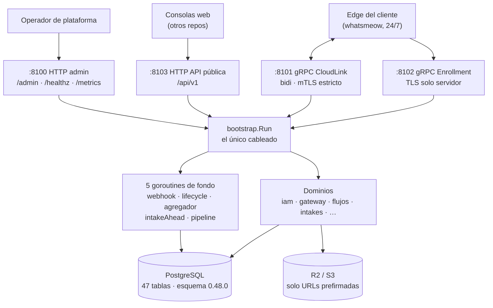
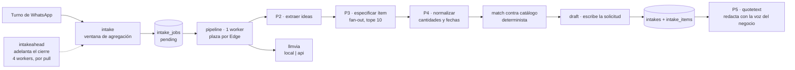

# Arquitectura de `wapp-cloud-platform`

> Organizado **por dominios**, no por carpetas: la carpeta es un detalle, el dominio es la
> frontera. Al final se dice **dónde se rompen** esas fronteras, con la línea exacta.

---

## 1 · La forma general: un proceso, cuatro listeners, un `Run` gigante

No es hexagonal global. Es **modular por capacidad**: cada módulo de `internal/` tiene su
frontera, sus tablas y su API. La única zona hexagonal (`domain` / `usecase` / `ports` /
`infra` / `transport`) es `internal/iam/`, y es deliberado.

Todo se cablea en **una función**: `bootstrap.Run(ctx)` —
`internal/bootstrap/bootstrap.go:106` → cierra en `:1096`. Son **991 líneas** que construyen
cifrado, R2, motor de flujos, gateway, IAM, pipeline LLM, cinco goroutines de fondo y los
cuatro listeners. 🔴 **Para saber qué existe de verdad en esta pieza, se lee ese fichero.** El
precio de esa concentración está en `deuda.md`.

| Listener | Variable | Default | Qué expone |
|---|---|---|---|
| HTTP admin/health | `WAPP_HTTP_ADDR` | `:8100` | `/healthz`, `/metrics`, `/admin/*` |
| gRPC CloudLink | `WAPP_GRPC_CONNECT_ADDR` | `:8101` | `Connect` bidi, **mTLS estricto** |
| gRPC Enrollment | `WAPP_GRPC_ENROLL_ADDR` | `:8102` | `EnrollEdge`, **TLS solo de servidor** (el Edge enrola antes de tener certificado) |
| HTTP API pública | `WAPP_PUBLIC_HTTP_ADDR` | `:8103` | `/api/v1/*` |

⚠️ El listener público **no tiene sonda de salud**: `/healthz` solo existe en `:8100`
(verificado en UAT: `:8103/healthz` → 404).

---

## 2 · Los dominios

### 2.1 · IAM — `internal/iam/` (~17.000 líneas, la única zona hexagonal)

Canje **Identity Token → Context Token** (ES256), RBAC glob multi-tenant, roles y grants,
membresías, invitaciones de un solo uso y **empresa activa**. Aquí **no hay usuarios ni
contraseñas**: las valida identity-core (ver I-CP-9 en `constitucion.md`).

Subpaquetes: `domain` (entidades y reglas), `usecase` (canje, grants, delegación),
`ports/{in,out}`, `infra/{postgres,memory,identity}` (el `identity` habla con el SSO, incluido
el plano M2M), `transport/http`.

Tablas propias: `iam_roles`, `iam_role_grants`, `iam_user_roles`, `iam_user_grants`,
`tenant_members`, `tenant_invitations`, `user_active_tenant`, `audit_events`.

### 2.2 · Gateway — `internal/gateway/` (~21.000 líneas con `grpc`)

La terminación de los túneles de cada Edge. Cuatro piezas:

- **`grpc`** (46 f · 14.186 l) — el servidor `Connect` bidi. `route()` despacha **10** tipos de
  `EdgeToCloud` (`internal/gateway/grpc/connect.go:211`). Regla de diseño explícita: el bucle
  `Recv` **suelta el trabajo** a un carril por sesión, salvo `Ack` e `InferenceResult`, que se
  quedan **inline** porque son O(1) en memoria y son las víctimas del head-of-line, no su
  causa.
- **`enroll`** — la CA propia y `EnrollEdge`: CSR + código de un solo uso → certificado.
- **`lease`** — emisión y revocación Ed25519. **Es el lado servidor de la doble llave**
  (I-ECO-2).
- **`session`** / **`fleet`** — el registro de streams vivos en memoria y el estado
  online/offline/loggedout **durable** en `fleet_sessions`.

### 2.3 · Motor de flujos y módulos — `internal/flujos/` (~70.000 líneas)

La pieza 05. Una máquina de estados dinámica con dos puertos (`ContentSource`, `EventSink`) y
un **Registry de módulos enchufables**.

| Paquete | Qué es |
|---|---|
| `engine` | El núcleo **puro**: no conoce BD ni transporte |
| `model` | `Flow` / `Node` / `Conversation` + su JSON y validación |
| `modules` | El `Registry` y las coerciones de payload |
| `modules/cart` | **11.080 líneas**: el carrito conversacional (catálogo → ítems → cierre). El módulo grande, con diferencia |
| `modules/menu` · `survey` · `media` | Menú numerado (reprompt máx. 3) · pregunta + proyector a `survey_results` · envío de PDF/imagen que **no** espera input |
| `runtime` | **El paquete más grande (98 f · 33.612 l)**: `OnIncoming` → resolver → engine → efectos → sinks, agregador de ráfagas, políticas de resume |
| `store` | Persistencia del motor: `flow_definitions`, `flow_state`, `flow_events` |
| `trigger` | Ante un entrante sin conversación viva, decide qué flujo arranca (o el fallback, o nada) |
| `events` | El **evento conversacional**: instancia viva de una capacidad para (tenant, sesión, contacto) |
| `contact` | Identidad **opaca** del contacto, con PII cifrada (KEK versionada + índice ciego HMAC) |
| `content` · `admin` | El puerto de contenido · los handlers `/admin/flows` y triggers |

**Módulos registrados en producción: exactamente cuatro**, y se ven en una línea cada uno —
`bootstrap.go:339` menu, `:340` survey, `:350` cart, `:351` media.

### 2.4 · Intakes y pipeline LLM — `internal/intake*`, `llmvia`, `prompts` (~55.000 líneas)

El corazón del producto reciente. **Un pedido y un presupuesto son el mismo objeto**
(`intakes`), con una máquina de **11 estados** (`internal/intakes/status.go:13`) más un alias
legado (`closed` → `confirmed`) resuelto en un único punto.

El camino, de mensaje a borrador:

| Paquete | Qué es |
|---|---|
| `intake` | **La cola**: ventana de agregación + máquina de `intake_jobs` (`machine.go`) |
| `intake/stages` | Las etapas: `p2.go`, `p3.go`, `p4.go`, `match*.go`, `draft.go`, más `tope.go` (el tope de 10 ítems a la entrada de P3) y `plazo.go` |
| `intake/pipeline` | **El worker**: reclama un job, descifra el literal, encadena P2→P3→P4→match→draft, y lo termina o lo castiga con la causa escrita |
| `intake/anclaje` | A qué línea pertenece cada adjunto. **Determinista, sin LLM** — y **sin llamante de producción** (ver `deuda.md`) |
| `intake/catalogo` | Caché del catálogo del tenant para el match |
| `intakeahead` | Adelanto de la ventana **por pull**, 4 workers (`intakeahead.go:96`). Es hoy **el único consumidor real de una clasificación** |
| `intakes` | El dominio de la solicitud: cabecera, líneas, estados, revisiones, `buyerdata` (PII cifrada) |
| `intakes/quotetext` | **P5**: redacta la cotización con la voz del negocio |
| `llmvia` | 🔴 El **único** switch por vía (`local`\|`api`), `llmvia.go:219`, más el decorador que avisa al dueño cuando la vía falla |
| `llmvia/local` | El provider que habla con el **Ollama del Edge del tenant** por frames CloudLink |
| `prompts` | Carga de disco el texto ajustable de P2–P5 (`WAPP_LLM_PROMPTS_DIR`) |
| `evidence` | La regla de la evidencia: ¿la frase que el modelo dice citar está de verdad en el texto? |
| `turnoacotado` | Nivel B: una pregunta suelta al modelo cuando un módulo determinista no entendió |
| `tenantllm` | La vía del tenant y su credencial de proveedor, **cifrada** |

🔴 **La inferencia la orquesta ESTE repo; el Edge solo la sirve** (I-CP-2). El prompt lo
construye aquí `wapp-shared/llm` + `internal/prompts`; el Edge recibe *prompt entra → JSON
sale*.

### 2.5 · Catálogo — `internal/catalogimport` (11 f · 4.115 l)

Import del catálogo del tenant en dos formas: **estricta** (JSON validado) y **tabular**
(xlsx, vía `excelize`). Tope de ítems por `WAPP_IMPORT_MAX_ITEMS` (default 500). Expone
también una plantilla y un prompt de ayuda para preparar el fichero. El catálogo alimenta el
`match` del pipeline (2.4) y el módulo `cart`.

### 2.6 · Entitlements — `internal/entitlements` (9 f · 1.477 l)

Los derechos comerciales por tenant: `Has` / `ListEffective` / `CacheTTL`, más el middleware
`RequireFeature` que **gatea rutas**. Fail-closed (I-CP-6). Caché en memoria por TTL que **no
sostiene el mutex** durante la consulta a BD (`postgres.go:98`) — eso está bien hecho, no lo
rompas.

Tablas: `plans`, `plan_features`, `tenant_features`. **6 planes** (`basic`, `commerce`,
`advisor_ai`, `advisor_ai_pro`, `advisor_ai_local`, `pro`) × **14 features sembradas**, de las
que 11 tienen constante en Go.

### 2.7 · Telemetría y flota — `internal/platform/metrics`, `inferstats`, `diagnostics`

- **`platform/metrics`** — el registro Prometheus: 17 nombres declarados + 5 descriptores
  dinámicos (la lista y la regla para recontarlos, en `contratos.md` §8). También el colector incremental `flowlifecycle`, que lee el outbox append-only
  `flow_events` hacia `/metrics` (para que la tabla no sea write-only).
- **`inferstats`** — el parte de inferencia que llega en el `Heartbeat` del Edge, agregado
  **en memoria** y publicado por `NewDesc` (`platform/metrics/inferstats.go:69`).
- **`diagnostics`** — diagnóstico remoto **bajo demanda** de la flota, con TTL y consentimiento
  por tenant (`tenant_diagnostics_consent`, `diagnostics_bundles`).
- **`intakes/telemetria`** — deja **cinco** eventos de bandeja en `flow_events`:
  `intake_draft_created`, `intake_reanalyzed`, `intake_line_corrected`, `intake_approved`,
  `intake_info_requested`.

### 2.8 · CRM — `internal/integrations` (12 f) + `crmpush` + `sigv1`

El puente CRM es una **pieza independiente**; este repo congela el contrato `wapp-crm-v1`
(`docs/contracts/wapp-crm-v1/`). Tres verbos, **dos implementados**:

| Verbo | Dirección | Estado |
|---|---|---|
| `intake.push` | wApp → puente | **Implementado**: outbox durable (`webhook_outbox`) + firma HMAC |
| `intake.status` | puente → wApp | **Implementado**: `POST /api/v1/integrations/callback` |
| `catalog.pull` | puente → wApp | **NO implementado**: responde **422** «catalog.pull diferido» (`internal/publicapi/integrations.go:307`) |

`sigv1` es HMAC-SHA256 sobre el cuerpo crudo, con ventana anti-replay ±300 s y comparación en
**tiempo constante** (`sigv1.go:39`).

### 2.9 · `publicapi` — `internal/publicapi` (97 f · 30.944 l)

**No es un dominio: es la cara.** `Register(...)` (`publicapi.go:440`) monta 66 rutas y las
delega en los dominios de arriba. Sus dos cadenas de middleware:

- `protect(...)` = `accessLog → Authenticate → RequirePermission(scope) → AuditMiddleware → h`
- `protectRead(...)` = igual **sin auditoría** (una lectura no tiene efecto que registrar)

Envoltura global del mux público (`bootstrap/http.go:171`):
`InstrumentHTTP("public") → PublicRateLimit → mux`.

### 2.10 · Los dominios pequeños

- **`platformadmin`** (9 f · 3.918 l) — la vía del **operador de plataforma**: tenants,
  access-requests, signup público. Es el módulo cuyo nombre detecta el candado de I-CP-5.
- **`casebank`** (7 f · 1.786 l) — banco de casos anonimizados **con consentimiento**. Se
  siembra con `cmd/casebank`, que **se niega** sin `-consentido`.
- **`degradation`** (4 f · 1.710 l) — el aviso al dueño cuando el LLM cae al Nivel A
  (determinista). Se cablea como **decorador** del provider, no en el pipeline: así ve
  **todas** las vías, no solo la del pipeline.
- **`reanalisis`** (3 f · 2.006 l) — el caso de uso de `POST /api/v1/intakes/{id}/reanalyze`.
- **`ingest`** (5 f) — dedupe de entrantes por `(session_id, wa_message_id)`.
- **`receipts`** (6 f) — acuses `delivered`/`read` extremo a extremo.
- **`intentcfg`** (4 f) — el catálogo de intenciones por tenant. **Aquí vive «P1»** (§3.3 de
  `constitucion.md`).
- **`filtercfg`**, **`tenantvars`** — configuración empujada al Edge y variables del tenant.
- **`contracts`** (1 f) — un paquete Go que **solo contiene un test**: valida los ejemplos de
  `docs/contracts/wapp-crm-v1` contra su JSON Schema.
- **`platform/`** — soporte transversal, **no es dominio**: `config`, `crypto` (`FieldCipher`,
  `rekey`, KMS), `httpapi` (health/admin/authmw), `logging`, `metrics`, `ratelimit`,
  `storage/postgres` (runner de migraciones) y `storage/objectstore` (R2).

---

## 3 · Puntos de entrada: cuatro binarios, no dos

| `cmd/` | Binario | Qué hace |
|---|---|---|
| `cmd/server` | `server` | El proceso real. `main.go` son 36 líneas: migra al arrancar y delega en `bootstrap.Run(ctx)`. Levanta los cuatro listeners y hace cierre gracioso |
| `cmd/migrate` | `migrate` | Aplica el DDL **y sale**, sin listeners. `-status` solo consulta. Lee las **mismas** `WAPP_DB_*` que el servidor, nunca un argumento |
| `cmd/prompts` | `prompts` | `-volcar <dir>` escribe los 4 `.tmpl` de P2–P5 con el texto que corre hoy; `-comprobar <dir>` los valida sin arrancar (`cmd/prompts/main.go:44`) |
| `cmd/casebank` | `casebank` | `-tenant X -consentido` siembra un caso en `intake_case_bank` y sale. **Sin `-consentido` se niega** (`cmd/casebank/main.go:53`) |

`cmd/server` y `cmd/casebank` tienen tests; `cmd/migrate` y `cmd/prompts` no.

---

## 4 · 🔴 Dónde se rompen las fronteras

La disciplina que el ecosistema decidió para esta pieza (ADR-0010, en el repo de documentación
del ecosistema) es: **un despliegue, módulos por dominio, y ninguna tabla compartida entre
módulos**. La primera mitad se cumple. La segunda **no**, y está medido.

**14 tablas las toca más de un módulo:**

| Tabla | Módulos que la tocan |
|---|---|
| `tenants` | **5** — entitlements · gateway · iam · platform · platformadmin |
| `fleet_sessions` | flujos · gateway · platformadmin |
| `flow_events` | flujos · platform · publicapi |
| `access_requests` | iam · platformadmin |
| `conversation_events` | flujos · intakes |
| `iam_roles` · `iam_user_roles` · `tenant_members` | iam · platformadmin |
| `intakes` · `intake_items` | flujos · intakes |
| `leases` | gateway · platformadmin |
| `plan_features` · `tenant_features` | entitlements · platformadmin |
| `tenant_settings` | flujos · intakes |

🔴 **El caso más incómodo: `gateway` no solo LEE `public.tenants`, la ESCRIBE.**
`internal/gateway/lease/repository_postgres.go:106` hace
`UPDATE public.tenants SET revoked_at = now() …` y `:117` el `UPDATE … SET revoked_at = NULL`,
cuando la tabla la crea y la sirve `platform`
(`internal/platform/storage/postgres/tenant.go:48`). El kill-switch comercial escribe en la
tabla de identidad de otro módulo, **sin API interna de por medio**.

**No hay candado para esto.** La herramienta existe y se usa para otras cosas (hay más de diez
tests-AST de cableado en `internal/bootstrap/`); simplemente nadie la apuntó a la pregunta
«¿qué módulo toca qué tabla?». Está en `deuda.md`.

**Contraverificación honesta**, para que nadie repita un falso positivo: `intake_jobs`,
`flow_state` e `iam_users` **sí están limpias**. Los ocho ficheros de `internal/flujos/**` que
mencionan `intake_jobs` lo hacen **solo en comentarios**; el SQL vive íntegro en
`internal/intake*`. Un grep que no distinga comentario de código reporta aquí un
incumplimiento que no existe.

---

## 5 · Las cinco goroutines de fondo

`bootstrap.go` lanza cinco `go X.Run(ctx)` **a pelo**, sin supervisión ni reinicio:

| Línea | Qué hace | Qué pasa si muere |
|---|---|---|
| `:1033` | worker del **webhook** durable (CRM) | los `intake.push` dejan de salir |
| `:1045` | colector **flowlifecycle** → `/metrics` | la telemetría de flujos se congela |
| `:1060` | **agregador** de ventanas de intake | las ventanas no cierran |
| `:1070` | **intakeAhead** | «no habría adelanto nunca», dice el propio código en `:1065` |
| `:1086` | el **worker del pipeline** | «los jobs quedarían `pending` y nadie los reclamaría nunca. Ni un error en el log» (`:1083`) |

🔴 **Los cinco fallos son MUDOS y están identificados como tales en el propio código.** La
única red es un test de cableado (`pipeline_captacion_cableado_test.go`), no un supervisor en
tiempo de ejecución. Ver `deuda.md`.
