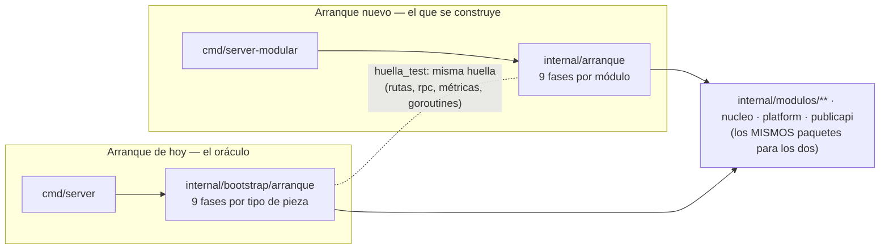

# 04 · La estructura final — cómo quedará el árbol, y cómo se llega por fases

> **Qué es esto.** El dibujo del acabado: cada carpeta y cada fichero de producción de `cmd/` e
> `internal/` tal como quedarían **al terminar** la reorganización, con su origen al lado. Es una
> guía visual y, a la vez, el insumo del script de reescritura (§4).
>
> **Generado, no escrito a mano.** El árbol de §3 sale por script de la lista real de ficheros
> (`go list` sobre `dev` @ `11766a5`, 2026-09-27) aplicándole el mapeo de §4. Los únicos
> ficheros que no existen hoy son los marcados ✚.

---

## 0 · Qué da por decidido este dibujo

El árbol asume las **recomendaciones** de [`03`](03-pendientes-y-contratos.md) §3. Si Jhoan decide
otra cosa, el dibujo cambia así:

| Decisión | Se asume | Si se decide lo contrario… |
|---|---|---|
| D-1 alcance | Opción 2: mover **y** corregir ubicaciones | Opción 1: desaparecen `modulos/catalogo/catalog.go`, `nucleo/` y los ✎ de `platform` |
| D-2 forma | `internal/modulos/<módulo>/` | Se quita el nivel `modulos/` |
| D-3 aplanar | Sí: `flujos/runtime` → `conversacion/runtime` | Se conserva el nivel intermedio: `conversacion/flujos/runtime` |
| D-4 renombrar | **No**: la carpeta hoja conserva el nombre del paquete | — (con **una** excepción obligada: `indice`, §5) |
| D-5 módulos | La candidata de `02` §4, con `acceso` y `operador` **fusionados** (así se deshace el ciclo 1) | Aparece `modulos/operador/` con `platformadmin` y `entitlements` |
| D-6 `publicapi` | Cara HTTP única, no se reparte — ⚠️ **no se sostiene con el método de `05`** (§8.2): ver D-10 | Sus 33 ficheros se reparten entre los módulos |

**Leyenda**: `← origen` carpeta movida sin tocar su contenido · ✚ nuevo · ↦ fichero que viene de
otro sitio · ✎ cambia su contenido (no solo sus imports) · 🔒 no se toca · `(+ N _test.go)` los
tests del paquete, que viajan con él.

> Todo fichero movido cambia **sus líneas de import** y las rutas citadas en sus comentarios.
> Eso no se marca con ✎: lo hace el script. ✎ señala solo cambios de lógica o de forma.

---

## 1 · Vista de pájaro

```
cmd/                      los binarios — no se mueven
internal/
├── arranque/             ✚ el cableado, ordenado por módulo (sustituye a bootstrap/)
├── publicapi/            la cara HTTP /api/v1 — no se mueve
├── platform/             soporte transversal: config, cripto, métricas, BD… — no es módulo
├── nucleo/               ✚ lo que comparten varios módulos (la identidad de contacto)
└── modulos/              ✚ el negocio, un directorio por módulo
    ├── acceso/           quién eres y qué puedes: IAM, planes y derechos, operador de plataforma
    ├── edge/             el túnel con cada Edge: gRPC, enrolamiento, lease, flota, acuses
    ├── conversacion/     el Motor de Flujos y sus módulos (menú, encuesta, carrito, media)
    ├── catalogo/         el catálogo del tenant: modelo, índice de búsqueda e importador
    ├── captacion/        la cola que convierte una conversación en borrador (P2→P4, match, draft)
    ├── inferencia/       el LLM: vía local|api, prompts, credencial del tenant, degradación
    └── solicitudes/      la solicitud y su vida: bandeja, estados, P5, CRM
```

De **29 cajas planas** se pasa a **7 módulos + 4 piezas de soporte**. La pregunta «¿dónde está
lo del CRM?» se contesta mirando el árbol, no leyendo 707 ficheros.

---

## 2 · Cómo se llega: por fases, con dos arranques en paralelo

### 2.1 · La idea

Durante la transición conviven **dos puntos de entrada**, y los dos compilan siempre:

```
cmd/
├── server/                → internal/bootstrap → internal/bootstrap/arranque/   (el de hoy: el que se despliega)
└── server-modular/     ✚  → internal/arranque/                                  (el nuevo: nueve fases por módulo)
    ├── main.go            copia de cmd/server/main.go que llama a arranque.Ejecutar
    └── integration_test.go copia del e2e de cmd/server, contra el arranque nuevo
```



Los **paquetes son los mismos** para los dos binarios: cuando una ola mueve un paquete, el
script reescribe los imports de **ambos** arranques. Lo que difiere es **solo el cableado**: el
viejo conserva su forma y sirve de **oráculo**; el nuevo se reorganiza por módulo ola a ola, y un
test compara las huellas de los dos.

### 2.2 · Lo que protege, y lo que no (para no confiarse)

| Protege | No protege |
|---|---|
| **El re-cableado**: si el arranque nuevo olvida una ruta, una goroutine o un hook, la huella lo delata frente al viejo | **El movimiento de paquetes**: afecta a los dos binarios por igual. Eso lo protegen el compilador, los candados AST (`01` §3.1) y los gates |
| **La marcha atrás del cableado**: hasta el relevo, UAT puede seguir desplegando `cmd/server` | Una vuelta atrás de un paquete movido: eso es un `git revert` de la ola |

🔴 **Nunca los dos binarios a la vez contra la misma BD o los mismos puertos.** Los dos migran al
arrancar, los dos escuchan `:8100-8103`, los dos lanzarían las cinco goroutines de fondo (dos
agregadores con ventanas **en memoria** partirían las ráfagas) y el Edge solo se conecta a uno. El
nuevo se prueba en local, en el e2e, o **en sustitución** del viejo en UAT, nunca a su lado.

**Coste de la idea**: mientras dure la transición hay **dos cableados que mantener** (y los 11
candados AST de cableado, duplicados). Por eso exige la **ventana de congelación** de `03` §2
(P-5): si entra una funcionalidad nueva, hay que cablearla en los dos.

### 2.3 · Las fases

> ⚠️ **Sustituida por [`05`](05-metodo-contratos-y-tdd.md) §6** (2026-09-27): el método ya no es
> mover sino reconstruir por contratos y TDD. Se conserva para ver de dónde se partió.

| Fase | Qué se hace | Qué NO se hace | Cómo se sabe que salió bien |
|---|---|---|---|
| **F0 · Andamiaje** | `cmd/server-modular` + `internal/arranque` como **copia exacta** del arranque de hoy · `huella_test.go` · `modulos/fronteras_test.go` en modo **medición** · el script de reescritura con la tabla de §4 | No se mueve ni un paquete | Huellas idénticas · los dos e2e verdes · gates |
| **F1 · Base** | `platform` deja de depender de dominios (los tres ✎ de §3) · `flujos/contact` → `nucleo/contact` | — | El ciclo 1 de `02` §4 desaparece del script de medición |
| **F2 · inferencia** | Mover `llmvia`, `prompts`, `tenantllm`, `degradation` · crear `fase4_inferencia.go` en el arranque nuevo | — | Es pequeño: **valida el script** antes de las olas grandes |
| **F3 · acceso** | Mover `iam/**`, `platformadmin`, `entitlements` · `fase2_acceso.go` | Partir `auth.go` (se anota, no se hace) | Candado I-CP-5 (`platform_permissions_test`) sigue detectando `platformadmin.` |
| **F4 · edge** | Mover `gateway/**`, `diagnostics`, `inferstats`, `receipts`, `ingest`, `filtercfg` · `fase3_edge.go` | Tocar `lease` más allá de su ruta | El test del literal del aviso pasivo sigue encontrando su `.md` |
| **F5 · solicitudes** | Mover `intakes/**`, `integrations/**`, `contracts`, `tenantvars` · `cart/note.go` → `intakes/note.go` | — | Los tres tests del contrato CRM encuentran `docs/contracts/` |
| **F6 · catálogo** | Extraer `cart/catalog.go` a `modulos/catalogo/` · `intake/catalogo` → `catalogo/indice` · mover `catalogimport` | Sacar `revalidate.go` del carrito (usa sus internos, §5) | 🔴 La constante de `frontera_test.go:20` actualizada **a mano** |
| **F7 · captación** | Mover `intake`, `pipeline`, `stages`, `anclaje`, `intakeahead`, `evidence`, `reanalisis`, `casebank`, `intentcfg` | — | `inv1_aprobar_ast_test` lee sus seis directorios |
| **F8 · conversación** | Mover `flujos/**` y `turnoacotado` · `fase7_conversacion.go` | Cortar el ciclo de negocio (`02` §4, D-7) | Es la ola más grande (~25k l de prod, ~48k de test) |
| **F9 · Relevo** | `cmd/server` pasa a llamar a `internal/arranque` · se borran `internal/bootstrap/` y `cmd/server-modular/` · `fronteras_test` pasa a modo **estricto** | — | Un despliegue de UAT con el binario de siempre (`go build -o bin/server ./cmd/server`) |

Cada ola termina con el repo **verde y desplegable**, y se deshace con un `git revert`. El orden
F2→F8 va de lo pequeño a lo grande a propósito: las primeras olas prueban el script donde un fallo
cuesta poco.

---

## 3 · El árbol completo, al terminar (tras F9)

```
cmd/
├── casebank/
│   ├── main.go
│   └── (+ 1 _test.go)
├── debug_inferencia/                         utilidad fuera de banda
│   └── main.go
├── migrate/
│   └── main.go
├── prompts/
│   └── main.go
└── server/
    ├── main.go                               ✎ importa internal/arranque en vez de internal/bootstrap
    ├── integration_test.go                   ✎ ídem (EnrollServerCreds)
    └── (+ 1 _test.go)

internal/
├── arranque/                                 ✚ el arranque nuevo, por módulo (sustituye a internal/bootstrap/ y bootstrap/arranque/)
│   ├── orquestador.go                        ↦ lista `fases`, requiere() e hitos, heredados
│   ├── contenedor.go                         ↦ ✎ campos agrupados por módulo
│   ├── servir.go                             ↦
│   ├── fase1_plataforma.go                   ✚ métricas · BD y migraciones · X25519 · cifrado PII y R2 (hoy fase1 + parte de fase3)
│   ├── fase2_acceso.go                       ✚ plano de auth del IAM · JWKS · entitlements · platformadmin (hoy fase2)
│   ├── fase3_edge.go                         ✚ PKI · clave del lease · enrolamiento · gateway gRPC (hoy parte de fase1 + fase4)
│   ├── fase4_inferencia.go                   ✚ selector de vía LLM · prompts P2–P5 · degradación (hoy dentro de fase5)
│   ├── fase5_captacion.go                    ↦ ✎ etapas P2→P4 · worker · aforo · intakeahead
│   ├── fase6_solicitudes.go                  ↦ ✎ bandeja · notificador · recordatorios · CRM
│   ├── fase7_conversacion.go                 ✚ Motor de Flujos, sus 4 módulos y los hooks del gateway (hoy fase7_flujos.go)
│   ├── fase8_transporte.go                   ↦ los cuatro listeners y sus rutas
│   ├── fase9_fondo.go                        ↦ las cinco goroutines
│   ├── plataforma_database.go                ↦ de database.go
│   ├── acceso_auth.go                        ↦ de auth.go (834 l: candidato a partirse)
│   ├── edge_pki.go                           ↦ de pki.go
│   ├── edge_lease.go                         ↦ de lease.go
│   ├── inferencia_prompts.go                 ↦ de prompts.go
│   ├── conversacion_flows.go                 ↦ de flows.go
│   ├── conversacion_flowforkind.go           ↦ de flowforkind.go
│   ├── transporte_http.go                    ↦ de http.go
│   ├── transporte_rutas_admin.go             ↦ de rutas_admin.go
│   ├── huella_test.go                        ✚ la huella de contratos: rutas, rpc, métricas, variables
│   └── (+ tests: los 20 de hoy, portados (11 son candados AST de cableado))
├── modulos/                                  ✚ los módulos de negocio
│   ├── fronteras_test.go                     ✚ candado: qué módulo puede importar a cuál (lista blanca de hoy congelada)
│   ├── acceso/
│   │   ├── entitlements/                     ← internal/entitlements
│   │   │   ├── entitlements.go
│   │   │   ├── middleware.go
│   │   │   ├── postgres.go
│   │   │   └── (+ 6 _test.go)
│   │   ├── iam/
│   │   │   ├── domain/                       ← internal/iam/domain
│   │   │   │   ├── canje.go
│   │   │   │   ├── entities.go
│   │   │   │   ├── errors.go
│   │   │   │   ├── invitation.go
│   │   │   │   └── (+ 2 _test.go)
│   │   │   ├── infra/
│   │   │   │   ├── identity/                 ← internal/iam/infra/identity
│   │   │   │   │   ├── client.go
│   │   │   │   │   ├── m2m.go
│   │   │   │   │   └── (+ 2 _test.go)
│   │   │   │   ├── memory/                   ← internal/iam/infra/memory
│   │   │   │   │   ├── active_tenant_store.go
│   │   │   │   │   ├── audit_store.go
│   │   │   │   │   ├── grant_store.go
│   │   │   │   │   ├── invitation_store.go
│   │   │   │   │   ├── membership_store.go
│   │   │   │   │   ├── role_store.go
│   │   │   │   │   ├── store.go
│   │   │   │   │   └── (+ 1 _test.go)
│   │   │   │   └── postgres/                 ← internal/iam/infra/postgres
│   │   │   │       ├── active_tenant.go
│   │   │   │       ├── audit.go
│   │   │   │       ├── canje.go
│   │   │   │       ├── grants.go
│   │   │   │       ├── invitations.go
│   │   │   │       ├── memberships.go
│   │   │   │       ├── postgres.go
│   │   │   │       ├── roles.go
│   │   │   │       └── (+ 9 _test.go)
│   │   │   ├── ports/
│   │   │   │   ├── in/                       ← internal/iam/ports/in
│   │   │   │   │   ├── active_tenant.go
│   │   │   │   │   ├── canje.go
│   │   │   │   │   └── usecases.go
│   │   │   │   └── out/                      ← internal/iam/ports/out
│   │   │   │       ├── active_tenant.go
│   │   │   │       ├── canje.go
│   │   │   │       └── repos.go
│   │   │   ├── transport/
│   │   │   │   └── http/                     ← internal/iam/transport/http
│   │   │   │       ├── active_tenant.go
│   │   │   │       ├── auth.go
│   │   │   │       ├── canje.go
│   │   │   │       ├── http.go
│   │   │   │       ├── invitations.go
│   │   │   │       ├── roles.go
│   │   │   │       └── (+ 6 _test.go)
│   │   │   └── usecase/                      ← internal/iam/usecase
│   │   │       ├── active_tenant.go
│   │   │       ├── audit.go
│   │   │       ├── canje.go
│   │   │       ├── config.go
│   │   │       ├── context_token.go
│   │   │       ├── delegated_auth.go
│   │   │       ├── exchange.go
│   │   │       ├── grants.go
│   │   │       ├── invitations.go
│   │   │       ├── memberships.go
│   │   │       ├── roles.go
│   │   │       └── (+ 11 _test.go)
│   │   └── platformadmin/                    ← internal/platformadmin
│   │       ├── access_requests.go
│   │       ├── handlers.go
│   │       ├── postgres.go
│   │       ├── signup.go
│   │       └── (+ 5 _test.go)
│   ├── captacion/
│   │   ├── anclaje/                          ← internal/intake/anclaje
│   │   │   ├── anclaje.go
│   │   │   └── (+ 1 _test.go)
│   │   ├── casebank/                         ← internal/casebank
│   │   │   ├── anonimizar.go
│   │   │   ├── casebank.go
│   │   │   ├── postgres.go
│   │   │   ├── semilla.go
│   │   │   └── (+ 3 _test.go)
│   │   ├── evidence/                         ← internal/evidence
│   │   │   ├── evidence.go
│   │   │   └── (+ 1 _test.go)
│   │   ├── intake/                           ← internal/intake
│   │   │   ├── machine.go
│   │   │   ├── machine_postgres.go
│   │   │   ├── memory.go
│   │   │   ├── postgres.go
│   │   │   ├── reanalisis.go
│   │   │   ├── store.go
│   │   │   └── (+ 7 _test.go)
│   │   ├── intakeahead/                      ← internal/intakeahead
│   │   │   ├── calentamiento.go
│   │   │   ├── intakeahead.go
│   │   │   ├── saneo.go
│   │   │   └── (+ 2 _test.go)
│   │   ├── intentcfg/                        ← internal/intentcfg
│   │   │   ├── store.go
│   │   │   ├── store_postgres.go
│   │   │   └── (+ 2 _test.go)
│   │   ├── pipeline/                         ← internal/intake/pipeline
│   │   │   ├── backoff.go
│   │   │   ├── memoria.go
│   │   │   ├── pipeline.go
│   │   │   ├── plaza.go
│   │   │   └── (+ 8 _test.go)
│   │   ├── reanalisis/                       ← internal/reanalisis
│   │   │   ├── reanalisis.go
│   │   │   └── (+ 2 _test.go)
│   │   └── stages/                           ← internal/intake/stages
│   │       ├── draft.go
│   │       ├── fechas.go
│   │       ├── match.go
│   │       ├── match_cascada.go
│   │       ├── match_lineas.go
│   │       ├── p2.go
│   │       ├── p3.go
│   │       ├── p4.go
│   │       ├── plazo.go
│   │       ├── tope.go
│   │       └── (+ 17 _test.go)
│   ├── catalogo/                             ✚ paquete nuevo `catalogo`: el modelo del catálogo sale del carrito
│   │   ├── catalog.go                        ↦ de conversacion/modules/cart/catalog.go (Catalog, Article, Variant, ParseCatalog…); importa conversacion/model
│   │   ├── (+ tests: sus tests salen del carrito con él)
│   │   ├── catalogimport/                    ← internal/catalogimport
│   │   │   ├── contract.go
│   │   │   ├── diff.go
│   │   │   ├── prompt.go
│   │   │   ├── tabular.go
│   │   │   ├── template.go
│   │   │   ├── validator.go
│   │   │   └── (+ 5 _test.go)
│   │   └── indice/                           ← internal/intake/catalogo  ⚠️ único renombre de paquete: catalogo → indice
│   │       ├── cache.go
│   │       ├── indice.go
│   │       ├── normalizador.go
│   │       └── (+ 5 _test.go)
│   ├── conversacion/
│   │   ├── admin/                            ← internal/flujos/admin
│   │   │   ├── doc.go
│   │   │   ├── durable_flow.go
│   │   │   ├── handlers.go
│   │   │   ├── sessions.go
│   │   │   ├── triggers.go
│   │   │   └── (+ 7 _test.go)
│   │   ├── content/                          ← internal/flujos/content
│   │   │   ├── content.go
│   │   │   ├── json.go
│   │   │   ├── router.go
│   │   │   ├── static.go
│   │   │   └── (+ 3 _test.go)
│   │   ├── engine/                           ← internal/flujos/engine
│   │   │   ├── consulta.go
│   │   │   ├── engine.go
│   │   │   └── (+ 9 _test.go)
│   │   ├── events/                           ← internal/flujos/events
│   │   │   ├── dispatcher.go
│   │   │   ├── events.go
│   │   │   ├── kinds.go
│   │   │   ├── menu.go
│   │   │   ├── store.go
│   │   │   ├── summary.go
│   │   │   ├── thread_reader.go
│   │   │   └── (+ 14 _test.go)
│   │   ├── model/                            ← internal/flujos/model
│   │   │   ├── model.go
│   │   │   └── (+ 1 _test.go)
│   │   ├── modules/                          ← internal/flujos/modules
│   │   │   ├── coerce.go
│   │   │   ├── consulta.go
│   │   │   ├── numbered.go
│   │   │   ├── ports.go
│   │   │   ├── registry.go
│   │   │   ├── (+ 4 _test.go)
│   │   │   ├── cart/                         ← internal/flujos/modules/cart  ✎ importa catalogo e intakes.SanitizeNote
│   │   │   │   ├── buyer.go
│   │   │   │   ├── cart.go
│   │   │   │   ├── consulta.go
│   │   │   │   ├── effects.go
│   │   │   │   ├── preresolutor.go
│   │   │   │   ├── prime.go
│   │   │   │   ├── projection.go
│   │   │   │   ├── resume.go
│   │   │   │   ├── revalidate.go
│   │   │   │   ├── screens.go
│   │   │   │   ├── state.go
│   │   │   │   ├── troceo.go
│   │   │   │   ├── validate.go
│   │   │   │   ├── variants.go
│   │   │   │   └── (+ 25 _test.go)
│   │   │   ├── media/                        ← internal/flujos/modules/media
│   │   │   │   ├── media.go
│   │   │   │   └── (+ 1 _test.go)
│   │   │   ├── menu/                         ← internal/flujos/modules/menu
│   │   │   │   ├── menu.go
│   │   │   │   └── (+ 1 _test.go)
│   │   │   └── survey/                       ← internal/flujos/modules/survey
│   │   │       ├── projection.go
│   │   │       ├── survey.go
│   │   │       └── (+ 2 _test.go)
│   │   ├── runtime/                          ← internal/flujos/runtime
│   │   │   ├── aggregator.go
│   │   │   ├── event_effects.go
│   │   │   ├── event_lifecycle.go
│   │   │   ├── event_sink.go
│   │   │   ├── events.go
│   │   │   ├── exit_menu.go
│   │   │   ├── incoming.go
│   │   │   ├── keyedmutex.go
│   │   │   ├── log_sink.go
│   │   │   ├── persist_sink.go
│   │   │   ├── resume.go
│   │   │   ├── runtime.go
│   │   │   ├── runtime_engine.go
│   │   │   ├── self_numbers.go
│   │   │   ├── send.go
│   │   │   ├── source_composer.go
│   │   │   ├── start.go
│   │   │   ├── streak.go
│   │   │   ├── summary_sources.go
│   │   │   ├── tenant_resolver.go
│   │   │   ├── thread.go
│   │   │   ├── webhook_sink.go
│   │   │   ├── welcome.go
│   │   │   └── (+ 75 _test.go)
│   │   ├── store/                            ← internal/flujos/store
│   │   │   ├── repository_memory.go
│   │   │   ├── repository_postgres.go
│   │   │   ├── store.go
│   │   │   └── (+ 18 _test.go)
│   │   ├── trigger/                          ← internal/flujos/trigger
│   │   │   ├── config_resolver.go
│   │   │   ├── store.go
│   │   │   ├── store_memory.go
│   │   │   ├── store_postgres.go
│   │   │   ├── trigger.go
│   │   │   └── (+ 5 _test.go)
│   │   └── turnoacotado/                     ← internal/turnoacotado
│   │       ├── prompt.go
│   │       ├── troceado.go
│   │       ├── turnoacotado.go
│   │       └── (+ 2 _test.go)
│   ├── edge/
│   │   ├── diagnostics/                      ← internal/diagnostics
│   │   │   ├── diagnostics.go
│   │   │   ├── postgres.go
│   │   │   └── (+ 2 _test.go)
│   │   ├── enroll/                           ← internal/gateway/enroll
│   │   │   ├── ca.go
│   │   │   ├── doc.go
│   │   │   ├── edgecert.go
│   │   │   ├── server.go
│   │   │   ├── service.go
│   │   │   ├── store.go
│   │   │   ├── store_postgres.go
│   │   │   └── (+ 3 _test.go)
│   │   ├── filtercfg/                        ← internal/filtercfg
│   │   │   ├── filtercfg.go
│   │   │   └── (+ 2 _test.go)
│   │   ├── fleet/                            ← internal/gateway/fleet
│   │   │   ├── fleet.go
│   │   │   ├── repository_postgres.go
│   │   │   ├── (+ 6 _test.go)
│   │   │   └── fleettest/                    ← internal/gateway/fleet/fleettest
│   │   │       └── slowrepo.go
│   │   ├── grpc/                             ← internal/gateway/grpc
│   │   │   ├── auth.go
│   │   │   ├── config_push.go
│   │   │   ├── connect.go
│   │   │   ├── diagnostics.go
│   │   │   ├── greeting.go
│   │   │   ├── inference.go
│   │   │   ├── plaza.go
│   │   │   ├── readiness.go
│   │   │   ├── receipt_sink.go
│   │   │   ├── send.go
│   │   │   ├── server.go
│   │   │   ├── types.go
│   │   │   ├── worklane.go
│   │   │   └── (+ 37 _test.go)
│   │   ├── inferstats/                       ← internal/inferstats
│   │   │   ├── inferstats.go
│   │   │   └── (+ 1 _test.go)
│   │   ├── ingest/                           ← internal/ingest
│   │   │   ├── dedupe.go
│   │   │   ├── postgres.go
│   │   │   └── (+ 3 _test.go)
│   │   ├── lease/                            ← internal/gateway/lease
│   │   │   ├── lease.go
│   │   │   ├── repository.go
│   │   │   ├── repository_postgres.go
│   │   │   ├── signingkey.go
│   │   │   └── (+ 3 _test.go)
│   │   ├── receipts/                         ← internal/receipts
│   │   │   ├── memory.go
│   │   │   ├── postgres.go
│   │   │   ├── receipts.go
│   │   │   ├── sink.go
│   │   │   └── (+ 2 _test.go)
│   │   └── session/                          ← internal/gateway/session
│   │       ├── registry.go
│   │       └── (+ 1 _test.go)
│   ├── inferencia/
│   │   ├── degradation/                      ← internal/degradation
│   │   │   ├── degradation.go
│   │   │   ├── postgres.go
│   │   │   └── (+ 2 _test.go)
│   │   ├── llmvia/                           ← internal/llmvia
│   │   │   ├── llmvia.go
│   │   │   ├── notify.go
│   │   │   ├── (+ 8 _test.go)
│   │   │   └── local/                        ← internal/llmvia/local
│   │   │       ├── calentamiento.go
│   │   │       ├── local.go
│   │   │       └── (+ 2 _test.go)
│   │   ├── prompts/                          ← internal/prompts
│   │   │   ├── prompts.go
│   │   │   ├── volcar.go
│   │   │   └── (+ 1 _test.go)
│   │   └── tenantllm/                        ← internal/tenantllm
│   │       ├── postgres.go
│   │       ├── tenantllm.go
│   │       └── (+ 1 _test.go)
│   └── solicitudes/
│       ├── contracts/                        ← internal/contracts
│       │   └── (+ 1 _test.go)
│       ├── intakes/                          ← internal/intakes
│       │   ├── approve.go
│       │   ├── aprobadas.go
│       │   ├── buyerdata.go
│       │   ├── crm.go
│       │   ├── customernote.go
│       │   ├── deposit.go
│       │   ├── discard.go
│       │   ├── edit.go
│       │   ├── intakes.go
│       │   ├── literal.go
│       │   ├── memory.go
│       │   ├── metricas.go
│       │   ├── note.go                       ↦ de cart/note.go: SanitizeNote es el contrato de dos columnas de la solicitud
│       │   ├── notifier.go
│       │   ├── postgres.go
│       │   ├── reanalisis.go
│       │   ├── requestinfo.go
│       │   ├── revalidate.go
│       │   ├── revisions.go
│       │   ├── service.go
│       │   ├── shipping.go
│       │   ├── status.go
│       │   ├── summary.go
│       │   ├── vencimiento.go
│       │   ├── (+ 50 _test.go)
│       │   ├── quotetext/                    ← internal/intakes/quotetext
│       │   │   ├── borrador.go
│       │   │   ├── precios.go
│       │   │   ├── quotetext.go
│       │   │   ├── render.go
│       │   │   └── (+ 8 _test.go)
│       │   └── telemetria/                   ← internal/intakes/telemetria
│       │       ├── telemetria.go
│       │       └── (+ 1 _test.go)
│       ├── integrations/                     ← internal/integrations
│       │   ├── crud.go
│       │   ├── gate.go
│       │   ├── outbox_stats.go
│       │   ├── postgres.go
│       │   ├── store.go
│       │   ├── worker.go
│       │   ├── (+ 6 _test.go)
│       │   ├── crmpush/                      ← internal/integrations/crmpush
│       │   │   ├── desde_intakes.go
│       │   │   ├── push.go
│       │   │   └── (+ 3 _test.go)
│       │   └── sigv1/                        ← internal/integrations/sigv1
│       │       ├── sigv1.go
│       │       └── (+ 1 _test.go)
│       └── tenantvars/                       ← internal/tenantvars
│           ├── memory.go
│           ├── postgres.go
│           ├── tenantvars.go
│           └── (+ 1 _test.go)
├── nucleo/                                   ✚ núcleo compartido, sin módulo
│   └── contact/                              ← internal/flujos/contact
│       ├── contact.go
│       ├── repository_memory.go
│       ├── repository_postgres.go
│       ├── resolver.go
│       └── (+ 6 _test.go)
├── platform/                                 soporte transversal (no es módulo); no se mueve
│   ├── config/
│   │   ├── config.go
│   │   └── (+ 1 _test.go)
│   ├── crypto/
│   │   ├── field_cipher.go
│   │   ├── keyprovider.go
│   │   ├── keyprovider_kms.go
│   │   ├── kms_gcp.go
│   │   ├── rekey.go
│   │   └── (+ 5 _test.go)
│   ├── httpapi/
│   │   ├── admin.go                          ✎ deja de importar gateway/session (ErrSessionOffline)
│   │   ├── audit_mw.go                       ✎ deja de importar iam/ports/in (AuditInput)
│   │   ├── authmw.go
│   │   ├── crypto.go
│   │   ├── health.go
│   │   ├── ratelimit.go
│   │   └── (+ 9 _test.go)
│   ├── logging/
│   │   ├── logging.go
│   │   └── (+ 1 _test.go)
│   ├── metrics/
│   │   ├── inferstats.go                     ✎ deja de importar edge/inferstats
│   │   ├── metrics.go
│   │   ├── (+ 4 _test.go)
│   │   └── flowlifecycle/
│   │       ├── collector.go
│   │       └── (+ 1 _test.go)
│   ├── ratelimit/
│   │   ├── ratelimit.go
│   │   └── (+ 1 _test.go)
│   └── storage/
│       ├── objectstore/
│       │   ├── presign.go
│       │   ├── r2_factory.go
│       │   └── (+ 1 _test.go)
│       └── postgres/
│           ├── connect.go
│           ├── health.go
│           ├── tenant.go
│           ├── tx.go
│           ├── (+ 8 _test.go)
│           └── migrations/                   🔒 no se mueve (runner full-replay)
│               ├── embed.go
│               ├── migrate.go
│               ├── schema.go
│               ├── version.go
│               ├── (+ 3 _test.go)
│               └── structure/
│                   └── 0001_…sql … 0084_…sql 84 migraciones, intactas
└── publicapi/                                la cara HTTP única (D-6); no se mueve, solo cambian sus imports
    ├── accesslog.go
    ├── audit.go
    ├── catalogimport.go
    ├── catalogtabular.go
    ├── catalogtemplate.go
    ├── conversationeventcancel.go
    ├── conversationevents.go
    ├── crmcallback.go
    ├── degradationnotices.go
    ├── diagnostics.go
    ├── entitlements.go
    ├── eventstelemetry.go
    ├── eventstelemetry_store.go
    ├── export.go
    ├── flows.go
    ├── health.go
    ├── intakes.go
    ├── intakes_llm_gate.go
    ├── integrations.go
    ├── intents.go
    ├── limits.go
    ├── media.go
    ├── messages.go
    ├── plazoescritura.go
    ├── publicapi.go
    ├── quotesuggestion.go
    ├── reanalyze.go
    ├── roleplane.go
    ├── sessions.go
    ├── summary.go
    ├── tenantcontent.go
    ├── tenantllm.go
    ├── tenantvariables.go
    └── (+ 64 _test.go)
```

---

## 4 · La tabla de correspondencia — lo que usará el script

Una sola tabla, aplicada **a la vez** a imports, comentarios y documentación (`01` §3.2). Gana el
prefijo más largo: `internal/flujos/contact` va a `nucleo/` aunque `internal/flujos` vaya a
`conversacion/`.

| Ruta de hoy | Ruta nueva |
|---|---|
| `internal/bootstrap` + `internal/bootstrap/arranque` | `internal/arranque` (en F9) |
| `internal/iam` | `internal/modulos/acceso/iam` |
| `internal/platformadmin` · `internal/entitlements` | `internal/modulos/acceso/…` (mismo nombre) |
| `internal/gateway` | `internal/modulos/edge` (aplanado: `gateway/grpc` → `edge/grpc`) |
| `internal/diagnostics` · `inferstats` · `receipts` · `ingest` · `filtercfg` | `internal/modulos/edge/…` |
| `internal/flujos` | `internal/modulos/conversacion` (aplanado) |
| `internal/flujos/contact` | `internal/nucleo/contact` |
| `internal/turnoacotado` | `internal/modulos/conversacion/turnoacotado` |
| *(nuevo, desde `flujos/modules/cart/catalog.go`)* | `internal/modulos/catalogo` |
| `internal/intake/catalogo` | `internal/modulos/catalogo/indice` ⚠️ renombre |
| `internal/catalogimport` | `internal/modulos/catalogo/catalogimport` |
| `internal/intake` | `internal/modulos/captacion/intake` |
| `internal/intake/pipeline` · `stages` · `anclaje` | `internal/modulos/captacion/…` (aplanado) |
| `internal/intakeahead` · `evidence` · `reanalisis` · `casebank` · `intentcfg` | `internal/modulos/captacion/…` |
| `internal/llmvia` · `prompts` · `tenantllm` · `degradation` | `internal/modulos/inferencia/…` |
| `internal/intakes` · `integrations` · `contracts` · `tenantvars` | `internal/modulos/solicitudes/…` |
| `internal/platform` · `internal/publicapi` | **sin cambio** |

---

## 5 · Tres decisiones de detalle que el dibujo ya toma (y por qué)

1. **`indice` es el único paquete que cambia de nombre.** El modelo extraído del carrito se llama
   `catalogo`, y el índice de búsqueda de `intake/catalogo` **también** se llama `catalogo`: el
   worker del pipeline necesita los dos, y dos paquetes homónimos obligarían a alias en cada
   import. Se renombra el índice, no el modelo. **Sus textos de error no cambian** (`"catalogo: …"`
   es un literal, no se deriva del nombre del paquete): el renombre no toca nada observable.
2. **`revalidate.go` se queda en el carrito.** `catalog.go` y `note.go` son autocontenidos
   (medido: no usan ningún identificador del resto del carrito; `catalog.go` solo importa
   `conversacion/model`, ver abajo), pero `revalidate.go` usa
   `cartLine`, `lineLabel`, `money`, `summaryWith` y `variantSKUSuffix`, y `PriceListOf` devuelve
   un `intakes.PriceList`. Además nadie fuera del carrito la llama en producción (las dos menciones
   son comentarios). Sacarla no aporta y arrastra internos.
   **La única dependencia que se lleva `catalog.go`** es `conversacion/model`: `ParseCatalog`
   recibe un `model.Content` y envuelve `model.ErrInvalidFlow`. Se acepta: `model` es una
   **hoja** (no importa nada interno, medido con `go list`), así que la arista
   `catalogo → conversacion/model` no puede formar ciclo. Cambiar la firma alteraría el
   `errors.Is(err, model.ErrInvalidFlow)` de quien la consume, y eso sí sería cambiar
   comportamiento.
3. **`note.go` va a `solicitudes/intakes`, no a `catalogo`.** Su cabecera lo dice: es *el
   contrato de contenido de dos columnas* de la solicitud (`intake_items.customization` e
   `intakes.customer_note`), con una regla para las dos puertas (carrito y pipeline). Su dueño
   natural es quien tiene esas columnas. El carrito ya importa `intakes`, así que no nace ninguna
   dependencia nueva.

**Técnica para no romper a nadie en F5 y F6**: al sacar `catalog.go` y `note.go`, el carrito puede
dejar **alias de tipo** temporales (`type Catalog = catalogo.Catalog`,
`var SanitizeNote = intakes.SanitizeNote`) para que sus consumidores migren en la misma ola sin
prisa, y borrarlos al cerrarla. Si el script reescribe todos los consumidores de golpe, no hacen
falta.
