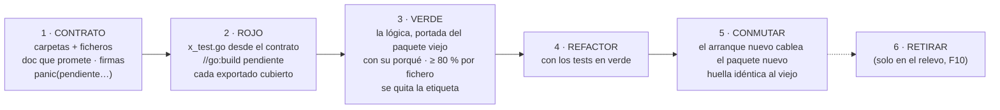

# 05 · El método: reconstrucción por contratos y TDD — no un movimiento mecánico

> 🔒 **Decisiones de Jhoan Medina, 2026-09-27.**
>
> 1. La reorganización **no se hace moviendo ficheros**: se aprovecha para **limpiar los tests en
>    primera instancia**. Cada fichero del árbol nuevo se **crea**: primero su **contrato**, sin
>    lógica, con **un test que cubre ese contrato**, en rojo; después la lógica, hasta verde. El
>    arranque paralelo de [`04`](04-estructura-final.md) §2 existe para poder ir **de a poco**.
> 2. **Los tests viejos no se portan.** Son demasiados. Los tests nuevos se escriben **desde el
>    contrato de cada fichero**, para que cada fichero de código **nazca con cobertura** y, cuando
>    llegue la lógica de verdad, ya exista el mecanismo que la valida.
> 3. **Los tests de integración tampoco se portan**: se escriben **de cero**, **por proceso** y no
>    por fichero (§7).
>
> Este documento es **normativo**: quien implemente lo cumple. Donde choca con un documento
> anterior, **manda este** (la lista de lo sustituido está en §8).

---

## 1 · El punto de partida de los tests (medido el 2026-09-27)

| | Hoy |
|---|---|
| Ficheros de producción (`internal/` + `cmd/`) | **349** |
| Ficheros de test | **534** |
| Funciones `Test*` de primer nivel | **3.131** (4.318 contando subtests) |
| Tests que llevan el nombre de un fichero de producción (`x.go` ↔ `x_test.go`) | **190** |
| Tests **sin** fichero homónimo (organizados por escenario, plan o guion: `guion_ambar_test.go`, `event_switch_test.go`…) | **344** |
| Ficheros de producción **sin** test homónimo | **159** |
| Ficheros de integración (se saltan solos sin Postgres, DT-52) | **107** |
| El test más grande | `internal/flujos/runtime/aggregator_test.go`, **1.993** líneas |

Hoy un test dice **qué escenario** prueba, no **qué fichero**. Para saber qué cubre
`runtime/incoming.go` hay que buscar entre 75 ficheros de test. Portar esa masa sería trasladar el
desorden a carpetas nuevas: por eso se escribe de nuevo, desde los contratos.

---

## 2 · La exigencia

Cada regla es comprobable. Las que tienen candado lo dicen (§5).

### E-1 · Nada se mueve: todo se crea

Ni `git mv`, ni reescritura de imports por script sobre el código viejo. Cada fichero del árbol
de [`04`](04-estructura-final.md) §3 se **crea** en su sitio nuevo. El código viejo **no se toca**
mientras dure la reconstrucción: es la **implementación de referencia**, es lo que corre en UAT, y
sus tests viejos lo siguen protegiendo hasta el relevo.

*Única excepción*: los tres ✎ de `platform` (`httpapi/admin.go`, `httpapi/audit_mw.go`,
`metrics/inferstats.go`) se corrigen **en su sitio** en F0, porque `platform` lo comparten los dos
arranques y hoy depende de dominios (`02` §3.3).

### E-2 · Primero el contrato, sin lógica

En la primera pasada de cada módulo, cada fichero nuevo contiene **solo su contrato**:

- el comentario de paquete (en el fichero principal) y el de **cada símbolo exportado**, que dice
  **qué promete**: qué recibe, qué devuelve, qué errores da y en qué casos. Ese comentario es la
  especificación de la que sale el test (E-4);
- tipos, interfaces, constantes, errores centinela y firmas;
- cuerpos que **no deciden nada**: `panic(pendiente.Implementar("paquete.Func"))`.

🔴 **Un cuerpo de contrato nunca devuelve un valor cero.** `return nil, nil` o `return ""` puede
hacer pasar un test por accidente («esperaba lista vacía»), y eso es exactamente lo que el TDD
prohíbe. El `panic` hace que **todo** test que toque el contrato falle, sin excepción.

`internal/pendiente` es un paquete de una función, creado en F0.

### E-3 · Un fichero, un test

Por cada `x.go` existe `x_test.go` **en el mismo directorio**, y ese test cubre **el contrato de
`x.go`**, no el de sus vecinos.

Excepciones cerradas, y ninguna más sin decisión escrita:

| Fichero | Qué lleva en su lugar |
|---|---|
| `doc.go` (solo comentario de paquete) | Nada |
| `embed.go` / ficheros solo con `//go:embed` | Lo prueba el test de quien lee lo embebido |
| Fichero **solo de interfaces** (puertos) | Una **suite de contrato** exportada en un paquete `…test` (patrón `fleettest`): `func Contrato(t *testing.T, nuevo func() Puerto)`. Cada implementación la ejecuta desde **su** test (E-6) |
| Dobles de test (`fleettest/slowrepo.go`) | Su propio test solo si tienen lógica |

### E-4 · El test sale del contrato, y nace en rojo

El test de `x.go` se escribe **leyendo el comentario del contrato**, no el código viejo: por cada
promesa del comentario («devuelve `ErrNotFound` si el tenant no coincide», «una frase vacía no es
evidencia»), al menos una aserción. Así el test **especifica** el comportamiento antes de que exista.

El commit que crea un contrato **incluye su test**, y ese test **falla** contra el contrato (por
el `panic` de E-2). El verde llega en un commit **posterior**, que añade la lógica. Los mensajes lo
dicen: `rojo(<módulo>): …` · `verde(<módulo>): …` · `refactor(<módulo>): …`.

### E-5 · `dev` siempre verde: el rojo vive detrás de una etiqueta

La regla del ecosistema es que toda ola aterriza en `dev`, y `dev` pasa el gate. Un test rojo no
puede romperlo, así que:

- un test en rojo lleva `//go:build pendiente` en la primera línea;
- `make ci-local` **no** lo ejecuta, pero `go vet -tags pendiente ./...` **sí lo compila**. Un test
  rojo que ni compila no es un test;
- `make test-pendiente` (nuevo) los corre y **cuenta lo que falta** por el número de llamadas a
  `pendiente.Implementar` que quedan en el árbol (cuenta estática, exacta). ⚠️ No por tests
  rojos: un `panic` **aborta el binario de test entero** del paquete, así que el primer contrato
  sin lógica tapa a los demás (verificado con el ejemplo de §10). Para ver un test concreto en
  rojo, se corre solo: `go test -tags pendiente -run '^TestX$' ./ruta`;
- al llegar a verde, el commit `verde(…)` **quita la etiqueta**, y el test entra en el gate normal.

🔴 **Nunca `t.Skip`** en código nuevo, ni para aparcar un rojo ni por falta de Postgres. Un SKIP
bajo `rc=0` es la deuda DT-52 (438 tests saltados con la pantalla en verde). La etiqueta hace el
rojo **visible y contable**; el SKIP lo esconde.

### E-6 · Sin base de datos: los tests de fichero son unitarios

Los tests de esta reconstrucción **no tocan Postgres**. Para los ficheros que sí hablan con él:

- **El puerto** que implementan tiene su **suite de contrato** (E-3), y la ejecuta **ya** una
  implementación en memoria, así que **el comportamiento del puerto nace cubierto**. Medido el
  2026-09-27: de los **20** paquetes con adaptador Postgres, **8** tienen hoy gemelo en memoria
  (`memory.go`, `repository_memory.go`, `iam/infra/memory`…). Para los **12** que no
  (`casebank`, `degradation`, `diagnostics`, `entitlements`, `gateway/enroll`, `gateway/fleet`,
  `gateway/lease`, `ingest`, `integrations`, `intentcfg`, `platformadmin`, `tenantllm`), la
  reconstrucción **crea un doble en memoria** en el paquete `…test` del puerto, en la misma pasada
  del contrato. Sin él, la suite no correría hasta F9.
- **El adaptador Postgres** tiene su `x_test.go` unitario con lo que se prueba sin BD: el
  constructor, la validación de argumentos, el mapeo de filas y de errores de `pgx` a los errores
  del dominio (con funciones puras extraídas para eso).
- **Su SQL** lo cubren los tests de **proceso** de §7, que ejecutan **la misma suite de contrato**
  contra la implementación Postgres. La suite se escribe una vez y sirve a las dos.

Consecuencia aceptada: un adaptador Postgres **nace con cobertura de sentencias baja**, a
propósito, y se excluye del umbral de E-9. Su verdad la da §7.

### E-7 · El test prueba comportamiento por el contrato

Se prueba lo que el fichero **promete** (sus exportados, y los no exportados que sus hermanos
usan), nunca su implementación. Los tests que leen el código como texto (AST) quedan
**prohibidos**, salvo los **candados de invariante** de §3.2.

### E-8 · Los tests viejos se consultan, no se portan

Los 3.131 tests viejos describen lo que el sistema hace hoy en UAT: son **material de consulta**
para escribir bien el contrato (sus casos borde, los incidentes que los motivaron), **no una
lista que haya que trasladar**. No hay inventario test a test.

Lo que **sí** es obligatorio: antes de escribir el contrato de un fichero, **leer los tests viejos
del paquete equivalente** (tabla de `04` §4) y llevar al comentario del contrato cualquier regla
que el código nuevo deba seguir cumpliendo. Una regla que se decide **no** mantener se dice en el
commit, con el motivo.

### E-9 · Cada fichero nace cubierto

- **Desde el rojo**: cada símbolo exportado de `x.go` aparece en `x_test.go`, y cada promesa del
  comentario tiene su aserción. **Candado estático** (§5): un exportado sin mención en su test hace
  fallar el gate, aunque la lógica aún no exista.
- **Al llegar a verde**: cobertura de sentencias **por fichero** (`go test -coverprofile`,
  agregada por fichero) **≥ 80 %** (umbral propuesto, D-12). Los adaptadores Postgres quedan fuera
  (E-6). Un fichero por debajo no cierra su `verde(…)`.

Así, cuando la lógica de verdad llegue, **ya hay algo que la valide**: ese es el objetivo de todo
el método.

### E-10 · El «porqué» viaja con la lógica

El estilo de la casa es *comentario-como-ADR* (~47 % del código de producción). En la pasada
**verde**, el comentario que explica **por qué** una línea es así viaja con ella. Cada fichero
nuevo dice en su cabecera **de dónde porta**: `// Porta internal/flujos/contact/contact.go @ <sha>`,
para que `git log` del fichero viejo siga siendo la historia.

---

## 3 · Lo que NO se limpia

### 3.1 · El comportamiento observable

Limpiar tests **no** es cambiar lo que el sistema hace. Todo lo de `03` §1 (rutas, rpc, tablas,
variables, métricas, textos de error, literal del aviso, contrato CRM, doble llave) sigue intacto.
El oráculo de §4 y los procesos de §7 lo comprueban.

### 3.2 · Los candados de invariante — se expresan siempre

Son la memoria de incidentes y de reglas de seguridad. **No se portan tal cual**, pero su regla
**tiene que** quedar escrita en el contrato del fichero nuevo que la cumple, con su test. Si solo
se puede verificar contra Postgres, pasa a la lista de procesos de §7.

| Candado de hoy | Qué protege | Dónde queda |
|---|---|---|
| `internal/intakes/inv1_aprobar_ast_test.go` | INV-1: la aprobación tiene una sola puerta | Contrato de `solicitudes/intakes` |
| `internal/bootstrap/arranque/platform_permissions_test.go` | 🔴 I-CP-5: los permisos de plataforma acaban en `.any` | Contrato del arranque nuevo · proceso de acceso |
| `internal/intake/catalogo/frontera_test.go` | El índice del catálogo no entra en el turno conversacional | `fronteras_test.go` |
| `internal/integrations/crmpush/contrato_ast_test.go` | Los campos del contrato CRM se fijan donde deben | Contrato de `solicitudes/integrations/crmpush` |
| `internal/iam/infra/postgres/{canje_orden,canje_una_consulta,membresia_unica}_ast_test.go` | Orden y atomicidad del canje; una membresía por usuario | Proceso de acceso (§7): necesitan BD |
| `internal/intakes/{inv_vencimiento,sello_poda}_ast_test.go` | Vencimiento y poda de revisiones | Contrato de `solicitudes/intakes` |
| `internal/flujos/runtime/streak_invariante_test.go` · `internal/flujos/modules/cart/orden_consulta_ast_test.go` · `internal/flujos/events/summary_test.go` | Invariantes del motor y del carrito | Contratos de `conversacion` |
| `internal/gateway/grpc/greeting_internal_test.go` | 🔒 El literal `AVISO_SESION_PASIVA_V1`, byte a byte | Contrato de `edge/grpc` |
| Los 11 `*_cableado_test.go` de `internal/bootstrap/arranque/` | El cableado del arranque | Contrato del arranque nuevo |

---

## 4 · El ciclo, por módulo



**El oráculo.** Durante toda la transición, `cmd/server` corre **el código viejo** con el arranque
viejo, y `cmd/server-modular` corre **el código nuevo** con el arranque nuevo. Los dos binarios
**no comparten los paquetes de dominio**, y la huella (`internal/arranque/huella_test.go`: rutas,
rpc, métricas, goroutines) compara lo que expone cada uno.

🔴 Siguen sin poder correr **a la vez** contra la misma BD o los mismos puertos (`04` §2.2).

### 4.1 · Los puentes al código viejo

Un paquete nuevo **debería** importar solo paquetes nuevos, `platform` o `nucleo`. Pero el ciclo
de negocio de `02` §4 lo impide en algunos casos: `captacion` necesita el almacén de
`conversacion`, que se reconstruye después. Para eso existen los **puentes**: un import de un
paquete nuevo hacia uno viejo, **declarado** en la lista de `internal/modulos/fronteras_test.go`.

- Un puente no declarado hace fallar el gate.
- Un puente se retira cuando su destino ya se reconstruyó. Ese paso tiene un coste: el paquete
  nuevo cambia de tipos, así que se re-toca.
- En el relevo, **cero puentes**.

El orden de §6 minimiza los puentes, pero no los elimina.

---

## 5 · Los candados de la reconstrucción (nacen en F0)

| Candado | Qué hace fallar el gate |
|---|---|
| `internal/modulos/fronteras_test.go` | Un import entre módulos fuera de la lista blanca, o un puente al código viejo no declarado |
| `internal/modulos/un_fichero_un_test_test.go` | Un `x.go` sin `x_test.go` al lado, salvo las excepciones de E-3 |
| `internal/modulos/exportados_cubiertos_test.go` | Un símbolo exportado de `x.go` que no aparece en `x_test.go` (E-9) |
| `make cobertura-ficheros` | Un fichero ya en verde por debajo del umbral (E-9), salvo adaptadores Postgres |
| `internal/arranque/huella_test.go` | Una diferencia en la huella entre los dos arranques, para un módulo ya conmutado |
| `go vet -tags pendiente ./...` en `ci-local` | Un test rojo que no compila |
| `sin_pendientes_test.go` | **Solo en F10**: cualquier `pendiente.Implementar` que quede |

---

## 6 · Las fases (sustituyen a las de `04` §2.3)

Orden **de la base hacia arriba**, para que cada módulo encuentre reconstruido lo que importa:

| Fase | Qué | Notas |
|---|---|---|
| **F0 · Andamiaje** | `cmd/server-modular` + `internal/arranque`, **copia exacta** del arranque viejo, que al principio cablea **paquetes viejos** · `internal/pendiente` · la etiqueta `pendiente` y sus `make` · los candados de §5 · los tres ✎ de `platform` en su sitio | No se crea ningún módulo |
| **F1 · `nucleo` — el piloto** | `nucleo/contact` completo: contrato → rojo → verde → conmutar | **4 ficheros de producción, solo depende de `platform`**, y tiene implementación en memoria y en Postgres: prueba también la suite de contrato de E-6. Calibra el método: cuánto cuesta un fichero, si el umbral es razonable, si los candados estorban. **Tras F1, parada para decidir si se sigue igual** |
| **F2 · `acceso`** | `iam/**`, `platformadmin`, `entitlements` | `iam` ya es hexagonal: sus puertos piden suites de contrato |
| **F3 · `edge`** | `grpc`, `enroll`, `lease`, `session`, `fleet`, `diagnostics`, `inferstats`, `receipts`, `ingest`, `filtercfg` | 🔒 `lease` es la mitad servidora de la doble llave: se reconstruye sin cambiar comportamiento |
| **F4 · `inferencia`** | `llmvia/**`, `prompts`, `tenantllm`, `degradation` | — |
| **F5 · `catalogo`** | El modelo extraído del carrito, `indice`, `catalogimport` | Puente a `conversacion/model` hasta F8 (o se reconstruye `model` aquí: es una hoja) |
| **F6 · `solicitudes`** | `intakes/**` (con `note.go`), `integrations/**`, `tenantvars` | Puente de `telemetria` a `conversacion/store` hasta F8. `contracts` desaparece como paquete: su validación del esquema CRM pasa al contrato de `integrations` |
| **F7 · `captacion`** | `intake`, `pipeline`, `stages`, `anclaje`, `intakeahead`, `evidence`, `reanalisis`, `casebank`, `intentcfg` | Puentes a `conversacion` hasta F8 |
| **F8 · `conversacion`** | `flujos/**` y `turnoacotado` | La mayor: **23 ficheros de producción solo en `runtime`**. Al cerrar, se retiran todos los puentes |
| **F9 · Procesos** | La suite de integración **de cero, por proceso** (§7) | 🔴 **Condición del relevo**: sin ella, el código nuevo no tendría ni una prueba contra Postgres |
| **F10 · Relevo** | `cmd/server` → `internal/arranque` · se borran los paquetes viejos (con sus tests viejos), `internal/bootstrap` y `cmd/server-modular` · `sin_pendientes_test` activo | Un despliegue de UAT con el binario de siempre |

Dentro de cada módulo, la pasada de **contratos y rojo de todo el módulo** va primero (y puede
ser una sola ola), y la de **verde** va **fichero a fichero**, cada uno en su commit.

---

## 7 · Los tests de integración: de cero, por proceso

Los **107** ficheros de integración viejos **no se portan**. Siguen protegiendo el código viejo
(que es el que corre en UAT) hasta el relevo, y se borran con él. La suite nueva se escribe en
**F9**, desde cero, y se organiza **por proceso de negocio**, no por fichero.

### 7.1 · Reglas

- **Caja negra.** Cada proceso entra por la puerta real: HTTP en `:8103`/`:8100`, gRPC en
  `:8101`/`:8102` con un Edge de prueba, y mira el resultado en Postgres y en lo que el proceso
  devuelve. No importa paquetes internos.
- **Ventaja de la caja negra: corre contra los DOS binarios.** Un proceso se escribe primero
  contra `cmd/server` (el viejo, lo que está en UAT): si pasa, **el test es correcto**. Después se
  corre contra `cmd/server-modular`: si pasa, **el código nuevo hace lo mismo**. Es el oráculo más
  fuerte que tiene la reconstrucción.
- **Postgres obligatorio.** `//go:build integracion`; sin Postgres **falla**, no se salta
  (E-5). `make test-procesos` levanta el contenedor.
- **Las suites de contrato de E-6 corren aquí contra la implementación Postgres.** Así el SQL
  queda cubierto sin tests de integración por fichero.
- **Los candados de invariante que necesitan BD** (§3.2) entran como aserciones de su proceso.

### 7.2 · Procesos candidatos (a cerrar en D-13)

| Proceso | Recorre |
|---|---|
| Enrolamiento de un Edge y su lease | `EnrollEdge` → certificado → `Connect` → lease emitido → **revocación (kill-switch)** |
| Canje de identidad y permisos | Identity Token → Context Token → RBAC → rutas `.any` de plataforma denegadas a un admin de cliente (I-CP-5) |
| Entrante a respuesta | Mensaje del Edge → dedupe → trigger → flujo → respuesta enviada → acuses |
| De mensaje a borrador | Ráfaga → ventana → `intake_jobs` → P2→P4 (proveedor falso) → match → solicitud en bandeja |
| La bandeja de la dueña | Editar, aprobar, pedir información, P5, vencimiento |
| CRM | `intake.push` por el outbox con firma · `intake.status` por el callback, anti-replay |
| Catálogo | Importación estricta y tabular → caché → match |
| Re-análisis | `reanalyze` sobre una solicitud existente → job → revisión nueva |

---

## 8 · Lo que esta decisión cambia en los documentos anteriores

| Documento | Qué queda sustituido |
|---|---|
| [`01`](01-factibilidad.md) §1 y §4 | El «tiempo A · mover, mecánico, coste bajo-medio». **El método es reconstrucción** (§9) |
| [`04`](04-estructura-final.md) §2.3 | La tabla de fases → sustituida por §6 (con F9 · Procesos y **F10 · Relevo**) |
| [`04`](04-estructura-final.md) §4 | La tabla de correspondencia ya no alimenta un script de movimiento: dice **qué paquete viejo** es la referencia de cada paquete nuevo (y qué tests viejos consultar, E-8) |
| [`04`](04-estructura-final.md) §3 | **El árbol destino sigue valiendo**, con dos excepciones: `publicapi` (§9.2) y `solicitudes/contracts`, que desaparece (§6, F6) |
| [`03`](03-pendientes-y-contratos.md) D-4 | «No renombrar paquetes» se relaja: un paquete nuevo **puede** llevar otro nombre, siempre que **los textos observables** (errores que ve un humano) no cambien |

---

## 9 · Lo que cuesta, dicho claro

### 9.1 · Escala y duración

Es una reconstrucción de **349 ficheros de producción**, cada uno con un test nuevo escrito desde
su contrato, con **dos copias del dominio** vivas hasta el relevo. No portar los 3.131 tests
viejos lo abarata mucho frente a la versión anterior de este documento, pero traslada el peso a
**la calidad del contrato**: un comportamiento que nadie escribió en un comentario no tendrá test.
Mientras dure:

- **todo arreglo se hace dos veces** (en lo viejo, que es lo que corre en UAT, y en lo nuevo si ya
  está reconstruido), y toda funcionalidad nueva se congela o se hace dos veces;
- **se pierde el `git blame` directo** del fichero nuevo (lo mitiga la cabecera de E-10);
- el riesgo deja de ser «romper un import», que el compilador caza, y pasa a ser **olvidar un
  comportamiento**. Lo cazan tres redes: la lectura obligatoria de los tests viejos (E-8), el
  oráculo de la huella (§4) y, sobre todo, los procesos de caja negra corridos contra los dos
  binarios (§7).

Por eso **F1 es un piloto con parada**: el coste real por fichero se mide ahí, y con ese dato se
decide si el resto sigue igual, se acelera o se acota.

### 9.2 · `publicapi` no puede quedarse como está

`publicapi` (33 ficheros de producción) importa **directamente** los tipos de los dominios. El
arranque viejo necesita que hable con los paquetes viejos, y el nuevo, con los nuevos. **No puede
hacer las dos cosas.** Con este método, la decisión D-6 («cara HTTP única») deja de sostenerse, y
la salida natural es que **cada módulo tenga su transporte HTTP** (`modulos/<m>/http/`, como ya
hace `iam/transport/http`), que el arranque nuevo monta. El `publicapi` viejo sigue sirviendo al
arranque viejo hasta el relevo. Es la decisión **D-10** de `03`.

### 9.3 · Lo que el método gana

- **Ficheros que nacen cubiertos**: cuando llega la lógica, el test que la valida ya estaba ahí.
- **Tests que se encuentran**: para saber qué cubre `x.go`, se abre `x_test.go`.
- **Contratos escritos antes que la lógica**: cada módulo dice lo que promete antes de decidir
  cómo, que es justo la conversación de fronteras que ADR-0010 pedía.
- **El código nuevo nace sin DT-52**: sin un solo `t.Skip` (E-5).
- **Integración que se entiende**: una suite por proceso de negocio, que además sirve de oráculo
  entre el código viejo y el nuevo.

---

## 10 · Ejemplo: un fichero de principio a fin

`internal/evidence/evidence.go` (80 líneas, dos funciones) → `modulos/captacion/evidence/`.

**Antes de escribir (E-8)**: se leen los dos tests viejos (`TestNormalize_ColapsaBlancosYBaja`,
`TestContains_LasTresDecisionesDeLaRegla`), que dicen las tres decisiones de la regla. Van al
comentario del contrato.

**Commit `rojo(captacion): contrato de evidence`** — `evidence.go`:

```go
// Package evidence es la regla de la evidencia: ¿la frase que el modelo dice citar
// está de verdad en el texto del cliente?
//
// Porta internal/evidence/evidence.go @ <sha>.
package evidence

import "github.com/EduGoGroup/wapp-cloud-platform/internal/pendiente"

// Normalize baja a minúsculas y colapsa cualquier secuencia de blancos en un espacio.
// Es la ÚNICA normalización: texto y frase pasan por ella antes de compararse.
func Normalize(s string) string {
	panic(pendiente.Implementar("evidence.Normalize"))
}

// Contains dice si la frase, normalizada, aparece en un texto YA normalizado.
// Una frase vacía tras normalizar no es evidencia: devuelve false.
func Contains(textoNorm, frase string) bool {
	panic(pendiente.Implementar("evidence.Contains"))
}
```

`evidence_test.go`, escrito **desde ese comentario**: una aserción por promesa.

```go
//go:build pendiente

package evidence

import "testing"

func TestNormalize(t *testing.T) {
	casos := []struct{ entrada, quiere string }{
		{"  Hola   MUNDO ", "hola mundo"},
		{"a\t\nb", "a b"},
		{"", ""},
	}
	for _, c := range casos {
		if got := Normalize(c.entrada); got != c.quiere {
			t.Errorf("Normalize(%q) = %q, quiere %q", c.entrada, got, c.quiere)
		}
	}
}

func TestContains(t *testing.T) {
	texto := Normalize("Quiero 2 hamburguesas con QUESO para el sábado")
	if !Contains(texto, "hamburguesas  con queso") {
		t.Error("una frase presente, con otro espaciado y otra caja, es evidencia")
	}
	if Contains(texto, "sin cebolla") {
		t.Error("una frase ausente no es evidencia")
	}
	if Contains(texto, "   ") {
		t.Error("una frase vacía tras normalizar no es evidencia")
	}
}
```

`make test-pendiente` → **2 pendientes** (las dos llamadas a `pendiente.Implementar`), y los
dos tests caen por el `panic` si se corren solos. `make ci-local` → verde: sin la etiqueta, Go
responde `no test files`. Los dos exportados aparecen en el test, así que el candado de E-9 ya
está satisfecho **antes de que exista la lógica**. (Las tres afirmaciones, comprobadas con este
mismo ejemplo el 2026-09-27: rojo contra el contrato, verde contra la lógica vieja,
`vet -tags pendiente` limpio.)

**Commit `verde(captacion): evidence`** — se sustituyen los `panic` por la lógica del paquete
viejo **con sus comentarios del porqué**, se quita `//go:build pendiente`, y
`make cobertura-ficheros` confirma `evidence.go` ≥ 80 %.
