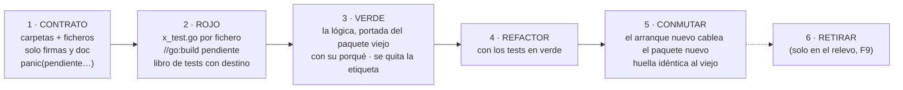

# 05 · El método: reconstrucción por contratos y TDD — no un movimiento mecánico

> 🔒 **Decisión de Jhoan Medina, 2026-09-27.** La reorganización **no se hace moviendo ficheros**:
> se aprovecha para **limpiar los tests en primera instancia**. Cada fichero del árbol nuevo se
> **crea**: primero su **contrato**, sin lógica, con **un test que lo prueba**, en rojo; después
> la lógica, hasta verde. El arranque paralelo de [`04`](04-estructura-final.md) §2 existe
> precisamente para poder ir **de a poco**.
>
> Este documento es **normativo**: quien implemente lo cumple. Donde choca con un documento
> anterior, **manda este** (la lista de lo que queda sustituido está en §7).

---

## 1 · El punto de partida de los tests (medido el 2026-09-27)

| | Hoy |
|---|---|
| Ficheros de producción (`internal/` + `cmd/`) | **349** |
| Ficheros de test | **534** |
| Funciones `Test*` de primer nivel | **3.131** (4.318 contando subtests) |
| Tests que llevan el nombre de un fichero de producción (`x.go` ↔ `x_test.go`) | **190** |
| Tests **sin** fichero homónimo (organizados por escenario, plan o guion: `guion_ambar_test.go`, `event_switch_test.go`…) | **344** |
| Ficheros de producción **sin** test homónimo | **159** |
| Ficheros de integración (se saltan solos sin Postgres, DT-52) | **107** |
| El test más grande | `internal/flujos/runtime/aggregator_test.go`, **1.993** líneas |

Hoy un test dice **qué escenario** prueba, no **qué fichero**. Para saber qué cubre
`runtime/incoming.go` hay que buscar entre 75 ficheros de test. La exigencia de §2 invierte eso.

---

## 2 · La exigencia

Cada regla es comprobable. Las que tienen candado lo dicen.

### E-1 · Nada se mueve: todo se crea

Ni `git mv`, ni reescritura de imports por script sobre el código viejo. Cada fichero del árbol
de [`04`](04-estructura-final.md) §3 se **crea** en su sitio nuevo. El código viejo **no se toca**
mientras dure la reconstrucción: es la **implementación de referencia** y el oráculo (§4).

*Única excepción*: los tres ✎ de `platform` (`httpapi/admin.go`, `httpapi/audit_mw.go`,
`metrics/inferstats.go`) se corrigen **en su sitio** en F0, porque `platform` lo comparten los dos
arranques y hoy depende de dominios (`02` §3.3).

### E-2 · Primero el contrato, sin lógica

En la primera pasada de cada módulo, cada fichero nuevo contiene **solo su contrato**:

- el comentario de paquete (en el fichero principal) y el de cada símbolo exportado, que dice
  **qué promete**, no cómo lo hace;
- tipos, interfaces, constantes, errores centinela y firmas;
- cuerpos que **no deciden nada**: `panic(pendiente.Implementar("paquete.Func"))`.

🔴 **Un cuerpo de contrato nunca devuelve un valor cero.** `return nil, nil` o `return ""` puede
hacer pasar un test por accidente («esperaba lista vacía»), y eso es exactamente lo que el TDD
prohíbe. El `panic` hace que **todo** test que toque el contrato falle, sin excepción.

`internal/pendiente` es un paquete de una función, creado en F0. **Candado** (§5): antes del
relevo, cero llamadas a `pendiente.Implementar` en el árbol.

### E-3 · Un fichero, un test

Por cada `x.go` existe `x_test.go` **en el mismo directorio**, y ese test prueba **el contrato de
`x.go`**, no el de sus vecinos. **Candado** (§5): un fichero de producción sin su test homónimo
hace fallar el gate.

Excepciones cerradas, y ninguna más sin decisión escrita:

| Fichero | Qué lleva en su lugar |
|---|---|
| `doc.go` (solo comentario de paquete) | Nada |
| `embed.go` / ficheros solo con `//go:embed` | Lo prueba el test de quien lee lo embebido |
| Fichero **solo de interfaces** (puertos) | Una **suite de contrato** exportada en un paquete `…test` (patrón `fleettest`): `func Contrato(t *testing.T, nuevo func() Puerto)`, que cada implementación ejecuta desde **su** test. Así la interfaz tiene un test y cada implementación prueba que la cumple |
| Dobles de test (`fleettest/slowrepo.go`) | Su propio test solo si tienen lógica |

### E-4 · Rojo antes que verde, y se ve

El commit que crea un contrato **incluye su test**, y ese test **falla** contra el contrato (por
el `panic` de E-2). El verde llega en un commit **posterior**, que añade la lógica. Los mensajes lo
dicen: `rojo(<módulo>): …` · `verde(<módulo>): …` · `refactor(<módulo>): …`.

### E-5 · `dev` siempre verde: el rojo vive detrás de una etiqueta

La regla del ecosistema es que toda ola aterriza en `dev`, y `dev` pasa el gate. Un test rojo no
puede romperlo, así que:

- un test en rojo lleva `//go:build pendiente` en la primera línea;
- `make ci-local` **no** lo ejecuta, pero `go vet -tags pendiente ./...` **sí lo compila**. Un test
  rojo que ni compila no es un test;
- `make test-pendiente` (nuevo) los corre y **cuenta lo que falta** por el número de llamadas a
  `pendiente.Implementar` que quedan en el árbol (cuenta estática, exacta). ⚠️ No por tests
  rojos: un `panic` **aborta el binario de test entero** del paquete, así que el primer contrato
  sin lógica tapa a los demás (verificado con el ejemplo de §9). Para ver un test concreto en
  rojo, se corre solo: `go test -tags pendiente -run '^TestX$' ./ruta`;
- al llegar a verde, el commit `verde(…)` **quita la etiqueta**, y el test entra en el gate normal.

🔴 **Nunca `t.Skip` para aparcar un rojo.** Un SKIP bajo `rc=0` es la deuda DT-52 (438 tests
saltados con la pantalla en verde). La etiqueta hace el rojo **visible y contable**; el SKIP lo
esconde.

### E-6 · Los tests de integración nuevos no se saltan nunca

Un fichero que habla con Postgres tiene un test de integración con `//go:build integracion`.
**Sin Postgres, falla; no se salta.** `make test-integracion` levanta el contenedor y los corre.
Así el código nuevo **nace sin DT-52**.

### E-7 · El test prueba comportamiento por el contrato

Se prueba lo que el fichero **promete** (sus exportados y los no exportados que sus hermanos usan),
nunca su implementación. Los tests que leen el código como texto (AST) quedan **prohibidos**,
salvo los **candados de invariante** de §3.2, que se portan como tales.

### E-8 · Ningún test viejo desaparece sin dejar rastro

Los **3.131** tests viejos son la **especificación** del comportamiento: es lo que el sistema hace
hoy en UAT. Cada uno tiene una línea en el **libro de tests** del módulo
(`documentations/reorganizacion-modular/libro/<módulo>.md`) con uno de cuatro destinos:

| Destino | Qué significa |
|---|---|
| **Portado** | Su comportamiento está en `nuevo/x_test.go:TestY` |
| **Fusionado** | Lo cubre otro test junto con otros; se dice cuál |
| **Descartado** | No prueba comportamiento (detalle de implementación, duplicado, obsoleto): **con el motivo escrito** |
| **Invariante** | Es un candado de §3.2: se porta sí o sí |

Un módulo **no cierra** con líneas sin destino.

### E-9 · La cobertura no baja

Por módulo, la cobertura de sentencias del paquete nuevo (`go test -cover`, con integración) es
**mayor o igual** que la de los paquetes viejos que sustituye. Si baja, el libro dice qué se
descartó y por qué.

### E-10 · El «porqué» viaja con la lógica

El estilo de la casa es *comentario-como-ADR* (~47 % del código de producción). En la pasada
**verde**, el comentario que explica **por qué** una línea es así viaja con ella. Cada fichero
nuevo dice en su cabecera **de dónde porta**: `// Porta internal/flujos/contact/contact.go @ <sha>`,
para que `git log` del fichero viejo siga siendo la historia.

---

## 3 · Lo que NO se limpia

### 3.1 · El comportamiento observable

Limpiar tests **no** es cambiar lo que el sistema hace. Todo lo de `03` §1 (rutas, rpc, tablas,
variables, métricas, textos de error, literal del aviso, contrato CRM, doble llave) sigue intacto.
El oráculo de §4 lo comprueba.

### 3.2 · Los candados de invariante — se portan siempre

Son la memoria de incidentes y de reglas de seguridad. Destino fijo: **Invariante**.

| Candado de hoy | Qué protege |
|---|---|
| `internal/intakes/inv1_aprobar_ast_test.go` | INV-1: la aprobación tiene una sola puerta |
| `internal/bootstrap/arranque/platform_permissions_test.go` | I-CP-5: los permisos de plataforma acaban en `.any` |
| `internal/intake/catalogo/frontera_test.go` | El índice del catálogo no entra en el turno conversacional |
| `internal/integrations/crmpush/contrato_ast_test.go` | Los campos del contrato CRM se fijan donde deben |
| `internal/iam/infra/postgres/{canje_orden,canje_una_consulta,membresia_unica}_ast_test.go` | Orden y atomicidad del canje; una membresía por usuario |
| `internal/intakes/{inv_vencimiento,sello_poda}_ast_test.go` | Vencimiento y poda de revisiones |
| `internal/flujos/runtime/streak_invariante_test.go` · `internal/flujos/modules/cart/orden_consulta_ast_test.go` · `internal/flujos/events/summary_test.go` | Invariantes del motor y del carrito |
| `internal/gateway/grpc/greeting_internal_test.go` | 🔒 El literal `AVISO_SESION_PASIVA_V1`, byte a byte |
| Los 11 `*_cableado_test.go` de `internal/bootstrap/arranque/` | El cableado del arranque; se portan al arranque nuevo |

---

## 4 · El ciclo, por módulo



**El oráculo.** Durante toda la transición, `cmd/server` corre **el código viejo** con el arranque
viejo, y `cmd/server-modular` corre **el código nuevo** con el arranque nuevo. Aquí el arranque
paralelo cobra todo su sentido: los dos binarios **no comparten los paquetes de dominio**, y la
huella (`internal/arranque/huella_test.go`: rutas, rpc, métricas, goroutines) más los dos e2e
comparan lo que hace cada uno.

🔴 Siguen sin poder correr **a la vez** contra la misma BD o los mismos puertos (`04` §2.2).

### 4.1 · Los puentes al código viejo

Un paquete nuevo **debería** importar solo paquetes nuevos, `platform` o `nucleo`. Pero el ciclo
de negocio de `02` §4 lo impide en algunos casos: `captacion` necesita el almacén de
`conversacion`, que se reconstruye después. Para eso existen los **puentes**: un import de un
paquete nuevo hacia uno viejo, **declarado** en la lista de `internal/modulos/fronteras_test.go`.

- Un puente no declarado hace fallar el gate.
- Un puente se retira cuando su destino ya se reconstruyó. Ese paso tiene un coste: el paquete
  nuevo cambia de tipos, así que se re-toca.
- En el relevo, **cero puentes**.

El orden de §6 minimiza los puentes, pero no los elimina.

---

## 5 · Los candados de la reconstrucción (nacen en F0)

| Candado | Qué hace fallar el gate |
|---|---|
| `fronteras_test.go` | Un import entre módulos fuera de la lista blanca, o un puente al código viejo no declarado |
| `un_fichero_un_test_test.go` (en `internal/modulos/`) | Un `x.go` sin `x_test.go` al lado, salvo las excepciones de E-3 |
| `sin_pendientes_test.go` | **Solo en F9**: cualquier `pendiente.Implementar` que quede |
| `huella_test.go` | Una diferencia en la huella entre los dos arranques, para un módulo ya conmutado |
| `go vet -tags pendiente ./...` en `ci-local` | Un test rojo que no compila |

---

## 6 · Las fases (sustituyen a las de `04` §2.3)

Orden **de la base hacia arriba**, para que cada módulo encuentre reconstruido lo que importa:

| Fase | Qué | Notas |
|---|---|---|
| **F0 · Andamiaje** | `cmd/server-modular` + `internal/arranque`, **copia exacta** del arranque viejo, que al principio cablea **paquetes viejos** · `internal/pendiente` · etiquetas `pendiente` e `integracion` y sus `make` · los candados de §5 · la plantilla del libro · los tres ✎ de `platform` en su sitio | No se crea ningún módulo |
| **F1 · `nucleo` — el piloto** | `nucleo/contact` completo: contrato → rojo → verde → conmutar | **4 ficheros de producción, 6 de test, solo depende de `platform`.** Es la vuelta corta que calibra el método: cuánto cuesta un fichero, si la plantilla del libro sirve, si los candados molestan. **Tras F1, parada para decidir si se sigue igual** |
| **F2 · `acceso`** | `iam/**`, `platformadmin`, `entitlements` | `iam` ya es hexagonal: sus puertos piden suites de contrato (E-3) |
| **F3 · `edge`** | `grpc`, `enroll`, `lease`, `session`, `fleet`, `diagnostics`, `inferstats`, `receipts`, `ingest`, `filtercfg` | 🔒 `lease` es la mitad servidora de la doble llave: se porta sin cambiar comportamiento |
| **F4 · `inferencia`** | `llmvia/**`, `prompts`, `tenantllm`, `degradation` | — |
| **F5 · `catalogo`** | El modelo extraído del carrito, `indice`, `catalogimport` | Puente a `conversacion/model` hasta F8 (o se reconstruye `model` aquí: es una hoja) |
| **F6 · `solicitudes`** | `intakes/**` (con `note.go`), `integrations/**`, `contracts`, `tenantvars` | Puente de `telemetria` a `conversacion/store` hasta F8 |
| **F7 · `captacion`** | `intake`, `pipeline`, `stages`, `anclaje`, `intakeahead`, `evidence`, `reanalisis`, `casebank`, `intentcfg` | Puentes a `conversacion` hasta F8 |
| **F8 · `conversacion`** | `flujos/**` y `turnoacotado` | La mayor: **23 ficheros de producción y 75 de test solo en `runtime`**. Al cerrar, se retiran todos los puentes |
| **F9 · Relevo** | `cmd/server` → `internal/arranque` · se borran los paquetes viejos, `internal/bootstrap` y `cmd/server-modular` · `sin_pendientes_test` activo | Un despliegue de UAT con el binario de siempre |

Dentro de cada módulo, la pasada de **contratos de todo el módulo** va primero (y puede ser una
sola ola), y la de **verde** va **fichero a fichero**, cada uno en su commit.

---

## 7 · Lo que esta decisión cambia en los documentos anteriores

| Documento | Qué queda sustituido |
|---|---|
| [`01`](01-factibilidad.md) §1 y §4 | El «tiempo A · mover, mecánico, coste bajo-medio». **El método es reconstrucción**, y su coste es **alto** (§8) |
| [`04`](04-estructura-final.md) §2.3 | La tabla de fases → sustituida por §6 |
| [`04`](04-estructura-final.md) §4 | La tabla de correspondencia ya no alimenta un script de movimiento: sirve para saber **qué paquete viejo** es la referencia de cada paquete nuevo |
| [`04`](04-estructura-final.md) §3 | **El árbol destino sigue valiendo**, con una excepción abierta: `publicapi` (§8.2) |
| [`03`](03-pendientes-y-contratos.md) D-4 | «No renombrar paquetes» se relaja: un paquete nuevo **puede** llevar otro nombre, siempre que **los textos observables** (errores que ve un humano) no cambien |

---

## 8 · Lo que cuesta, dicho claro

### 8.1 · Escala y duración

Es una reconstrucción de **349 ficheros de producción** y una reorganización de **3.131 tests**
(344 de ellos sin fichero homónimo que los acoja), con **dos copias del dominio** vivas hasta el
relevo. Mientras dure:

- **todo arreglo se hace dos veces** (en lo viejo, que es lo que corre en UAT, y en lo nuevo si ya
  está portado), y toda funcionalidad nueva se congela o se cablea dos veces;
- **se pierde el `git blame` directo** del fichero nuevo (lo mitiga la cabecera de E-10);
- el riesgo deja de ser «romper un import», que el compilador caza, y pasa a ser **portar mal un
  comportamiento**, que solo cazan los tests. Por eso el libro (E-8), la cobertura (E-9) y el
  oráculo (§4) no son opcionales.

Por eso **F1 es un piloto con parada**: el coste real por fichero se mide ahí, y con ese dato se
decide si el resto sigue igual, se acelera o se acota.

### 8.2 · `publicapi` no puede quedarse como está

`publicapi` (33 ficheros de producción, 64 de test) importa **directamente** los tipos de los
dominios. El arranque viejo necesita que hable con los paquetes viejos, y el nuevo, con los
nuevos. **No puede hacer las dos cosas.** Con este método, la decisión D-6 («cara HTTP única, no se
reparte») deja de sostenerse, y la salida natural es que **cada módulo tenga su transporte HTTP**
(`modulos/<m>/http/`, como ya hace `iam/transport/http`), que el arranque nuevo monta. El
`publicapi` viejo sigue sirviendo al arranque viejo hasta el relevo. Queda como decisión **D-10**
en `03`.

### 8.3 · Lo que el método gana

- **Tests que se encuentran**: para saber qué cubre `x.go`, se abre `x_test.go`.
- **Contratos escritos antes que la lógica**: cada módulo expone lo que promete antes de decidir
  cómo, que es justo la conversación de fronteras que ADR-0010 pedía.
- **El código nuevo nace sin DT-52**: sin SKIP silenciosos (E-5, E-6).
- **Un inventario honesto de los tests**: el libro dice, por primera vez, qué prueba cada uno y
  cuáles sobraban.

---

## 9 · Ejemplo: un fichero de principio a fin

`internal/evidence/evidence.go` (80 líneas, dos funciones) → `modulos/captacion/evidence/`.

**Commit `rojo(captacion): contrato de evidence`** — `evidence.go`:

```go
// Package evidence es la regla de la evidencia: ¿la frase que el modelo dice citar
// está de verdad en el texto del cliente?
//
// Porta internal/evidence/evidence.go @ <sha>.
package evidence

import "github.com/EduGoGroup/wapp-cloud-platform/internal/pendiente"

// Normalize baja a minúsculas y colapsa cualquier secuencia de blancos en un espacio.
// Es la ÚNICA normalización: texto y frase pasan por ella antes de compararse.
func Normalize(s string) string {
	panic(pendiente.Implementar("evidence.Normalize"))
}

// Contains dice si la frase, normalizada, aparece en un texto YA normalizado.
// Una frase vacía tras normalizar no es evidencia: devuelve false.
func Contains(textoNorm, frase string) bool {
	panic(pendiente.Implementar("evidence.Contains"))
}
```

`evidence_test.go`, con la etiqueta, portando los dos tests viejos
(`TestNormalize_ColapsaBlancosYBaja`, `TestContains_LasTresDecisionesDeLaRegla`):

```go
//go:build pendiente

package evidence

import "testing"

func TestNormalize(t *testing.T) {
	casos := []struct{ entrada, quiere string }{
		{"  Hola   MUNDO ", "hola mundo"},
		{"a\t\nb", "a b"},
		{"", ""},
	}
	for _, c := range casos {
		if got := Normalize(c.entrada); got != c.quiere {
			t.Errorf("Normalize(%q) = %q, quiere %q", c.entrada, got, c.quiere)
		}
	}
}

func TestContains(t *testing.T) {
	texto := Normalize("Quiero 2 hamburguesas con QUESO para el sábado")
	if !Contains(texto, "hamburguesas  con queso") {
		t.Error("una frase presente, con otro espaciado y otra caja, es evidencia")
	}
	if Contains(texto, "sin cebolla") {
		t.Error("una frase ausente no es evidencia")
	}
	if Contains(texto, "   ") {
		t.Error("una frase vacía tras normalizar no es evidencia")
	}
}
```

`make test-pendiente` → **2 pendientes** (las dos llamadas a `pendiente.Implementar`), y los
dos tests caen por el `panic` si se corren solos. `make ci-local` → verde: sin la etiqueta, Go
responde `no test files`. (Las tres afirmaciones, comprobadas con este mismo ejemplo el
2026-09-27: rojo contra el contrato, verde contra la lógica vieja, `vet -tags pendiente` limpio.)

**Commit `verde(captacion): evidence`** — se sustituyen los `panic` por la lógica del paquete
viejo **con sus comentarios del porqué**, se quita `//go:build pendiente`, y el libro de
`captacion` anota: `TestNormalize_ColapsaBlancosYBaja` → **Portado** a
`evidence_test.go:TestNormalize`; `TestContains_LasTresDecisionesDeLaRegla` → **Portado** a
`evidence_test.go:TestContains`.
