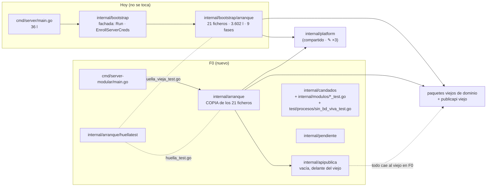
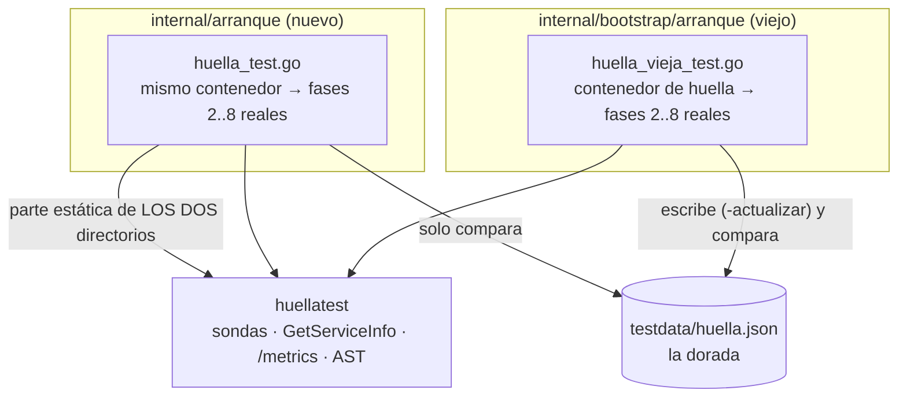

# F0 · Andamiaje — arquitectura (la vista macro)

> F0 **no crea ningún módulo**. Crea lo que todas las fases siguientes necesitan: el segundo
> arranque, el paquete `pendiente`, los candados y la huella, la cara HTTP nueva vacía, y corta
> las tres dependencias de `platform` hacia dominios. Medido sobre `dev` @ `1b18932`
> (2026-09-27/28) salvo donde se dice otra cosa.

## 1 · Lo que existe hoy, y lo que F0 añade

| Qué | Hoy | Tras F0 |
|---|---|---|
| Binarios de servidor | `cmd/server` | `cmd/server` (igual) + `cmd/server-modular` |
| Arranques | `internal/bootstrap/arranque` | los dos; el nuevo **cablea paquetes viejos** |
| Módulos (`internal/modulos/<m>/`) | — | **ninguno** (solo `doc.go` y tres candados) |
| Cara HTTP `:8103` | `publicapi` viejo | `apipublica` (vacía) **delante** del viejo |
| Candados de la reconstrucción (`05` §5) | — | siete activos; `sin_pendientes_test` nace en F10 |
| `platform → dominio` | 3 aristas (`02` §3.3) | **0** |
| Ficheros viejos tocados | — | 3 de `platform` (✎) + 3 líneas de alias en dominio (D-F0-3) + 1 test añadido al arranque viejo (D-F0-2) |

## 2 · El arranque viejo, inventariado

`ls internal/bootstrap/arranque/*.go | grep -v _test | wc -l` → **21** ficheros de producción,
**3.602** líneas (`wc -l`), más `internal/bootstrap/bootstrap.go` (42 l, la fachada de dos
símbolos). Tests: **20** ficheros, **54** funciones `Test*`
(`grep -h '^func Test' internal/bootstrap/arranque/*_test.go | wc -l`).

### 2.1 · Las nueve fases (`orquestador.go:51-61`)

| # | Fichero | `requiere()` | Marca | Qué cablea | Red / entorno al arrancar |
|---|---|---|---|---|---|
| 1 | `fase1_infraestructura.go` | — | `db metricas pki lease enroll` | `metrics.New()` · `setupDatabase` (abre y **migra**, `database.go:25-36`) · `RegisterDBStats` (6 series `wapp_db_*`) · `loadPKI` (ficheros `WAPP_PKI_*`) · `buildLeaseManager` (`WAPP_LEASE_PRIVATE_KEY_FILE`/`_B64`; efímera en dev) · `buildEnrollServer` + par X25519 (`WAPP_CLOUD_ENC_PRIVKEY_B64`) | 🔴 **Postgres** (ping + 84 migraciones) |
| 2 | `fase2_autenticacion.go` | `db` | `auth` | `buildAuthStack` (`auth.go:108`): ES256 (`WAPP_JWT_EC_PRIVATE_KEY_FILE`; efímera en dev), `MultiVerifier`, `AuditService`, `ContextTokenService`, `httpapi.Middleware`; canje si `WAPP_IDENTITY_JWKS_URL`; delegación si `WAPP_IDENTITY_URL`; M2M si `WAPP_IDENTITY_URL`+`WAPP_IDENTITY_API_KEY` · `buildJWKSConfig` | ⚠️ **JWKS de identity** solo si `WAPP_IDENTITY_JWKS_URL` (fetch *eager*, `auth.go:290`) |
| 3 | `fase3_almacenes.go` | `db` | `cipher almacenes` | `buildFlowRuntimeDeps` (`flows.go:51`): KeyProvider (`WAPP_KEK_*`) + `FieldCipher` + **R2** + resolver de contactos; y **16** objetos de salida (almacenes `NewPostgres…(db)` y el notificador de degradación) | 🔴 **R2/S3**: `flows.go:75` → `NewR2PresignClient` → `HeadBucket` virtual-hosted (`r2_factory.go:51,64`); ⚠️ GCP KMS si `WAPP_KEK_PROVIDER=kms` |
| 4 | `fase4_gateway.go` | `lease enroll cipher almacenes auth metricas` | `gateway` | `inferstats.New()` + `RegisterInferenceStats` (5 `NewDesc`) · `gatewaygrpc.New(session.NewRegistry(…), …)` con 12 opciones | — |
| 5 | `fase5_captacion.go` | `gateway almacenes cipher` | `selector captacion` | compositor del literal · `llmvia.NewSelector` (frame = gateway) · `turnoacotado` · P2/P3/P4/match/draft · caché de catálogo · aforo K=1 · `pipeline.NewWorker` · `reanalisis` · `quotetext` | lee `WAPP_LLM_PROMPTS_DIR` (aborta si inválido, `prompts.go:25`) |
| 6 | `fase6_solicitudes.go` | `gateway almacenes` | `solicitudes` | gate CRM · notificador · recordatorios · `intakes.NewService` (cierra el campo diferido `intakeService`) | — |
| 7 | `fase7_flujos.go` | `gateway selector almacenes solicitudes` | `flujos` | registry con **4** módulos (`:47,48,58,59`) · engine · `durableFlowChecker` · limitador · `intakeahead` + agregador (campo diferido) · despachador · `flowruntime.New` con 22 opciones · `SetFlowAutoreplyStreakMaxSource` · hooks `OnIncoming`, `OnHeartbeat`, `OnWarmup`, `OnEdgeReady` | — |
| 8 | `fase8_transporte.go` | `gateway flujos auth pki almacenes` | `transporte` | 2 `grpc.Server` + 2 `net.Listen` · `platformRepo` · `filtersPusher` · `buildPublicAPIServer` (`http.go:28`) · `servidorAdmin` (`:101`) | abre `:8102` y `:8101` (`WAPP_GRPC_*_ADDR`) |
| 9 | `fase9_fondo.go` | `almacenes selector flujos` | — | las **5** goroutines de fondo | — |

Después, `servir.go:35` pone a escuchar los cuatro listeners y bloquea; el prólogo
(`orquestador.go:71-84`) hace `config.Load()`, `logging.New` y `signal.NotifyContext`.

### 2.2 · Los demás ficheros de producción

`auth.go` (834 l: auth stack, JWKS, cadena de config al Edge, plano de roles, canje, empresa
activa) · `contenedor.go` (197 l: el estado compartido, dos **campos diferidos**
`intakeService` `:128` e `intakeAggregator` `:142`) · `database.go` · `flowforkind.go` ·
`flows.go` · `http.go` (servidor público y `adminHandler` `:216`) · `lease.go` · `orquestador.go`
· `pki.go` (exporta `EnrollServerCreds` `:22`) · `prompts.go` · `rutas_admin.go` (las 22 rutas
de `:8100`, `registerAdminRoutes` `:63`) · `servir.go`.

Exportados del paquete: **dos**, `Ejecutar` (`orquestador.go:66`) y `EnrollServerCreds`
(`pki.go:22`); la fachada `internal/bootstrap` los re-exporta.

### 2.3 · Superficie que expone (la huella de hoy)

| Componente | Cifra | Cómo se contó (regla: lo que se registra **en ejecución**) |
|---|---|---|
| Rutas HTTP | **95**: **22** en `:8100` + **73** en `:8103` | Prototipo en proceso (2026-09-28, copia de `dev` en un directorio temporal): fases 2 y 4–8 **reales**, fase 1 y `flowDeps` de la 3 simulados sin red; cada patrón candidato se sondea contra `httpSrv.Handler` y `publicSrv.Handler` (`httptest`), y cuenta si el mux **no** responde su propio 404 ni un 405 con `Allow`. Candidatos: los literales de `Handle`/`HandleFunc` de `internal/` sin tests (`go/ast`) → **95**, y los **95** se montan. Coincide con `contratos.md` (95), que contó por grep con corrección a mano |
| rpc gRPC | **2**: `wapp.cloudlink.v1.Enrollment/EnrollEdge` (`:8102`) · `wapp.cloudlink.v1.CloudLink/Connect` (`:8101`) | `grpc.Server.GetServiceInfo()` de `enrollGS` y `connectGS` en el mismo prototipo |
| Métricas | **22** nombres declarados (11 en `metrics.New()` + 6 `wapp_db_*` + 5 `NewDesc` de `wapp_edge_*`); **11** familias `wapp_*` visibles en `/metrics` en frío tras las sondas | `# TYPE wapp_` en el cuerpo de `GET /metrics` del prototipo. Los `CounterVec` sin muestras **no aparecen** (trampa 6 de `constitucion.md`) |
| Goroutines del arranque | **10** sentencias `go`: 5 de fondo (`fase9_fondo.go:54,63,75,84,99`), 4 de servicio (`servir.go:46-49`), 1 del apagado (`servir.go:93`) | `grep -rn '^\s*go ' internal/bootstrap/arranque/*.go` sin tests. Ningún constructor de dominio lanza goroutines al construirse (medido: las 9 `go` de `internal/` fuera del arranque están en caminos de petición) |
| *Hooks* de métricas | **14** usos de **12** métodos de `*metrics.Metrics` | `grep -o 'mtx\.[A-Za-z]*'` sobre los ficheros de producción del arranque |
| Lectura de entorno | solo `platform/config` (`config.go:735` + el loader) | `grep -rn 'os.Getenv\|os.LookupEnv' --include='*.go' internal cmd` sin tests → 1 línea |

## 3 · El arranque nuevo en F0

- **`internal/arranque`** = copia de los 21 ficheros (tabla §2.1), mismo nombre de paquete
  (`arranque`), mismos imports: **cablea los paquetes viejos**. No hay reescritura de imports ni
  en lo viejo ni en lo nuevo. Cada fichero lleva la cabecera de origen (E-10).
- **Única desviación de la copia en F0**: `http.go` monta `internal/apipublica` delante del
  `publicapi.Register` viejo (§5). La huella debe salir **idéntica** con esa desviación.
- **`cmd/server-modular/main.go`**: copia de `cmd/server/main.go` que llama a
  `arranque.Ejecutar` del paquete nuevo. No importa `internal/bootstrap` (lo comprueba T0.11).
- **Tests del arranque nuevo**: 19 de los 20 viejos, copiados (los 10 AST de cableado y
  permisos, `astpaquete_test.go`, y los unitarios de sus funciones puras), **menos**
  `pool_metrics_integration_test.go` (`t.Skipf` sin `WAPP_TEST_DB_DSN`: prohibido en código
  nuevo). Es la excepción D-F0-1: ver [`README.md`](README.md).
- **Evolución después de F0**: en cada `conmutar(<m>)`, la fase del módulo pasa a cablear los
  paquetes nuevos; el orden de `fases` y los `requiere()` se conservan (el reparto por módulo de
  `04` §3 —`fase3_edge.go`, `fase4_inferencia.go`…— lo decide cada fase, no F0).

## 4 · Estado en memoria y goroutines: por qué los dos binarios no conviven

🔴 **Nunca a la vez contra la misma BD ni los mismos puertos** (`04` §2.2). Medido en el código:

| Qué duplicaría un segundo proceso | Dónde | Consecuencia |
|---|---|---|
| Migraciones al arrancar | `database.go:36` | dos runners full-replay con `pg_advisory_lock` sobre la misma base |
| Los cuatro listeners | `fase8_transporte.go:49,68` · `http.go:198` · `fase8_transporte.go:155` | `address already in use` (el menor de los males) |
| El agregador de ventanas **en memoria** | `fase9_fondo.go:75` | dos ventanas por conversación: las ráfagas se parten |
| El worker W=1 y el aforo K=1 **de proceso** | `fase9_fondo.go:99` · `fase5_captacion.go:257` | W=2 real contra un Edge con una plaza (I-CP-4, ADR-0046) |
| El registro de sesiones vivas del gateway | `fase4_gateway.go:48` | el Edge solo conecta a uno: el otro no puede enviar |
| `flowruntime.Runtime` (ventanas y rachas en memoria) | `fase7_flujos.go:105` | dos máquinas de estado sobre las mismas conversaciones |

Por eso la huella de F0 **no levanta servidores**: se calcula en proceso (§6).

## 5 · La cara HTTP en F0 (lo que F0 necesita de D-10)

El mecanismo del estrangulador y el mapa ruta a ruta son de
[`../FX-cara-http/`](../FX-cara-http/README.md). Para F0 basta con esto:

- `internal/apipublica` nace **vacía**: no registra ninguna ruta.
- El arranque nuevo compone el handler del `:8103` con `apipublica` **delante** y el `publicapi`
  viejo detrás: una ruta que la cara nueva no registra **cae** al viejo. En F0 eso es **todo**.
- Los envoltorios globales del `:8103` (`InstrumentHTTP("public") → PublicRateLimit → mux`,
  `http.go:192-195`) se conservan **por fuera** de la composición: la métrica y el
  rate-limit siguen contando igual.
- La huella de F0 debe salir **idéntica** a la dorada: 73 rutas en `:8103`.

## 6 · La huella: cómo se compara lo que no puede correr a la vez

- **Parte de ejecución** (rutas por listener, rpc por listener, familias de `/metrics`): la
  calcula cada lado **dentro de su paquete** (el contenedor es privado), con las fases 2–8
  reales; la del viejo se guarda en la dorada y la del nuevo se compara con ella. Si alguien
  cambia el arranque viejo (un arreglo «hecho dos veces», `05` §9.1), `TestHuellaVieja` falla
  hasta regenerar la dorada, y entonces `TestHuella` falla hasta que el nuevo recibe lo mismo:
  es la ventana de congelación de `03` P-5 convertida en gate.
- **Parte estática** (goroutines, *hooks* de métricas, lectura de entorno): la calcula
  `huella_test.go` sobre la fuente de **los dos** directorios (`go/ast`, permitido a los
  candados, E-7) y las compara entre sí.
- **Lo que no se puede comparar así** está en [`diseno.md`](diseno.md) §6.5, con quién lo
  cubre.

## 7 · Los tres ✎ de `platform` (`02` §3.3)

| ✎ | Dependencia hoy | Corte | Toca además (una línea, D-F0-3) |
|---|---|---|---|
| `platform/httpapi/admin.go` | import `:13` `internal/gateway/session`; uso `:306` `errors.Is(err, session.ErrSessionOffline)` | el centinela se declara en `platform` y `admin.go` compara contra él | `gateway/session/registry.go:22`: `ErrSessionOffline` pasa a **ser** el de `platform` (mismo texto `"sesión offline"`) |
| `platform/httpapi/audit_mw.go` | import `:8` `internal/iam/ports/in`; `in.AuditInput` en `:34` (interfaz `AuditRecorder`) y `:85` | el DTO de auditoría (6 campos, `usecases.go:129-136`) se declara en `platform` | `iam/ports/in/usecases.go:129`: `AuditInput` pasa a ser **alias** del de `platform` |
| `platform/metrics/inferstats.go` | import `:9` `internal/inferstats`; `:16` `type FuenteInferencia func() inferstats.Agregado` | el tipo `Agregado` (`inferstats.go:144`) se declara en `platform/metrics` con su comentario | `internal/inferstats/inferstats.go:144`: `Agregado` pasa a ser **alias** |

Tras los tres, `platform` no importa ningún paquete de dominio, y la base queda en capas
`platform ← nucleo ← acceso ← edge` (`02` §4, ciclo 1). Los alias son lo que deja que los
paquetes **viejos** y los **nuevos** (que declararán el mismo alias) entreguen el mismo tipo a
un `platform` compartido. Ni una línea del arranque viejo cambia.

## 8 · Lo que no cambia hacia fuera

Ni una ruta, ni un rpc, ni una tabla, ni una variable `WAPP_*`, ni una métrica, ni un texto de
error (`03` §1). `cmd/server` sigue siendo el binario que se despliega (`go build -o bin/server
./cmd/server`) y sigue cableando **el código viejo**: en F0 no llega a UAT nada nuevo salvo los
tres ✎, cuya equivalencia la prueban la huella (T0.17–T0.19) y la integración vieja (T0.22).
