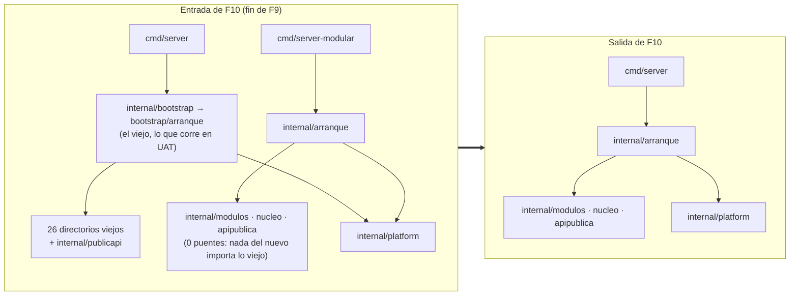

# F10 · Arquitectura — qué se borra, en qué orden, y lo que no cambia

## 1 · Antes y después

Con **cero puentes** a la entrada (condición de F8), el grafo del binario nuevo ya no toca ningún
paquete viejo: el borrado de F10 no rompe `cmd/server-modular` ni un solo test nuevo. Lo único que
todavía importa lo viejo es **el arranque viejo, sus binarios y sus tests**, y eso es justo lo que se
borra.

## 2 · Quién importa lo viejo hoy (medido el 2026-09-28)

| Consumidor | Importa | Qué hace F10 |
|---|---|---|
| `cmd/server/main.go` | `internal/bootstrap` | Pasa a `internal/arranque` (`arranque.Ejecutar`) |
| `cmd/server/integration_test.go` | `internal/bootstrap` (`EnrollServerCreds`), `internal/gateway/{enroll,fleet,grpc,lease,session}` | ✎ contra los paquetes nuevos de `internal/modulos/edge/**` y `internal/arranque` (D-F10-4) |
| `cmd/server/flows_integration_test.go` | `internal/flujos/{contact,engine,model,modules,modules/menu,runtime,store}` + BD | Se borra (D-F10-4): P3 cubre su escenario |
| `cmd/casebank/main.go` (+ `main_test.go`) | `internal/casebank` | Re-apuntar a `internal/modulos/captacion/casebank` **si F7 no lo hizo** |
| `cmd/prompts/main.go` | `internal/prompts` | Re-apuntar a `internal/modulos/inferencia/prompts` **si F4 no lo hizo** |
| `cmd/migrate`, `cmd/debug_inferencia` | Solo `internal/platform/**` o nada | Nada |
| `test/procesos/main_test.go` | Compila `cmd/server` **y** `cmd/server-modular` | Solo `cmd/server`; fuera `WAPP_PROCESOS_BINARIO` |
| `internal/arranque/huella_test.go` | La huella medida por `internal/bootstrap/arranque/huella_vieja_test.go` (F0, D-F0-2) | Compara contra una **dorada** (`testdata/huella-vieja.golden`), generada antes de borrar |

Comando: `for d in cmd/*/; do GOWORK=off go list -f '{{join .Imports "\n"}}{{"\n"}}{{join .TestImports "\n"}}' ./$d | grep wapp-cloud-platform/internal; done`.

## 3 · El orden de los commits (cada uno deja `dev` verde)

| # | Commit | Por qué en este orden |
|---|---|---|
| 1 | `relevo: la huella del viejo, congelada` — genera `internal/arranque/testdata/huella-vieja.golden` desde el viejo y enseña a `huella_test` a comparar **también** contra ella | Después del borrado ya no hay viejo que medir. Mientras existan los dos, el test comprueba que la dorada y el viejo en ejecución coinciden: la dorada nace verificada |
| 2 | `relevo: cmd/server usa el arranque nuevo` — `main.go`, `integration_test.go` ✎, borra `flows_integration_test.go`, re-apunta `cmd/casebank` y `cmd/prompts` si hace falta | Desde aquí los dos binarios corren **el mismo** arranque; `make test-procesos` lo confirma (pasa dos veces igual) |
| 3 | `relevo: fuera cmd/server-modular y la variable del arnés` | Ya no aporta nada; el arnés se simplifica |
| 4 | `relevo: fuera la cara vieja y el estrangulador` — TX.25 de [`FX-cara-http`](../FX-cara-http/tareas.md) | Tras F8 no sirve ninguna ruta del binario nuevo |
| 5 | `relevo: fuera el arranque viejo` — `internal/bootstrap/**` (22 de producción + 21 tests: los 20 de hoy más `huella_vieja_test.go` de F0), incluidos `platform_permissions_test.go` y los **9** `*cablead*_test.go` viejos (`ls internal/bootstrap/arranque/*cablead*_test.go \| wc -l` → 9; «11» son los que leen AST, F0 README contradicción 1) | Sus reglas viven ya en `internal/arranque` (F0) |
| 6 | `relevo: fuera los paquetes viejos` — los 26 directorios restantes, con sus tests | Nada los importa desde el commit 5 |
| 7 | `relevo: cero pendientes` — `sin_pendientes_test.go` activo y, con D-F10-3, fuera `internal/pendiente`, la etiqueta y sus targets | Solo tiene sentido con todo lo viejo fuera |
| 8 | `relevo: la integración vieja, retirada` — `Makefile`, `ci.yml` (y los 9 tests de BD de `platform` si D-F10-5) | El relevo deja **una** forma de probar contra Postgres |
| 9 | `docs(reorganizacion-modular): relevo` + las rutas nuevas en la doc del repo | La doc dice lo que hay |

Los commits 5 y 6 pueden ser uno si el diff se revisa por directorio; separados, un `git revert` del 6
no resucita el arranque viejo.

## 4 · Los candados tras el relevo

| Candado (`05` §5) | Antes de F10 | Después |
|---|---|---|
| `internal/modulos/fronteras_test.go` | Lista blanca + lista de puentes | Lista de puentes **vacía** y prohibida de crecer (caso `muerde`) |
| `internal/modulos/un_fichero_un_test_test.go` · `exportados_cubiertos_test.go` | Sobre el árbol nuevo | Igual |
| `make cobertura-ficheros` | ≥ 80 % por fichero en verde | Igual (ya no hay ficheros en rojo) |
| `internal/arranque/huella_test.go` | Viejo en ejecución ↔ nuevo | **Dorada** ↔ arranque único. La dorada solo se regenera con decisión escrita (cambiar una ruta, rpc, métrica o variable es cambiar un contrato: `03` §1) |
| `go vet -tags pendiente` | En `ci-local` | Fuera con D-F10-3 |
| `test/procesos/sin_bd_viva_test.go` | Sobre `test/procesos` | Igual |
| `sin_pendientes_test.go` | No existe (nace aquí, F0 `reglas.md`) | Activo |
| I-CP-5, cableado (`05` §3.2) | En el arranque nuevo (F0) y en el viejo | Solo en el nuevo |

## 5 · Estado en memoria, goroutines y UAT

El relevo no cambia el estado en memoria ni las cinco goroutines de fondo: son las del arranque nuevo,
que ya estaban en `cmd/server-modular` y que la huella comparó con las del viejo. Lo que sí importa en
UAT es que **un reinicio pierde lo que vive en memoria** (sesiones gRPC vivas, disponibilidad de
inferencia por Edge, cachés): pasa en cualquier reinicio, el Edge reconecta solo y el lease sigue
valiendo porque la clave de firma sale del `.env` de la máquina (`WAPP_LEASE_PRIVATE_KEY_*`: por eso
la prueba mira la línea `key_source`). El esquema **no cambia** (las 84 migraciones de `internal/platform`
son las mismas para los dos binarios), y por eso la marcha atrás es solo un binario.

## 6 · Lo que no cambia hacia fuera

- Las **95 rutas**, los **2 rpc**, las **47 tablas** y el esquema **0.48.0**, las variables de entorno
  (71 efectivas, ver F9 README contradicción 8), los nombres de métricas, los textos de error, el
  literal `AVISO_SESION_PASIVA_V1`, el contrato `wapp-crm-v1` y la doble llave (`03` §1). Lo prueban la
  dorada de la huella y los procesos.
- **El despliegue**: `GOWORK=off go build -o bin/server ./cmd/server` y `systemctl restart wapp-cloud`
  (D-9). Ni la unidad systemd, ni el `EnvironmentFile`, ni la ruta del binario cambian.
- `cmd/migrate`, `cmd/prompts`, `cmd/casebank`, `cmd/debug_inferencia`: mismos nombres, flags y salida.
- `internal/platform/**` (27 ficheros de producción + 34 de test) no se toca, salvo sus 9 tests con BD
  si D-F10-5.
