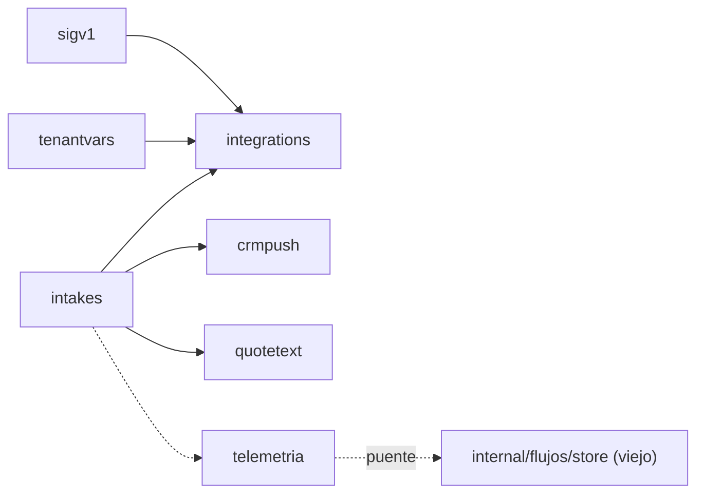

# F6 · Arquitectura — paquetes, imports, puentes, costuras, cableado y rutas

> Medido sobre `dev` @ `1b18932` el 2026-09-28. `S` = `internal/modulos/solicitudes`. Regla de
> conteo del grafo (`02` §5): una arista A → B existe si un fichero **de producción** de A importa B.

## 1 · Paquetes viejos → nuevos

| Viejo (referencia, no se toca) | Nuevo | Prod. | Líneas | Tests viejos (`func Test`) | Qué es |
|---|---|---:|---:|---|---|
| `internal/intakes` | `S/intakes` | 23 | 8.733 | 50 ficheros (316); 23 llaman a `openTestDB`; 4 AST | La **solicitud** (pedido = presupuesto, ADR-0031): cabecera, líneas, 11 estados, revisiones, acciones de la dueña, PII del comprador cifrada, notificador y recordatorios |
| `internal/flujos/modules/cart/note.go` | `S/intakes/note.go` | 1 | 150 | `cart/notes_test.go` (14) | `SanitizeNote`: el contrato de las dos columnas `intake_items.customization` e `intakes.customer_note` (`04` §5.3) |
| `internal/intakes/quotetext` | `S/intakes/quotetext` | 4 | 1.401 | 8 (40) | **P5**: la cotización con la voz de la dueña |
| `internal/intakes/telemetria` | `S/intakes/telemetria` | 1 | 103 | 1 (4) | Adaptador que escribe los eventos de bandeja en `flow_events` |
| `internal/integrations` | `S/integrations` | 6 | 1.163 | 6 (33); 4 de integración | El puente CRM: `tenant_integrations`, outbox durable `webhook_outbox` y su **worker** |
| `internal/integrations/crmpush` | `S/integrations/crmpush` | 2 | 409 | 3 (18); 1 AST | El payload `intake.push` y el empuje de revisiones de la dueña |
| `internal/integrations/sigv1` | `S/integrations/sigv1` | 1 | 57 | 1 (7) | HMAC-SHA256, ventana ±300 s, tiempo constante |
| `internal/tenantvars` | `S/tenantvars` | 3 | 219 | 1 (5, integración) | Variables del tenant (`GET/PUT /api/v1/tenant-variables`, y el worker las lee) |
| `internal/contracts` | — **desaparece** | 0 | 0 | 1 (5) | Solo un test: ejemplos `wapp-crm-v1` contra su esquema → D-F6-3 |
| **Total** | | **41** | **12.235** | | |

Comando: `for d in …; do ls $d/*.go | grep -v _test.go | wc -l; cat … | wc -l; grep -h '^func Test' $d/*_test.go | wc -l; done`
(el de `diseno.md` §1). Exportados: **404** (regla en `diseno.md` §1).

Árbol nuevo (de `04` §3 con D-F6-3 y D-F6-6):

```
internal/modulos/solicitudes/
├── intakes/            24 ficheros (+ buyerdata_postgres.go si D-F6-6) · intakeshelpertest/ (suite de Store)
│   ├── quotetext/      borrador · precios · quotetext · render
│   └── telemetria/     telemetria                       ← único PUENTE de import (→ internal/flujos/store)
├── integrations/       crud · gate · outbox_stats · postgres · store · worker · integrationshelpertest/ (suite + doble NUEVO)
│   ├── crmpush/        desde_intakes · push
│   └── sigv1/          sigv1
└── tenantvars/         memory · postgres · tenantvars · tenantvarshelpertest/
```

## 2 · Imports hacia fuera del módulo (producción, medido con `go list`)

`GOWORK=off go list -f '{{.ImportPath}}|{{join .Imports ","}}' ./internal/intakes/... ./internal/integrations/... ./internal/tenantvars/...`

| Paquete viejo | Importa (interno) | En el nuevo | Clase |
|---|---|---|---|
| `intakes` | `internal/flujos/contact` (`notifier.go`: `PostgresResolver`, `Ref`) | `internal/nucleo/contact` (F1) | permitido (nucleo) |
| `intakes` | `internal/platform/crypto` (`FieldCipher`) · `internal/platform/storage/postgres` (`WithTx`×5, `IsUniqueViolation`) | igual | permitido (platform) |
| `intakes` | `wapp-cloudlink/…/cloudlinkv1` (`Ack`, en `MessageSender.SendText`, `notifier.go:102-104`) · `wapp-shared/logger` · `google/uuid` | igual | externo |
| `intakes/quotetext` | `internal/intakes` · `wapp-shared/llm` (`LLMProvider`, `GenerateQuoteTextInput`, `ParseQuoteText`…) | `S/intakes` | interno del módulo |
| `intakes/telemetria` | **`internal/flujos/store`** (`FlowEvent` en `Outbox.InsertFlowEvent`, `telemetria.go:64-66`) | **igual (viejo)** | 🔶 **PUENTE** hasta F8 |
| `integrations` | `intakes`, `integrations/sigv1`, `tenantvars`, `platform/crypto` | `S/…` | interno + platform |
| `integrations/crmpush` | `intakes` (`CRMPusher`, `Detail`, `NormalizeStatus`, `Item`) | `S/intakes` | interno |
| `sigv1` | — | — | hoja |
| `tenantvars` | `platform/storage/postgres` (`WithTx`) | igual | platform |

**Lista blanca de F6 en `fronteras_test.go`**: `solicitudes → {platform, nucleo}`; ninguna arista a
otro módulo nuevo. Y un **puente** declarado:
`internal/modulos/solicitudes/intakes/telemetria → internal/flujos/store` — «nace F6 · muere F8
(al reconstruir `conversacion/store`, se re-toca `telemetria.go` para importar el nuevo)».

Nota: ni `intakes` ni `integrations` importan `llmvia`: P5 recibe el selector por un puerto
estructural (`ProviderSelector.For(ctx, tenantID, originSessionID) (llm.LLMProvider, error)`,
`quotetext.go:219`). Por eso F6 **no** depende de un tipo de `inferencia`.

## 3 · Orden interno (grafo dentro del módulo)



- **Contratos (hojas primero)**: `sigv1` → `tenantvars` → `intakes` (dentro: `status`, `note`,
  `revisions`, `shipping`, `literal`, `customernote`, `intakes` antes que `service` y las acciones) →
  `telemetria` → `quotetext` → `crmpush` → `integrations`.
- **Verde**: el mismo orden; dentro de `intakes`, primero lo puro (estados, saneo, revisiones,
  resumen), luego `memory.go` (corre la suite), luego `service.go` y las acciones, al final
  `postgres.go`, `buyerdata(_postgres).go` y `notifier.go`.

## 4 · 🔴 Costuras con la conversación vieja (hasta F8) — cómo se resuelven

La conversación (`flujos/**`) se reconstruye **después** (F8) y **consume** objetos de solicitudes.
El código viejo **no se toca** (E-1), así que el arranque nuevo tiene que dárselos con tipos que el
viejo acepte. Regla de preferencia de FX [`arquitectura.md`](../FX-cara-http/arquitectura.md) §4:
(1) objeto nuevo si el puerto es **estructural**; (2) adaptador en `internal/arranque/bridge_<x>.go` (`05` §4.2);
(3) segunda instancia **vieja** solo si **no tiene estado**.

| Consumidor viejo (fase que lo rehace) | Puerto que exige (`fichero:línea`) | Tipos | Salida | Muere |
|---|---|---|---|---|
| `flowruntime.WithIntakeAbandoner` (F8) | `IntakeAbandoner.AbandonByEvent(ctx, tenantID, eventID string) error` (`flujos/runtime/events.go:108`) | stdlib | **(1)** el `Service` nuevo | F8 |
| `flowruntime.WithDepositReminder` (F8) | `DepositReminder.RemindContact(ctx, tenantID, contactID string) []string` (`runtime_engine.go:272`) | stdlib | **(1)** el `DepositReminder` nuevo | F8 |
| `flowruntime.NewWebhookSink` (F8) | `WebhookQueuer = crmpush.Queuer` (`webhook_sink.go:56`): `EnqueueWebhook(ctx, tenantID, kind string, payload json.RawMessage) (int64, error)` · `WebhookGate = crmpush.Gate`: `Enabled(ctx, tenantID string) (bool, error)` | stdlib | **(1)** `integrations.Postgres` y `EntitlementsGate` nuevos | F8 |
| `cart.NewProjector` (F8), 2.º y 3.er argumento | `RevisionWriter.InsertRevision(ctx, intakes.Revision) (intakes.Revision, error)` · `ShippingEnsurer.EnsureShippingLine(ctx, tenantID, intakeID string, intakes.ShippingPolicy) error` (`cart/projection.go:53-66`) | **`intakes` viejo** | **(3)** segunda instancia **vieja** de `intakes.Postgres` (D-F6-1: sin estado) | F8 |
| `cart.NewProjector`, 4.º argumento | `BuyerDataWriter.PutBuyerField(ctx, intakeID, key, value string) error` (`projection.go:79`) | stdlib | **(1)** `PostgresBuyerData` nuevo | F8 |
| `cart.NewProjector`, 1.er argumento | `ProjectionStore` (`projection.go:32`, tipos de `flujos/store`) | conversación | sigue el `flowStore` viejo | F8 |
| `webhook_sink.go` construye `crmpush.Input` **viejo** (`crmpush.Build`) | llamada directa a `crmpush` **viejo** | `crmpush` viejo | nada que hacer: el sink viejo enlaza su `crmpush` viejo (sin estado); el payload es el mismo porque los dos cumplen el mismo esquema (R6.4.a) | F8 |

Consecuencia: `cmd/server-modular` **enlaza `internal/intakes` viejo** hasta F8 (por el carrito y
por el `crmpush` viejo del sink), igual que F1 dejó enlazado `flujos/contact` (F1 `README.md`
contradicción 6). Es correcto: lo viejo que queda **no tiene estado**; las piezas con estado o con
efecto único (Service, notificador, recordatorios, worker del outbox) son **una sola instancia nueva**.

✎ **Inventario E-12 (2026-10-07, hallazgo 3): la costura no es solo con la conversación.** Tres puertos de la
**captación vieja** (F7) exigen también tipos del `intakes` viejo y hoy reciben `c.intakeStore`:

| Consumidor viejo (fase que lo rehace) | Puerto que exige (`fichero:línea`) | Cableado hoy | Salida | Muere |
|---|---|---|---|---|
| `stages` · etapa `draft` (F7) | `EscritorRevision.InsertRevision(ctx, intakes.Revision)` (`internal/intake/stages/draft.go:342`) | `fase5_captacion.go:238` | **(3)** la misma segunda instancia vieja | F7 |
| `pipeline` (F7) | `ZonasDeEnvio.ShippingZones(…) ([]intakes.ShippingZone, error)` (`internal/intake/pipeline/pipeline.go:147`) | `fase5_captacion.go:294` | **(3)** ídem | F7 |
| `reanalisis` (F7) | `Solicitudes.ReanalysisTargetOf(…) (intakes.ReanalysisTarget, error)` (`internal/reanalisis/reanalisis.go:245`) | `fase5_captacion.go:333` | **(3)** ídem | F7 |

La segunda instancia vieja (D-F6-1, **mantenida** por Jhoan el 2026-10-07) sirve por tanto a **cuatro** puertos y
muere en dos tiempos: F7 (estos tres) y F8 (el carrito). Se construye con `ConCifraDeLiteral`: `draft` escribe el
literal cifrado por `InsertRevision` y, sin cipher, `intakes/postgres.go:728` lo rechaza.

**Lo que NO puede duplicarse** (dos instancias = bug):

| Objeto | Por qué | `fichero:línea` |
|---|---|---|
| Worker del outbox (`integrations.NewWorker` + `Run`) | goroutine con dos `time.Ticker` (`PollInterval`, `ClaimLease`); dos workers reclamarían lotes a la vez y duplicarían la métrica | `integrations/worker.go:183,185` · `fase9_fondo.go:54` |
| `intakes.Service` | «dos serían dos máquinas de estados opinando sobre las mismas filas» (`fase6_solicitudes.go:14-18`); no tiene estado en memoria (medido: sin `sync.`), pero cablea notificador, recordatorios, CRM y telemetría: dos instancias con cables distintos darían efectos distintos por puerta | `service.go` |
| Notificador y recordatorios | una sola salida hacia WhatsApp y un solo criterio de «ya recordé» (la marca vive en BD: `deposit_reminded_at`, `expiry_reminded_at`) | `fase6_solicitudes.go:28-50` |

### 4.1 · Adaptadores de arranque `bridge_<x>.go` (`05` §4.2) — fijado por el inventario E-12 (2026-10-07): D-F6-1 se mantiene, `bridge_intakes.go` **no nace**

Distintos del **puente (import)** del §2, que sigue siendo uno. El adaptador es nivel **simple** (traduce, sin estado,
una pasada), lleva `bridge_<x>_test.go` y cuenta para `un_fichero_un_test` y para el informe de cobertura.

| Adaptador | En F6 | Muere |
|---|---|---|
| `bridge_intakes.go` (tipo `intakesBridge`: `RevisionWriter`/`ShippingEnsurer` del carrito viejo sobre el `Postgres` nuevo) | **nace solo si** Jhoan cambia D-F6-1; con D-F6-1 vigente **no nace** y la salida es la segunda instancia vieja de `intakes.Postgres` (fila 4 de la tabla de arriba) | F8 |
| `bridge_contact` (F1) | **no muere**: el notificador nuevo usa `nucleo/contact` directo (§6) y deja de necesitarlo; el motor viejo lo sigue usando | F8 |

Recuento provisional: **nacen 0** (1 si se cambia D-F6-1) · **mueren 0**. Los adaptadores de F2–F4 que el notificador o
P5 dejen de usar al conmutar se anotan en el inventario (**sin medir** aquí: los listan sus fases).

**`Conmutados`** (`internal/modulos/fronteras_test.go`): `solicitudes` entra cuando muere su último adaptador, no al
conmutar. Con cualquiera de las dos salidas, lo transitorio del carrito muere en **F8**: ahí entra. `FaseActual = 6`
sube en T6.25, como siempre.

## 5 · Estado en memoria, goroutines, relojes y métricas

| Paquete | Estado / concurrencia | Relojes | Métricas |
|---|---|---|---|
| `intakes` | Solo `MemoryStore` (doble, `sync.Mutex`, `memory.go:20`) | `time.Now()` directo en `service.go:318` (D-F6-5) | ninguna Prometheus; publica 3 eventos a `flow_events` vía `PublicadorDeMetricas` (`metricas.go:83`) |
| `quotetext` | sin estado | plazo por opción `ConPlazo` | ninguna (D-15 de `deuda.md`: el fallback es mudo, a propósito) |
| `telemetria` | sin estado | — | — |
| `integrations` | worker: **1 goroutine** (la lanza el arranque), 2 tickers | `time.Now()` en `worker.go:247,460` (inyectar en el contrato nuevo) | `wapp_webhook_deliveries_total{status}` por callback `WebhookDelivery(status)` (`platform/metrics/metrics.go:93,269`): `delivered`·`failed`·`dead`·`claim_lost` |
| `crmpush` | sin estado | `now func() time.Time` inyectable (`push.go:209`) | — |
| `tenantvars` | `MemoryStore` con `sync.Mutex` (`memory.go:15`) y `SetClock` | inyectable | — |

## 6 · Cableado en el arranque nuevo (qué cambia en la conmutación, T6.24–T6.26)

F0 conservó los nombres de fase del arranque viejo (`F0-andamiaje/arquitectura.md` §«fases»): F6
**no reordena** la lista `fases` ni mueve construcciones de una fase a otra (el orden del primer
error es contrato, `orquestador.go:45-50`). Cambia **qué paquete** se construye en cada línea:

| Fichero de `internal/arranque` (copia de F0) | Líneas de la copia vieja | Pasa a |
|---|---|---|
| `fase3_almacenes.go` | `intakes.NewPostgres(…ConCifraDeLiteral, ConLogDeRetencion)` `:136` · `NewPostgresBuyerData` `:146` · `integrations.NewPostgres` `:151` | los tres **nuevos** + (D-F6-1) una `intakesviejo.NewPostgres` para el carrito |
| `fase5_captacion.go` | `quotetext.NewServicio(…ConSemilla(flowStore), ConPlazo(pipeline.PlazoPorLlamadaSuelo))` `:342-347` | `quotetext` **nuevo**; `ConSemilla` sigue recibiendo el `flowStore` viejo (puerto estructural `GetTenantContent(ctx, tenantID, ref string) ([]byte, error)`, `quotetext.go:210`); el plazo, del `pipeline` viejo hasta F7 |
| `fase5_captacion.go` | la clausura de `stages.ConEmpujeCRM` llama `c.intakeService.PushRevisionByID(ctx, tenant, intake string, rev int) error` `:230-233` | sin cambio de código: el campo pasa a ser el `Service` **nuevo** (firma de stdlib) |
| `fase6_solicitudes.go` | gate, notificador, recordatorios, `NewService` con 6 opciones | todo **nuevo**; notificador con el gw nuevo (F3) y `nucleo/contact` (F1) **directos** (el `bridge_contact`, ✎ D-F1-9, deja de hacer falta **aquí**; sigue para el motor) |
| `fase7_flujos.go` | `cart.NewProjector(flowStore, intakeStore, intakeStore, buyerDataStore)` `:234` · `NewWebhookSink(…integrationsStore, webhookGate)` `:245` · `WithIntakeAbandoner(intakeService)` `:278` · `WithDepositReminder(depositReminder)` `:344` | tabla del §4 |
| `fase8_transporte.go` | `publicapi.Deps{Intakes, QuoteSuggestions, TenantVariables, Integrations, CRMSecrets, CRMGate, CRMReflect, CRMNotify, EventTelemetry}` | esos campos a `nil` en la vieja; la cara nueva los recibe (TX.18) ⚠️ *(D-F6-13, 2026-10-08)*: `Intakes` **no** queda en `nil` sino con el centinela de montaje `oldFaceIntakesMountSentinel` (sin él la vieja deja de registrar H1); los demás sí. |
| `fase9_fondo.go` | `integrations.NewWorker(integrationsStore, buyerDataStore, intakeStore, tenantvars.NewPostgres(db), log, cfg, mtx.WebhookDelivery)` `:47-53` | worker **nuevo** con los tres stores nuevos; **la misma** goroutine (`go webhookWorker.Run(ctx)`), una sola |

🔴 **Nombres de import en el arranque nuevo**: el paquete **nuevo** conserva el nombre corto
(`intakes`, `quotetext`, `integrations`, `crmpush`, `tenantvars`) y el **viejo** lleva alias
(`intakesviejo`). Los candados de cableado copiados en F0 buscan el texto
`"quotetext.NewServicio"`, `"quotetext.ConSemilla"`, `"stages.ConEmpujeCRM"` y el campo
`QuoteSuggestions` de `Deps` (`internal/bootstrap/arranque/quotetext_cableado_test.go:56-69`,
`reanalisis_cableado_test.go:59-91`): con el alias al revés quedarían ciegos. Con la mudanza de G7,
la aserción del campo `QuoteSuggestions` pasa a mirar las dependencias de la **cara nueva** (T6.25).

**Cómo se prueba que el binario nuevo usa lo nuevo**: (a) `go list -deps ./cmd/server-modular`
contiene `internal/modulos/solicitudes/…` y (b) un test de cableado `solicitudes_cableado_test.go`
en `internal/arranque`, **completo** (hallazgo 39 de F1): afirma, por tipo (`%T`), que `Service`,
notificador, recordatorios, worker y los stores de las rutas son de `modulos/solicitudes`, **y**, con
un grep por ruta de import, que ninguna fase del arranque importa `internal/intakes`,
`internal/integrations` ni `internal/tenantvars` viejos fuera del sitio declarado para el carrito
(la segunda instancia vieja o `bridge_intakes.go`). La huella sola **no basta**: rutas, rpc,
métricas y goroutines son los mismos nombres antes y después (F1 contradicción 7).

## 7 · Rutas HTTP — la cara nueva (D-10)

**Autoridad**: [`FX-cara-http/mapa-de-rutas.md`](../FX-cara-http/mapa-de-rutas.md) §2.7. F6 muda
**18** rutas del listener `:8103` (G1–G18) y **ninguna** de `:8100`. Regla de conteo: un registro
real en producción, una vez por patrón (FX §0).

| Grupo | Rutas | Fichero(s) de `apipublica` (TX.16) | Notas |
|---|---|---|---|
| Bandeja | G1–G6, G8 (`/api/v1/intakes`, `{id}`, `{id}/status`, `{id}/items`, `{id}/approve`, `{id}/request-info`, `discard`) | `intakes.go`, `intakes_llm_gate.go`, `instantes.go` | gate `cart_basic`; G4 usa `SanitizeNote`/`MaxNoteRunes` de `S/intakes/note.go` |
| P5 | G7 `POST /api/v1/intakes/{id}/quote-suggestion` | `quotesuggestion.go`, `plazoescritura.go` | `cart_basic` + `llm_intake`; plazo **inyectado** = 48 s + 12 s (FX §4.3) |
| Exportación | G9 `…/export`, G10 `…/summary.json` | `export.go`, `summary.go` | `intakes_export`; 🔴 G2·G9·G10 en el mismo commit (solape de comodín, FX §4.2) |
| Variables | G11–G12 `/api/v1/tenant-variables` | `tenantvariables.go` | `content.read` / `content.write` |
| Integraciones | G13–G16 `/api/v1/integrations`, `…/outbox` | `integrations.go` | `crm_bridge`; incluye el 422 «catalog.pull diferido» |
| Callback CRM | G17 `POST /api/v1/integrations/callback` | `crmcallback.go` | 🔴 **sin JWT**, solo access-log; HMAC `sigv1` |
| Telemetría | G18 `GET /api/v1/events/telemetry` | `eventstelemetry.go`, `eventstelemetry_store.go` | SQL propio sobre `flow_events` (D-FX-4: se queda en la cara) |

Tests viejos de consulta para esas rutas (E-8), en `internal/publicapi/`: `intakes_test.go` (24),
`intakes_filtro_test.go` (21), `export_test.go` (20), `integrations_test.go` (27),
`crmcallback_test.go` (10), `crmcallback_schema_test.go` (1), `summary_test.go` (10),
`eventstelemetry_test.go` (10), `intakes_discard_test.go` (9), `intakes_items_test.go` (9),
`intakes_requestinfo_test.go` (9), `intakes_llm_gate_test.go` (8), `tenantvariables_test.go` (8),
`intakes_approve_test.go` (7), `quotesuggestion_test.go` (7), `intakes_abandoned_test.go` (5),
`export_internal_test.go` (3), `intakes_golden_test.go` (3), `intakes_literal_pruned_test.go` (3),
`intakes_vencimiento_test.go` (3), `plazoescritura_test.go` (2), `eventstelemetry_internal_test.go` (1);
de integración (a F9): `crmcallback_e2e_integration_test.go` (2), `eventstelemetry_integration_test.go` (3).
(Comando: `ls internal/publicapi/*_test.go | grep -iE 'intake|crm|integration|tenantvar|quote|export|summary|telemetry|plazo'` + `grep -c '^func Test'`.)

## 8 · Lo que NO cambia hacia fuera

Las tablas `intakes`, `intake_items`, `intake_revisions`, `intake_buyer_data`, `tenant_integrations`,
`webhook_outbox`, `tenant_variables` y las lecturas de `tenant_settings`/`conversation_events`; las
18 rutas con su texto; los 11 estados y sus claves en inglés (I-CP-8); los tres eventos de bandeja
`intake_line_corrected`, `intake_approved`, `intake_info_requested` (`metricas.go:55,57,59`); el
contrato `wapp-crm-v1` (carpeta `docs/contracts/wapp-crm-v1/` **no se mueve**); las variables
`WAPP_WEBHOOK_POLL_INTERVAL` · `WAPP_WEBHOOK_MAX_ATTEMPTS` · `WAPP_WEBHOOK_TIMEOUT` (defaults `5s` ·
`10` · `10s`); la métrica `wapp_webhook_deliveries_total`; el cifrado del literal y del comprador con
el mismo `FieldCipher` y keyring (I-CP-10; `intake_buyer_data` sigue en el censo `rekeyTargets`).

🔴 **Homónimo DEK**: las columnas `*_dek` de `intake_buyer_data` y el sobre de `buyerdata.go:11` son
la llave del **envelope de PII de negocio**, que esta pieza custodia y envuelve con su KEK. **No** es
la DEK del ADR-0007 (fuera de este repo: *«la DEK descifra el almacén de whatsmeow en el Edge, la
custodia el cliente y jamás cruza el contrato»*). Reconstruir `buyerdata.go` no toca el zero-knowledge.
