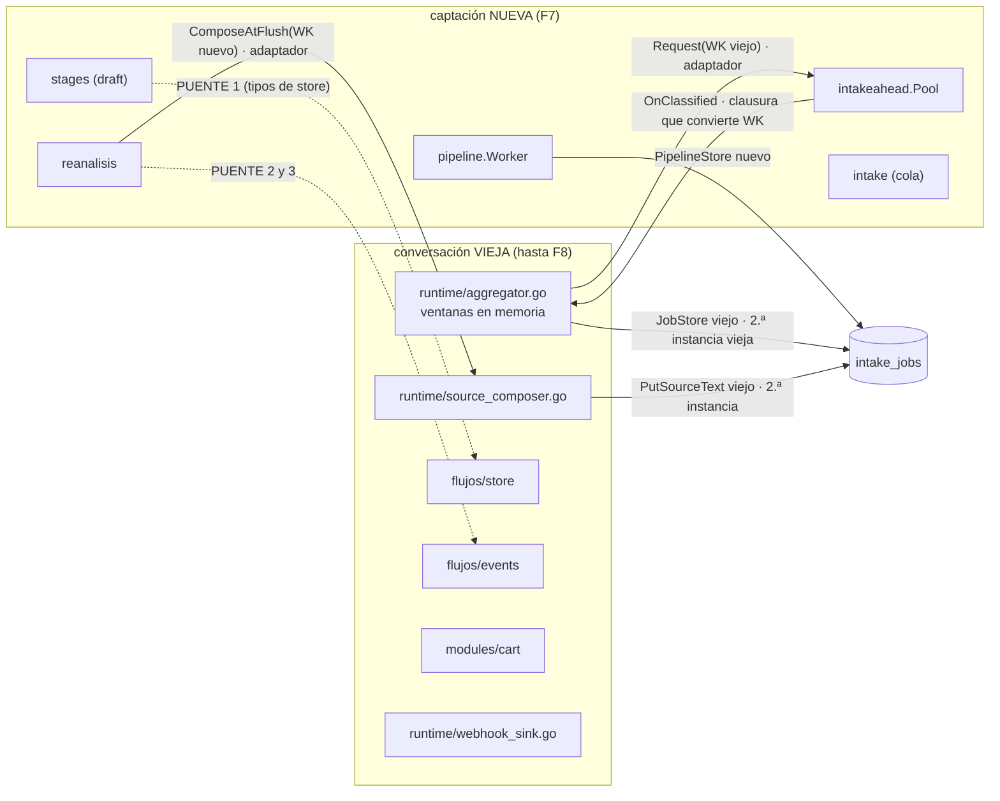

# F7 · Arquitectura — paquetes, el ciclo 2, puentes, costuras, estado y cableado

> Medido sobre `dev` @ `1b18932` el 2026-09-28. `C` = `internal/modulos/captacion`. Regla del grafo:
> `02` §5 (arista = import de un fichero de producción). Comando:
> `GOWORK=off go list -f '{{.ImportPath}}|{{join .Imports ","}}' ./internal/intake/... ./internal/intakeahead/... ./internal/evidence/... ./internal/reanalisis/... ./internal/casebank/... ./internal/intentcfg/...`

## 1 · Paquetes viejos → nuevos

| Viejo (referencia) | Nuevo | Prod. | Líneas | Tests viejos (`func Test`) | Qué es |
|---|---|---:|---:|---|---|
| `internal/intake` | `C/intake` | 6 | 1.796 | 7 (39); 6 de integración | La **cola** `intake_jobs` (⚠️ ≠ `intakes`): estados, etapas, `WindowKey`, puertos `JobStore` (`store.go:163`) y `PipelineStore` (`machine.go:280`), segundo productor de jobs (re-análisis) |
| `internal/intake/pipeline` | `C/pipeline` | 4 | 1.991 | 8 (40) | **El worker** (W=1) y el **aforo** K=1 por Edge (ADR-0046) |
| `internal/intake/stages` | `C/stages` | 10 | 4.195 | 17 (119); 2 con AST | P2 · P3 · P4 · match (cascada) · draft · fechas · tope · plazo |
| `internal/intake/anclaje` | `C/anclaje` | 1 | 441 | 1 (19) | A qué línea va cada adjunto — **sin llamante** de producción (deuda D-6) |
| `internal/intakeahead` | `C/intakeahead` | 3 | 955 | 2 (29) | Adelanto de la ventana **por pull** (4 workers) y calentamiento de la caché de prefijo del Edge |
| `internal/evidence` | `C/evidence` | 1 | 80 | 1 (2) | La regla de la evidencia (ejemplo de `05` §10) |
| `internal/reanalisis` | `C/reanalisis` | 1 | 772 | 2 (33); 1 con AST | El **orquestador** de `POST /api/v1/intakes/{id}/reanalyze` |
| `internal/casebank` | `C/casebank` | 4 | 786 | 3 (30); 1 de integración | Banco de casos anonimizados con consentimiento; **solo lo usa `cmd/casebank`** |
| `internal/intentcfg` | `C/intentcfg` | 2 | 128 | 2 (4); 1 de integración | **P1**: el catálogo de intenciones por tenant (`GET/PUT /api/v1/intents`), empujado al Edge |
| **Total** | | **32** | **11.144** | 43 ficheros (315) | |

`internal/intake/catalogo` **no** es de F7: es `modulos/catalogo/indice` (F5, `04` §5.1).
Exportados: **305**; cuerpos de función/método exportados ≈ **119** (regla en `diseno.md` §1).

## 2 · Imports hacia fuera (producción) y clase de cada uno

| Paquete | Importa | En el nuevo | Clase |
|---|---|---|---|
| `intake` | — (nada interno) | — | **hoja** |
| `evidence`, `casebank`, `intentcfg` | — | — | hojas |
| `anclaje` | `evidence` | `C/evidence` | interno |
| `stages` | `evidence`, `intake`, `anclaje` | `C/…` | interno |
| `stages` | `intake/catalogo` (`Indice`, `VerificarNormalizador`, `Coincidencia`) · `cart.Article` (`match_lineas.go:230,254`) | `modulos/catalogo/indice`, `modulos/catalogo` (F5) | módulo ya reconstruido |
| `stages` | `cart.SanitizeNote` (`match.go:428`, `match_lineas.go:364`) · `intakes` (`Revision`, `ShippingZone`, `DesiredShippingLine`, `ShippingSKU`, `Service`…) | `modulos/solicitudes/intakes` (F6; `note.go`) | módulo ya reconstruido |
| `stages` | **`internal/flujos/store`** (`store.Intake`, `store.FlowEvent` en los puertos `AlmacenSolicitudes` `draft.go:330-332` y `EscritorEvento` `:347-348`) | **viejo** | 🔶 **PUENTE 1** hasta F8 |
| `pipeline` | `intake`, `stages`, `anclaje` · `intake/catalogo` (`Cache`, `Indice`, `Construir`) · `cart.Article/Catalog/Category` (`memoria.go:371-380`) · `intakes` (`DesiredShippingLine`, `ShippingZone`) · `platform/storage/postgres` (`IsPermanentFailure`) | `C/…`, F5, F6, platform | permitido |
| `intakeahead` | `evidence`, `intake`, `intentcfg` · `wapp-shared/{intents,llm}` | `C/…` | interno + externo |
| `reanalisis` | `intake`, `stages` · `intakes` (`ReanalysisTarget`) · `cart.SanitizeNote` (`:647`) | `C/…`, F6 | permitido |
| `reanalisis` | `entitlements` (`FeatureLLMIntake`, `FeatureAPILLM`) · `tenantllm` (`Config`, `ValidVia`, `ViaAPI`, `ViaLocal`) | `modulos/acceso/entitlements` (F2) · `modulos/inferencia/tenantllm` (F4) | módulo ya reconstruido |
| `reanalisis` | **`internal/flujos/events`** (`ThreadEntry`, `KindMessage` en el puerto `Hilo` `:250-254`, `contarMensajes` `:704-706`) | **viejo** | 🔶 **PUENTE 2** hasta F8 |
| `reanalisis` | **`internal/flujos/runtime`** (`DefaultThreadLimit` = 200, `:666`; `source_composer.go:294`) | **viejo** | 🔶 **PUENTE 3** hasta F8 (o se copia la constante: ver §4 nota) |

**Lista blanca de F7** (`fronteras_test.go`): `captacion → {platform, solicitudes, catalogo,
inferencia, acceso}`. Ni `stages` ni `intakeahead` importan `llmvia`: reciben el selector por puertos
**estructurales** (`stages/p2.go:58` `ProviderSelector`, `intakeahead.go:161`, `calentamiento.go:70`).

## 3 · El ciclo 2 de `02` §4 y cómo lo congela el método (D-7)

Las aristas del ciclo, hoy y en F7:

| Arista del ciclo (`02` §4) | Causa | En F7 |
|---|---|---|
| conversación → captación | `runtime/aggregator.go` → `intake` (`WindowKey`, `JobStore`, `OpenJob`, `Append`) · `source_composer.go` → `intake` | el viejo sigue importando `intake` **viejo**; el arranque lo cose con el nuevo (§4) |
| captación → conversación | `stages` → `flujos/store`; `reanalisis` → `flujos/{events,runtime}`; `pipeline`/`stages` → `cart` | **2 puentes** declarados (3 si no se evita el de `runtime`, nota PUENTE 3 abajo); lo de `cart` ya no existe (catálogo en F5, `SanitizeNote` en F6) |
| captación → solicitudes | `pipeline`, `stages`, `reanalisis` → `intakes` | a `modulos/solicitudes` (F6): **sin ciclo** entre nuevos (solicitudes no importa captación) |
| solicitudes → conversación | `intakes/telemetria` → `flujos/store` | puente de F6 |
| catálogo → conversación | `indice`/`catalogo` → `flujos/model` | puente de F5 (o `model` reconstruido allí) |

**Cómo lo congela el método**: ningún paquete nuevo importa a otro nuevo en sentido contrario (la
lista blanca lo impide) y las aristas hacia lo viejo son **puentes declarados** con fecha de muerte.
En F8, al reconstruir `conversacion/{store,events,runtime}`, los tres puentes se retiran y se
re-tocan `stages/draft.go` y `reanalisis/reanalisis.go` (cambian los tipos de sus puertos). **F7 no
corta el ciclo**: lo delimita (D-7, `03` §3).

## 4 · 🔴 Costuras con la conversación vieja (hasta F8) — resolución en el arranque

Regla de FX `arquitectura.md` §4: (1) objeto nuevo si el puerto es estructural; (2) adaptador en
`internal/arranque/bridge_captacion.go` (`05` §4.2: nivel simple, sin estado, con test de cableado completo); (3) segunda
instancia vieja si no tiene estado, **construida dentro del adaptador** para que ninguna fase importe el `intake` viejo.
«Puente» en este documento es siempre el **import** nuevo → viejo de `05` §4.1; el fichero de arranque es «adaptador».

| Consumidor viejo o nuevo | Exige | Salida (D-F7-1) |
|---|---|---|
| `flowruntime.NewIntakeAggregator(log, jobs intake.JobStore, …)` (`aggregator.go:461`) | `JobStore` **viejo**: `OpenOrAppend(ctx, Append)`, `CloseWindow(ctx, WindowKey) (bool, error)`, `ListAggregating(ctx, limit) ([]OpenJob, error)` | **(3)** `intakeviejo.NewPostgres(db)` — solo guarda `*sql.DB` |
| `flowruntime.NewSourceTextComposer(log, thread, jobs SourceTextWriter, cipher)` (`source_composer.go:324`) | `PutSourceText(ctx, intake.WindowKey, intake.SourceText) (bool, error)` viejo | **(3)** la misma instancia vieja |
| `flowruntime.WithAheadRequester(ah)` | `AheadRequester.Request(key intake.WindowKey, text string)` viejo (`aggregator.go:320`) | **(2)** `aheadBridge{p *intakeahead.Pool}` convierte `intake.WindowKey(k)` |
| `intakeahead.New(…, sink Sink, …)` nuevo | `Sink.OnClassified(key intake.WindowKey, intent string, confidence float64)` **nuevo** (`intakeahead.go:188`) | **(2)** `SinkFunc` que llama `c.intakeAggregator.OnClassified(intakeviejo.WindowKey(k), …)` (clausura diferida, como hoy `fase7_flujos.go:150`) |
| `reanalisis.NewServicio(…, compositor Compositor, …)` nuevo | `ComposeAtFlush(ctx, intake.WindowKey) error` **nuevo** (`reanalisis.go:269`) | **(2)** `composerBridge{c *flowruntime.SourceTextComposer}` — **el mismo** compositor que el agregador: dos divergirían en el primer rótulo (`fase5_captacion.go:53-62`) |
| `reanalisis` puerto `Hilo` | `events.Store` viejo | **directo** por el puente 2 (el puerto nombra `events.ThreadEntry` viejo) |
| `stages.NewDraft(…, solicitudes AlmacenSolicitudes, revision EscritorRevision, eventos EscritorEvento, …)` | `flowStore` viejo (puertos con tipos de `flujos/store`) · revisión por el `intakes.Postgres` **nuevo** (F6, cipher del literal) | **directo** por el puente 1 |
| `gw.OnWarmup = pool.Warm` · `gw.OnEdgeReady = worker.Despertar` | `func(tenantID, edgeID, sessionID, kind string)` · `func(tenantID, edgeID string)` (`gateway/grpc/server.go:154,177`) | **(1)** directo (gw nuevo desde F3) |
| `pipeline.ConAforo(aforo, selector)` · etapas LLM | selector de vía nuevo (F4) por puertos estructurales | **(1)** 🔶 confirmar en T7.1 que `Plazas` (`plaza.go:97`) no nombra un tipo de `llmvia` |

Nota PUENTE 3: `runtime.DefaultThreadLimit` es una constante (200). Alternativa sin puente: el
contrato de `reanalisis` la **recibe** como parámetro del constructor y el arranque la lee del runtime
viejo (derivada, no copiada — mismo criterio que el plazo de G7 en FX §4.3). Recomendado: así F7 queda
con **2** puentes. Se decide en T7.12 y se dice en el commit.

**Adaptadores de arranque en F7** (el inventario E-12 los confirma): **nace 1**, `bridge_captacion.go` (`aheadBridge`,
`composerBridge`, la clausura del sink y la segunda instancia vieja), que muere en F8; **muere 1 por partes**:
`llmConfigBridge` de `bridge_inferencia.go` (F4), porque el `reanalisis` nuevo recibe el `tenantllm` nuevo. `captacion`
entra en `Conmutados` en F8, al morir `bridge_captacion.go`.

## 5 · Estado en memoria, goroutines, relojes y métricas

| Pieza | Estado / concurrencia (`fichero:línea`) | Relojes | Dos instancias = |
|---|---|---|---|
| `pipeline.Worker` | canal `despertares` cap. 32 (`pipeline.go:375,388`); `time.NewTicker(Cadencia)` (`:424`); **1 goroutine** lanzada por el arranque (`fase9_fondo.go:99`) | cadencia 5 s, backoff 30 s → 5 min | W=2 contra K=1: bloqueo en cabeza con un job reclamado en la mano (I-CP-4, D-12 de `deuda.md`) |
| Aforo `NuevoAforo(KPorPlaza)` | `sync.Mutex` (`plaza.go:142`), `sync.Once` (`:215`); **de proceso**, no distribuido (ADR-0046: con dos réplicas K=2, decisión escrita) | — | dos ideas de cuántas plazas hay |
| `intakeahead.Pool` | `mu` (`intakeahead.go:228`), `calMu` (`:243`), cola `chan peticion` cap. `DefaultQueue = 64` (`:289`), `DefaultWorkers = 4` con `WaitGroup` (`:339-342`); calentamiento en goroutine suelta (`calentamiento.go:149`); `Run` lo lanza el arranque (`fase9_fondo.go:84`) | — | marcas por clave duplicadas: dos clasificaciones de la misma ventana |
| `intake.MemoryStore` | `sync.Mutex` (`memory.go:79`) — doble | — | — |
| `pipeline/memoria.go` | `sync.Mutex` (`:86`) — D-F7-3 | — | — |
| `intentcfg.MemoryStore` | `sync.Mutex` (`store.go:48`), `time.Now()` (`:76`) — gemelo | inyectar | — |
| `intake.Postgres`, `stages.*`, `reanalisis.Servicio`, `casebank` | sin estado | 🔶 `machine_postgres.go`: ¿`now()` de SQL o de Go? (T7.1) | — |
| Métricas | ninguna Prometheus propia; `wapp_llm_degradacion_total` es del selector (F4); `wapp_cart_match_total` es del **carrito** (`fase7_flujos.go:58`), no de `stages` | | |

**Goroutines del arranque** (huella, 10 sentencias `go`): F7 sustituye el objeto de `:84`
(`intakeAhead.Run`) y `:99` (`intakePipeline.Run`) por los nuevos; `:75` (agregador) sigue viejo
hasta F8. El número no cambia.

## 6 · Cableado en el arranque nuevo (T7.23–T7.26)

| Fichero de `internal/arranque` | Hoy (copia de F0) | Pasa a |
|---|---|---|
| `fase3_almacenes.go` | `intentcfg.NewPostgresStore(db)` `:79` · `intake.NewPostgres(db)` `:181` | `intentcfg` **nuevo**; `intake` **nuevo** para worker y re-análisis; la instancia vieja (`intakeviejo.NewPostgres(db)`) para agregador y compositor la construye `bridge_captacion.go` |
| `fase5_captacion.go` | compositor `flowruntime.NewSourceTextComposer(…intakeJobStore…)` `:52` · P2/P3/P4/match/draft · `pipeline.NewWorker` · `reanalisis.NewServicio` · `quotetext…ConPlazo(pipeline.PlazoPorLlamadaSuelo)` | compositor viejo con la instancia vieja; etapas, worker, aforo y re-análisis **nuevos**; `ConPlazo` y G7 leen `PlazoPorLlamadaSuelo` (48 s) del `pipeline` **nuevo** (TX.21) |
| `fase7_flujos.go` | `intakeahead.New(log, intentStore, llmSelector, SinkFunc(…), WithCalentador, WithCalentamiento)` `:149-159` · `gw.OnWarmup` `:166` · agregador `:208-210` · `gw.OnEdgeReady = intakePipeline.Despertar` `:222` | `Pool` **nuevo** + adaptadores de §4 (`bridge_captacion.go`); los dos ganchos del gw con los objetos nuevos |
| `fase8_transporte.go` | `Deps{Reanalysis, Intents, …}` | `nil` en la vieja; la cara nueva los recibe |
| `fase9_fondo.go` | `go c.intakeAhead.Run(ctx)` `:84` · `go c.intakePipeline.Run(ctx)` `:99` | mismos campos, objetos nuevos |

🔴 El paquete **nuevo** conserva el nombre corto en el arranque (`pipeline`, `stages`, `reanalisis`,
`intakeahead`, `intake`) y el viejo lleva alias (`intakeviejo`): los candados de cableado copiados en
F0 buscan el texto `"pipeline.NewWorker"`, `"pipeline.ConAforo"`, `"pipeline.ConZonasDeEnvio"`,
`"stages.NewMatch"`, `"stages.NewDraft"`, `"gw.OnEdgeReady"`, `"gw.OnWarmup"`,
`"intakeahead.WithCalentamiento"`, `"reanalisis.NewServicio"`, `"stages.ConEmpujeCRM"` y el campo
`Reanalysis` (`internal/bootstrap/arranque/pipeline_captacion_cableado_test.go:85-164`,
`reanalisis_cableado_test.go:59-91`, `calentamiento_cableado_test.go:35,75`). La aserción del campo
`Reanalysis` pasa a mirar la cara nueva (T7.24). Y `"catalogo.NewCache"` ya lo cambió F5 a `indice`.

**Prueba de que el binario usa lo nuevo**: `go list -deps ./cmd/server-modular | grep modulos/captacion`
y `internal/arranque/captacion_cableado_test.go` (por tipo `%T`: worker, aforo, `Pool`, servicio de
re-análisis y store de intenciones de `modulos/captacion`; **y** grep por ruta de import: ninguna fase importa
`internal/{intake,intakeahead,reanalisis,intentcfg}` viejos fuera de `bridge_captacion.go` — hallazgo 39).

## 7 · Rutas (D-10) — autoridad FX

| # | Ruta | Fichero nuevo | Notas |
|---|---|---|---|
| H1 | `POST /api/v1/intakes/{id}/reanalyze` | `apipublica/reanalyze.go` (TX.19–TX.20) | W `intakes.write` (`intake`); **sin gate en la cadena**: los dos gates viven en el servicio; el 400 de forma va primero; usa `NoteTooLongError` de `solicitudes/intakes/note.go`; monta si `Reanalysis` ≠ nil (no depende de `Intakes`) ⚠️ *(F6-05, D-F6-13)*: en la cara **vieja** H1 sí depende de `Intakes` (`publicapi.go:648-651`); desde F6 lo sostiene el centinela `oldFaceIntakesMountSentinel` de `internal/arranque/fase8_transporte.go`, que **se retira al mudar H1**. |
| E1 | `GET /api/v1/intents` | `apipublica/intents.go` | R `intents.read`; monta si `Intents` y `Entitlements` |
| E2 | `PUT /api/v1/intents` | ídem | W `intents.write` (`intents`); gate `llm_intent` **dentro** del handler; `ConfigPush` por el gw nuevo, best-effort (su error solo se registra, `publicapi/intents.go:167`) |

Tests viejos de consulta: `publicapi/reanalyze_test.go` (16), `intents_test.go` (6),
`intents_aditividad_test.go` (2). Total F7: **3** rutas (1 + 2 por D-FX-1 alternativa).

## 8 · Lo que NO cambia hacia fuera

La tabla `intake_jobs` (y `intake_case_bank`, `tenant_intents`/config de intenciones 🔶 nombre exacto en
T7.1), los estados y etapas literales, los eventos `intake_draft_created` (`draft.go:90`) e
`intake_reanalyzed` (`draft.go:107`), la variable `WAPP_LLM_WARMUP_ENABLED`, las tres rutas, el push
de configuración `intents` al Edge, los flags de `cmd/casebank` (`-tenant`, `-consentido`), y la regla
de que el literal del cliente viaja cifrado en `source_text` con el keyring del Plan 012.
`intake_jobs.artifacts` sigue guardando la `evidence` de P2 **en claro** (deuda D-2, decidida y no
ejecutada): F7 no la «arregla» de paso.
