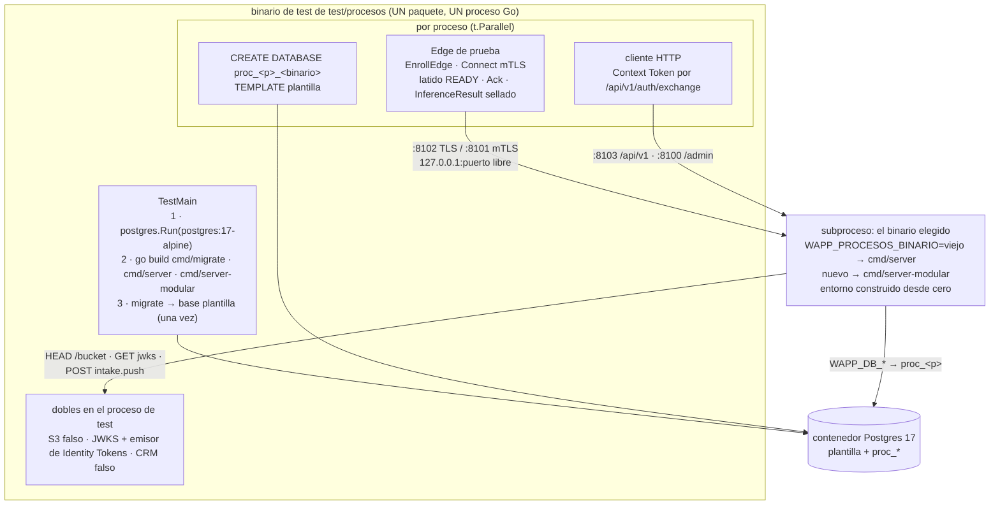

# F9 · Arquitectura — el arnés, los binarios y cuándo corre cada cosa

## 1 · La topología de una corrida

- **Un solo paquete** (`test/procesos`), porque Go compila un binario de test por paquete y dos
  paquetes serían dos contenedores (`05` §7.2).
- **Un servidor por proceso y por binario**: la base se llama `proc_<proceso>_<binario>`, así que la
  pasada contra `viejo` y la de `nuevo` nunca comparten base aunque se lancen seguidas. Nunca hay dos
  servidores contra la misma base (`04` §2.2: los dos migran, los dos lanzan cinco goroutines de fondo
  y dos agregadores partirían las ráfagas).
- **Los dobles viven en el proceso de test** y el servidor los alcanza por loopback. Ningún doble
  es otro contenedor (D-F9-3).

## 2 · Lo que el servidor exige para arrancar, fase a fase (medido en el arranque viejo)

El arranque viejo es `cmd/server/main.go` → `internal/bootstrap/bootstrap.go:27` →
`internal/bootstrap/arranque/orquestador.go` (9 fases, lista `fases`). El nuevo es copia exacta en F0
(`internal/arranque`), así que la tabla vale para los dos mientras nadie cambie el arranque.

| Fase (fichero) | Qué puede abortar el arranque | Variable efectiva | Doble del arnés |
|---|---|---|---|
| prólogo (`orquestador.go`) | `config.Load()` solo falla si `WAPP_CONFIG_FILE` apunta a un YAML ilegible (`config.go:730`) | `WAPP_CONFIG_FILE` | **No se pone**. Y el entorno se construye desde cero, así que un YAML del shell no se cuela |
| 1 · infraestructura (`fase1_infraestructura.go`, `database.go`) | Postgres inaccesible; migraciones | `WAPP_DB_HOST` `…PORT` `…USER` `…PASSWORD` `…NAME` `…SSLMODE` | El contenedor (`ctr.Host`, `ctr.MappedPort`), base `proc_*`, `sslmode=disable` |
| 1 · PKI (`pki.go:29-44`) | Ficheros de CA o de servidor ilegibles; la CA acepta PKCS#8 o SEC1 (`internal/gateway/enroll/ca.go:103,109`) | `WAPP_PKI_CA_CERT_FILE` `…CA_KEY_FILE` `…SERVER_CERT_FILE` `…SERVER_KEY_FILE` | CA EC P-256 y certificado de servidor (SAN `localhost`, `127.0.0.1`) generados en `t.TempDir()` — precedente: `scripts/gen-dev-certs.sh` |
| 1 · lease (`lease.go:18-51`) | Solo con `WAPP_APP_ENV=prod` y sin clave; en `dev` genera una **efímera** | `WAPP_LEASE_PRIVATE_KEY_B64` | Semilla Ed25519 de 32 B generada por corrida (así P0 aserta `key_source=base64` del lease; `config` es solo de la clave de la nube ✎ contradicción 11) |
| 1 · enrolamiento (`pki.go:88-121`) | `WAPP_CLOUD_ENC_PRIVKEY_B64` mal formada; vacía ⇒ efímera | `WAPP_CLOUD_ENC_PRIVKEY_B64` | Privada X25519 de 32 B generada |
| 2 · autenticación (`auth.go:108-201`) | Clave ES256 ilegible; con `WAPP_IDENTITY_JWKS_URL`, el **primer fetch del JWKS es EAGER y fail-closed** (`auth.go:277-289`); `WAPP_IDENTITY_URL` sin JWKS aborta (`auth.go:238`) | `WAPP_JWT_EC_PRIVATE_KEY_FILE` `WAPP_JWT_KID` `WAPP_IDENTITY_JWKS_URL` | Clave P-256 en fichero `0600`; JWKS servido por HTTP en loopback (identity-shared lo admite: `jwks.go:65,187`). **`WAPP_IDENTITY_URL` y `WAPP_IDENTITY_API_KEY` no se ponen**: sin ellas `/api/v1/signup` y `POST /api/v1/members` responden **503** (diseñado, `contratos.md` §2.1 y §2.6) y el relé de login del Edge contesta «auth no disponible» |
| 3 · almacenes (`fase3_almacenes.go:48`, `flows.go:52-96`) | KeyProvider de PII; 🔴 **`HeadBucket` incondicional** (`flows.go:75` → `r2_factory.go:54,63`) | `WAPP_KEK_PROVIDER=env` `WAPP_KEK_MASTER_B64` `WAPP_KEK_INDEX_B64` · `WAPP_STORAGE_S3_ENDPOINT` `…BUCKET` `…REGION` `…ACCESS_KEY_ID` `…SECRET_ACCESS_KEY` | KEK e índice aleatorios de 32 B; **S3 falso en `http://127.0.0.1:
`** (endpoint IP ⇒ path-style, D-F9-2) |
| 4 · gateway (`fase4_gateway.go`) | Registro de métricas duplicado (bug, no entorno) | `WAPP_GRPC_PUSH_TIMEOUT` `…ACK_TIMEOUT` `WAPP_GATEWAY_WORK_*` | Defaults |
| 5 · captación (`fase5_captacion.go`) | Prompts inválidos en `WAPP_LLM_PROMPTS_DIR` (I-CP-1); construcción de etapas | `WAPP_LLM_PROMPTS_DIR` | **Vacía** ⇒ prompts compilados (como UAT, `documentations/operacion.md` §6) |
| 6–7 · solicitudes, flujos | Constructores (bugs) | `WAPP_FLOW_*` | Defaults |
| 8 · transporte (`fase8_transporte.go:49,68`) | `net.Listen` de los dos gRPC; los HTTP se enlazan en `servir.go` | `WAPP_HTTP_ADDR` `WAPP_PUBLIC_HTTP_ADDR` `WAPP_GRPC_ENROLL_ADDR` `WAPP_GRPC_CONNECT_ADDR` | `127.0.0.1:<puerto libre>` — **siempre con host** (UAT enlaza `*` por ir sin host: `documentations/operacion.md` §6) |
| 9 · fondo (`fase9_fondo.go`) | Nada: lanza 5 goroutines | `WAPP_WEBHOOK_POLL_INTERVAL` `…MAX_ATTEMPTS` `…TIMEOUT` | P6 baja el sondeo a `200ms` y los intentos a `2` |

**Cadencias internas que marcan los tiempos de espera de un proceso** (no configurables por entorno):
barrido de ventanas **5 s** (`internal/flujos/runtime/aggregator.go:186`), sondeo del worker del
pipeline **5 s** (`internal/intake/pipeline/backoff.go:105`), colector de `flow_events` **15 s**
(`internal/platform/metrics/flowlifecycle/collector.go:80`). La ventana de agregación es **por
tenant, en BD** (`tenant_settings.aggregation_window_seconds` y `aggregation_max_seconds`, migración
`0076`): con **0** cierra en el primer barrido. No hay ruta HTTP que la escriba: la fija un fixture SQL.

## 3 · Lo que `test/procesos` puede importar (lista blanca)

| Sí | Para qué |
|---|---|
| `testcontainers-go`, `…/modules/postgres`, `github.com/jackc/pgx/v5/stdlib` | Contenedor y SQL de aserción y fixtures |
| `github.com/EduGoGroup/wapp-cloudlink/{gen/wapp/cloudlink/v1,lease,mtls}` (v0.17.0) | El Edge de prueba habla el contrato real y valida el lease con el `Validator` de verdad |
| `github.com/EduGoGroup/wapp-shared/envelope` (v0.2.1) | Sellar `IncomingMessage.enc_payload` y `InferenceOutput` con `cloud_enc_pubkey` |
| `github.com/EduGoGroup/identity-shared/auth/jwt` (v0.3.1) | `NewManager(priv, "identity-core", kid)` + `GenerateIdentityToken` (`manager.go:40,139`) |
| Paquetes `…helpertest` (D-F1-10; antes `…test`) de suites de contrato del árbol nuevo (`internal/modulos/**/…helpertest`, `internal/nucleo/**/…helpertest`), **el paquete del adaptador Postgres que prueban y los argumentos de su constructor** (D-F1-8: hoy `internal/nucleo/contact` e `internal/platform/crypto`) | Solo en `<paquete>_contrato_test.go` (H9.5); comando en R9.4.d. ⚠️ El comando mira el **paquete**, no el fichero: no ve un `p<n>_…_test.go` que use un paquete ya admitido (hallazgo 36 de F1); eso se mira a mano en T9.31. Entra en el gate que crea F1-06 |
| stdlib (`crypto/*`, `net/http/httptest`, `os/exec`…) | PKI, dobles, subprocesos |

| No | Por qué |
|---|---|
| Cualquier paquete de dominio viejo (`internal/gateway/**`, `internal/flujos/**`…) o nuevo fuera de las suites | Caja negra (`05` §7.1). El precedente `cmd/server/integration_test.go` compone piezas **dentro** del proceso: sirve de referencia de PKI y lease, no de modelo |
| `internal/bootstrap/**`, `internal/arranque/**` | El arranque se ejerce **como binario** |
| `internal/platform/storage/postgres/migrations` | La plantilla la migra el binario `cmd/migrate`, que es la puerta real de operación (`Makefile` → `make migrate`) |

## 4 · Estado en memoria y goroutines: por qué un servidor por proceso

El servidor guarda estado que **no** está en Postgres: las conexiones vivas de los Edge y el registro
de sesiones del gateway (`*gatewaygrpc.Server`), la disponibilidad de inferencia por Edge
(`edgeReadiness`, `internal/gateway/grpc/readiness.go:132`), las ventanas del motor
(`*flowruntime.Runtime`), cachés con TTL (entitlements, catálogo) y las cinco goroutines de fondo
(`fase9_fondo.go`: worker del CRM, colector, agregador, adelanto de ventana, worker del pipeline).
Dos procesos contra un mismo servidor se verían entre sí. Por eso **cada proceso lanza su servidor** y
lo para con `SIGTERM` (espera ≤ `shutdownTimeout` = 10 s, `internal/bootstrap/arranque/http.go:25`,
y después `SIGKILL`).

## 5 · 🔍 Adelantar F9: el análisis (D-F9-1)

### 5.1 · Qué módulo ejerce cada proceso

Un proceso solo es oráculo de un módulo **cuando ese módulo está conmutado** en el binario nuevo;
antes, el nuevo cablea paquetes viejos (F0 copia exacta) y el proceso pasa sin decir nada nuevo.

| Proceso | F1 `nucleo` | F2 `acceso` | F3 `edge` | F4 `inferencia` | F5 `catalogo` | F6 `solicitudes` | F7 `captacion` | F8 `conversacion` |
|---|---|---|---|---|---|---|---|---|
| P0 humo del arranque | ● | ● | ● | ● | ● | ● | ● | ● |
| P1 enrolamiento y lease | | ● | ● | | | | | |
| P2 canje y permisos | | ● | | | | | | |
| P3 entrante a respuesta | ● | ● | ● | | | | | ● |
| P4 mensaje a borrador | ● | | ● | ● | ● | ● | ● | ● |
| P5 bandeja | | | ● | ● | | ● | | |
| P6 CRM | | | | | | ● | | ● (`webhook_sink`) |
| P7 catálogo | | | | | ● | | | ● (`tenant_content` vive en `flujos/store`) |
| P8 re-análisis | | | ● | ● | | ● | ● | |
| P9 diagnóstico y config push | | ● (`entitlements`) | ● | | | | | |

**Regla de 9C**: en cada `conmutar(<m>)` corre **la suite entera** contra `nuevo` (es barata frente a
una conmutación); las columnas marcadas dicen qué procesos son **gate** de ese módulo: si uno de ellos
falla, el `conmutar` no se da por cerrado.

🔴 **Lo que 9C no ve** (hallazgo 39 de F1): que el arranque cablee por error el paquete **viejo**. El comportamiento es
el mismo y la suite pasa. Eso lo cierra el **test de cableado** del módulo (`05` §4.2: el arranque construye lo nuevo y
nadie importa lo viejo fuera de `bridge_<x>.go`), que tiene que estar completo antes de dar la pasada por buena.

### 5.1 bis · Qué cubre F9 ahora que no hay umbral de cobertura (P2)

Los procesos son una de las tres cosas que sustituyen al umbral, junto con «un test por promesa del contrato» y los
mutantes del nivel complejo (`05` E-9, E-12). A F9 le toca lo que ningún test de fichero alcanza: los auxiliares no
exportados sin test propio (`05` E-4), las ramas de error y la fontanería. Ejemplo medido: el reintento de `WithTx`
(R9.6.e).

### 5.2 · Pros y contras, con honestidad

| A favor de adelantar | En contra |
|---|---|
| **El SQL nuevo se prueba cuando nace.** La verdad de los adaptadores Postgres la da su suite contra Postgres (P4) y F9, no un test de fichero (E-6; sin umbral de cobertura, P2): con el orden de `05`, siete conmutaciones (F2–F8) llevarían a `dev` SQL que **nunca** ha tocado una base | **~8 pasadas 💻 más** (una por conmutación), cortas (correr, leer, cerrar), dentro del cierre local de cada módulo |
| **Cada conmutación con oráculo de conducta**, no solo de nombres: la huella (`internal/arranque/huella_test.go`) compara rutas, rpc, métricas y goroutines, no lo que devuelven | Mientras un módulo no conmuta, sus procesos **no prueban nada nuevo** (pasan contra paquetes viejos). No es un coste, pero conviene no leer ese verde como mérito |
| **Estable**: se escribe contra el viejo, que está congelado (E-1, P-5) | Un arreglo en el viejo durante la transición puede obligar a tocar un proceso (pasaría igual en F9 tardía, solo que antes) |
| **El riesgo del arnés se descubre al principio**: R2 (D-F9-2), JWKS, PKI, Edge de prueba. Hoy `ESTADO.md` lo apunta como obstáculo abierto del relevo | La ola 9A retrasa F2 **solo si** se serializa; puede ir en paralelo con F1 (toca `test/procesos/`, `go.mod`, `Makefile`, `.golangci.yml`; F1 toca `internal/nucleo/`). Conflicto posible en `Makefile` si F0 no ha cerrado: por eso 9A depende de F0 cerrada |
| **Con D-10 (estrangulador)**, cada módulo muda rutas a `internal/apipublica`: los procesos prueban por HTTP justo esas rutas, en el mismo ciclo | Más superficie en `dev` durante más tiempo (`test/procesos/` existe desde el principio). Mitigado: todo lleva `//go:build integracion` y no entra al binario |
| **F10 se acorta**: llega con procesos que ya pasaron ocho veces contra el nuevo | — |

**Recomendación**: adelantar. 9A tras F0 (puede solaparse con F1), 9B antes de conmutar F2, 9C dentro
de cada conmutación (F1 recibe su pasada **a posteriori** en la primera 9C), 9D antes de F10.

### 5.3 · Qué cambia si Jhoan no lo acepta

- 9A, 9B y 9D se ejecutan en bloque después de F8 (orden de `05` §6).
- Las tareas **T9.22–T9.29** (9C) se anulan y las sustituye **T9.34**: todas las suites de contrato
  contra Postgres de una vez.
- La columna «Entradas» del README pasa a exigir F8 conmutada para 9A.
- Nada del diseño del arnés ni de los procesos cambia.

## 6 · Lo que no cambia hacia fuera

- **Ni una línea de producción.** F9 añade `test/procesos/**` y toca `go.mod`/`go.sum`
  (testcontainers), `Makefile` (`test-procesos`, `vet-integracion` en `ci-local`) y `.golangci.yml`
  (`run.build-tags: [integracion]` para que el lint vea los procesos). El arranque, viejo o nuevo, no se
  toca: con D-F9-2 no hace falta ninguna opción nueva.
- **Ni una variable, ruta, rpc, tabla ni métrica nueva.** `WAPP_PROCESOS_BINARIO` la lee **solo el
  arnés** con `os.Getenv` (nombre completo, sin loader) y no llega nunca al servidor.
- **El binario de producción no importa testcontainers**: solo lo importa `test/procesos/`, con
  etiqueta `integracion` (`05` §7.3). Comprobable con
  `GOWORK=off go list -deps ./cmd/server | grep -c testcontainers` → 0.
- `make test-integration` (el viejo) **sigue** hasta F10: protege al código viejo, que es lo que corre
  en UAT.
