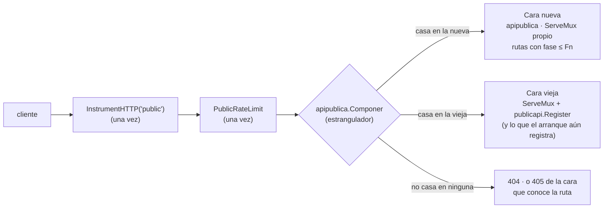

# FX · Arquitectura — el estrangulador, la cadena, el estado y los singletons

## 1 · De dónde se parte (medido en `dev` @ `1b18932`)

| Pieza | Dónde | Qué hace |
|---|---|---|
| Cara vieja | `internal/publicapi/` — 33 ficheros de producción, 8.762 líneas; 64 tests, 14 de ellos `*_integration_test.go`, 447 `func Test` | `Register(mux *http.ServeMux, d Deps, mw, auditor, log)` (`publicapi.go:440`) registra 66 patrones sobre **el mux que le pasan**; cada ruta lleva su cadena dentro (`protect`/`protectRead`, `:1129-1144`) |
| Montaje de `:8103` | `internal/bootstrap/arranque/http.go:28-208` (`buildPublicAPIServer`) | crea `publicMux := http.NewServeMux()` (`:80`); registra 7 patrones de autenticación (`iamhttp.Register` `:81` y 5 `publicMux.Handle` `:84-171`); llama a `publicapi.Register` (`:185`); envuelve el mux **entero** con `PublicRateLimit` (`:194`) y `InstrumentHTTP("public")` (`:195`); `http.Server` con `WriteTimeout` 10 s (`:23,204`) |
| `Deps` | `publicapi.go:134-287`, rellenado en `fase8_transporte.go:171-266` más `http.go:37,67-78,179` | 43 campos hoja (15 en 4 grupos embebidos + 28 sueltos), casi todos **interfaces declaradas en `publicapi`** con tipos de dominio viejos en la firma |
| Montaje de `:8100` | `rutas_admin.go:63-114` (`registerAdminRoutes`) + `fase8_transporte.go:101-162` | 22 patrones; cadena `adminHandler` (`http.go:216`); **no** pasa por `publicapi` |
| Goroutines | — | `publicapi` no lanza ninguna (`grep -n 'go func' internal/publicapi/*.go` fuera de tests → vacío); los limitadores tampoco |

Go: `go 1.26.5` en `go.mod:3`, sin `godebug` (`grep -n godebug go.mod` → vacío): el `ServeMux`
tiene la semántica de patrones de Go ≥ 1.22 (método + comodines, precedencia por especificidad,
405 automático). No hay CORS (`grep -rln 'Access-Control' internal/` → vacío).

## 2 · A dónde se llega, y cómo se compone por el camino

- **Dos `ServeMux`, no uno.** Registrar en el mismo mux el patrón nuevo y el viejo haría `panic`
  («conflicts with pattern»), y hay **18 patrones sin condición**
  (mapa §2: A1–A7 los registra el arranque; D1, I1–I10 `publicapi`). La cara nueva tiene su mux;
  la vieja, el suyo.
- **Por qué un despachador y no un comodín `"/"` en el mux nuevo.** Un `"/"` casa con **cualquier**
  método, así que el mux nuevo nunca daría 405: una petición con método equivocado a una familia ya
  mudada caería en la vieja, que si ya no la registra respondería **404**. El despachador pregunta
  a cada mux con `ServeMux.Handler(r)` (que no escribe ni muta `r`) y decide (contrato en
  [`diseno.md`](diseno.md) §2).
- **Qué gana.** Gana la nueva **por construcción** (se consulta primero). La precedencia «más
  específico gana» de Go solo vale dentro de un mux: de ahí la regla de solapes del mapa §4.2.
- **En F8**, cuando la cara nueva sirve las 73, el arranque deja de llamar a `publicapi.Register`:
  el compuesto sigue, con un mux viejo **vacío** (así la huella y el candado no cambian de forma a
  mitad de camino). En F10 se quitan el estrangulador y el mux vacío (TX.25).
- **`:8100` no se estrangula**: el arranque lo cablea entero y cambia constructores de handler por
  fase (mapa §3).

## 3 · La cadena de middlewares: idéntica en las dos caras, y una sola vez

| Capa | Dónde vive hoy | En el binario nuevo | Corre |
|---|---|---|---|
| `InstrumentHTTP("public")` — etiqueta `route = r.Pattern` (`platform/metrics/metrics.go:214`) | arranque, sobre el mux | arranque, sobre **el compuesto** | 1 vez |
| `PublicRateLimit` — cubos por credencial en memoria (`platform/httpapi/ratelimit.go:46`) | arranque, sobre el mux | arranque, sobre el compuesto (una instancia, compartida por las dos caras) | 1 vez |
| `accessLog` → `Authenticate` → `anotarTenant` → `RequirePermission` → `AuditMiddleware` (W) / sin auditoría (R) | por ruta, dentro de `publicapi` | por ruta, **en la cara que la sirve**: la vieja con su código, la nueva con el portado (`apipublica/cadena.go`) | 1 vez (una petición va a **una** cara) |
| Gates `entitlements.RequireFeature` / `RequireAnyFeature` | por ruta, **después** de RequirePermission | igual; en la cara nueva, del paquete `acceso/entitlements` nuevo (desde F2) | 1 vez |
| `conPlazoDeRedacción` (solo G7), **por fuera** de `protectRead` | `publicapi.go:770` | igual en la cara nueva (F6) | 1 vez |
| `WriteTimeout` 10 s, `ReadTimeout` 10 s, `ReadHeaderTimeout` 5 s, `IdleTimeout` 60 s | `http.go:20-26` | los mismos, en `internal/arranque/http.go` | — |

🔴 **La métrica depende del texto del patrón.** `ServeMux.ServeHTTP` escribe `r.Pattern` **en el
mismo `*http.Request`** que recibe; `InstrumentHTTP` lo lee **después** de servir. Para que la
serie `wapp_http_requests_total{route=…}` no cambie: (1) el patrón nuevo es **byte a byte** el
viejo (incluido el nombre del comodín: `{id}`, `{user_id}`, `{command_id}`, `{ref}`, `{role_id}`);
(2) el estrangulador pasa **el mismo puntero** a la cara que sirve. Una petición sin casar deja
`r.Pattern = ""` → `unmatched`, como hoy.

**Objetos compartidos por las dos caras** (una sola instancia, la construye el arranque): el
`*httpapi.Middleware` (`authMW`), el `httpapi.AuditRecorder` (`auditor`; tras el ✎ de F0 en
`platform/httpapi/audit_mw.go` ya no importa `iam/ports/in`), el logger y el limitador público.

## 4 · Estado: qué `Deps` de la cara vieja quedan huérfanos o duplicados en cada fase

**La regla**: la cara vieja se construye en cada fase con los `Deps` de las rutas que **todavía
sirve**; el campo de una ruta ya mudada se pone a **`nil`** (sus rutas condicionales dejan de
registrarse; las incondicionales quedan registradas **y tapadas** por la nueva, sin llegar nunca a
ejecutarse). Para un campo cuya ruta sigue en la vieja pero cuyo dominio ya conmutó, hay tres
salidas, **en este orden de preferencia**:

1. **Inyectar el objeto nuevo** si el puerto viejo es **estructural** (métodos con tipos de stdlib,
   `cloudlinkv1` o `platform`): una sola instancia, cero puentes de import.
2. **Adaptador de tipos en `internal/arranque`** (`bridge_<x>.go`, `05` §4.2; como el de F1 para
   `contact`) si el puerto exige un tipo viejo y el objeto tiene estado. Lo lista el inventario E-12 de
   la fase que lo crea.
3. **Segunda instancia vieja** solo si el objeto **no tiene estado** (adaptador Postgres puro).

| Campo(s) de `publicapi.Deps` | Objeto (fase del dominio) | Estado | Rutas que lo usan (mapa) | En la cara vieja |
|---|---|---|---|---|
| `Roles`, `Members`, `Invitations`, `Audit` | servicios IAM (F2) | no | B1–B14, C1 | `nil` desde F2 |
| `Entitlements` | `*entitlements.Postgres` (F2) | **caché TTL 60 s** por (tenant, feature) sin invalidación (`entitlements/postgres.go:15-34`) | C2 + los gates de E, F, G, I | desde F2 recibe el **resolver nuevo** (puerto estructural: `Has`, `ListEffective`, `CacheTTL`, `publicapi/entitlements.go:17-27`): una sola caché. `nil` en F8 |
| `Sender`, `DiagnosticsRequester` | gw (F3) | **sí** | D1, D5 | `nil` desde F3 |
| `ConfigPush` | gw (F3) | **sí** | E2 | **F3–F6**: el **gw nuevo** (puerto estructural `publicapi.ConfigPusher`, D-FX-1/D-F7-4) · `nil` desde F7. *(Alternativa D-FX-1 literal: `nil` desde F3.)* |
| `Sessions`, `SessionProfiles`, `SessionStatus`, `ProfilePush`, `Diagnostics`, `DiagnosticsBundleTTL`, `Health`, `Alerter` | fleet, filtercfg, diagnostics (F3) | `filtersPusher` envuelve al gw | D1–D6 | `nil` desde F3 |
| `Intents` | `intentcfg.PostgresStore` (F7) | no | E1–E2 | el **viejo** hasta F7 (su dominio aún no conmutó) · `nil` desde F7. *(Alternativa D-FX-1 literal: `nil` desde F3, mudada con puente.)* |
| `TenantLLM`, `DegradationNotices` | tenantllm, degradation (F4) | no | F1–F4 | `nil` desde F4 |
| `Intakes`, `QuoteSuggestions`, `TenantVariables`, `Integrations`, `CRMSecrets`, `CRMGate`, `CRMReflect`, `CRMNotify`, `EventTelemetry` | solicitudes (F6) | `Intakes` y `CRMNotify` guardan el **gw** (notificador); `QuoteSuggestions` guarda el **selector LLM** (que guarda el gw) | G1–G18 | **F3–F5**: servicios viejos con el **gw nuevo** inyectado (salida 1: `intakes.MessageSender` es estructural, `intakes/notifier.go:102-104`) · **F4–F5**: `QuoteSuggestions` viejo con el selector — ⚠️ ver abajo · `nil` desde F6 |
| `Reanalysis` | `reanalisis.Servicio` (F7) | no (guarda stores) | H1 | servicio viejo hasta F7 con los stores que toque (los de F4 y F6 ya nuevos: responsabilidad de F6/F7); `nil` desde F7 |
| `Flows`, `Modules`, `Triggers`, `TriggersDurableFlow`, `Content`, `ContentVersions`, `Media`, `ConversationEvents` | conversación (F8), presign (platform) | no | I1–I18 | viejos hasta F8 |
| `Starter`, `EventCanceller` | **rt** (F8) | **sí** | I4, I19 | el rt **viejo** hasta F8 — es el **único** rt del binario hasta entonces; en F8 se muda con él |
| `SendBudget`, `DBTimeout`, `ContentMaxBytes`, `ImportMaxItems` | config | no | — | valores; `SendBudget` deja de hacer falta en la vieja desde F3 |

⚠️ **Tres acoplamientos que F3 tiene que cablear y probar** (no son de la cara, pero la cara vieja
depende de ellos entre F3 y F8):

1. **El selector LLM viejo recibe el gw por `local.Frame`**, cuyo método `Infer` pide
   `gatewaygrpc.InferRequest` **viejo** (`internal/llmvia/local/local.go:270-272`): **no** es
   estructural. Entre F3 y F4 hace falta un adaptador de tipos en el arranque (salida 2: `bridge_gateway.go`, de F3). Afecta a
   G7 y a todo el pipeline, no solo a la cara.
2. **El runtime viejo** recibe el gw por `flowruntime.New(…, c.gw, …)` (`fase7_flujos.go:228`) y el
   gateway recibe ganchos del runtime (`c.gw.OnIncoming = c.flowRuntime.OnIncoming`, `:127`): los
   tipos de esas firmas deciden si hace falta adaptador (**sin medir** aquí; es de F3).
3. **Centinelas**: el código viejo que sigue sirviendo I4 y J19 compara
   `gateway/session.ErrSessionOffline` viejo (`publicapi/flows.go:235`,
   `flujos/admin/handlers.go:326`). Con **D-F3-2** (recomendación) no hace falta nada: desde el ✎ de
   F0 (T0.17) el viejo **es** el centinela de `platform`, y `modulos/edge/session` declara el mismo
   (`var ErrSessionOffline = <el de platform>`): identidad compartida, **cero puentes**. *(Alternativa
   D-FX-3, solo si D-F3-2 = no: puente de identidad al viejo, F3→F8.)*

## 5 · Puentes que nacen y mueren por la cara

| Puente (declarado en `internal/modulos/fronteras_test.go`) | Nace | Muere | Por qué |
|---|---|---|---|
| **Ninguno** con las recomendaciones | — | — | E1–E2 se quedan en la cara vieja hasta F7 con el gw nuevo inyectado (D-FX-1/D-F7-4); el centinela es el de `platform` (D-F3-2); G7 evita el puente al `pipeline` con el plazo inyectado (mapa §4.3); G4/H1 usan `SanitizeNote`/`NoteTooLongError` ya en `solicitudes/intakes/note.go` (F6) |
| *(alternativa)* `apipublica → internal/intentcfg` (tipo `Config`, constante `Kind`) | F3 | F7 | solo si D-FX-1 = literal (E1–E2 se mudan antes que su dominio); exige además la vía de excepción de la regla 4 de fronteras (F0 `diseno.md` §4.1) |
| *(alternativa)* `modulos/edge/session → internal/gateway/session` (identidad de `ErrSessionOffline`) | F3 | cierre de F8 | solo si D-F3-2 = no (D-FX-3) |

La tabla única de puentes y adaptadores de todo el plan: [`../00-marco/estructura.md`](../00-marco/estructura.md) §2.1.

## 6 · Lo que NO cambia hacia fuera

Las 95 rutas y su texto; los permisos y el sufijo `.any` (I-CP-5); los recursos de auditoría; los
gates de feature y su cuerpo `{"error":"feature_not_enabled","feature":"…"}`; los 404 de
«dependencia ausente»; el 503 del alta sin M2M; el 503 fijo del signup sin M2M; la firma HMAC del
callback; los textos de error; las etiquetas de `wapp_http_*`; los tiempos del servidor. `cmd/server`
(el viejo) **no** cambia ni un byte en todo FX: la cara nueva solo la monta `cmd/server-modular`
hasta F10.
