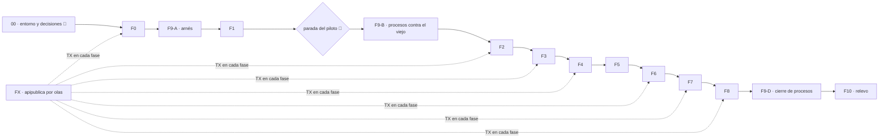

# El plan de trabajo de la reconstrucción modular

> **Estado: EN EJECUCIÓN** — resumen al 2026-10-07 (**el estado al día vive en [`../ESTADO.md`](../ESTADO.md)**,
> § «Avance de la ejecución», y en la tabla de [`sesiones/README.md`](sesiones/README.md)): F0, F1 (el piloto), F2 y
> F3 cerradas y en `dev`; F4 y F5 cerradas el 2026-10-07 (F45-03, por PR a `dev`; `FaseActual = 5`, las dos fuera de
> `Conmutados`);
> F9-A y F9-B hechos, F9-D pendiente; F6, F7, F8 y F10 sin empezar. **Recalibrado el 2026-10-03** tras la parada
> de F1 ([`DECISIONES.md`](DECISIONES.md) §3; `05` E-12, §4.2, E-9, E-4). Escrito el 2026-09-28. Es el plan **ejecutable** que pedía
> [`../ESTADO.md`](../ESTADO.md): convierte las fases F0–F10 de
> [`05-metodo-contratos-y-tdd.md`](../05-metodo-contratos-y-tdd.md) §6 en *specs* con sus historias
> de usuario, su arquitectura, su diseño, sus reglas y sus tareas, y en **56 sesiones** con su prompt
> (eran 81: las 66 pendientes se reagruparon en 41 de tamaño medio, 45–90 min).
> La norma de fondo sigue siendo `05`: si el plan choca con ella, manda `05` y el plan se corrige.
>
> **Siguiente paso** (al 2026-10-07, con F4 y F5 cerradas): [`sesiones/F6-01`](sesiones/F6-01-web-inventario-y-hojas.md) (inventario y hojas de `solicitudes`).
> Después, la tabla de [`sesiones/README.md`](sesiones/README.md), en orden: es ella la que dice cuál toca.

## Cómo está escrito (a lo *spec-driven*, estilo Kiro)

| Pieza | Qué es |
|---|---|
| [`00-marco/`](00-marco/README.md) | El *steering*: producto, tecnología, estructura, flujo web ↔ local, glosario y la **plantilla de fase**. Lo común a todas las fases, escrito una vez |
| `Fn-*/` | Una *spec* por fase, con seis ficheros: `README` (estado, entradas, salidas) · `requisitos` (historias de usuario y criterios **EARS**) · `arquitectura` (macro: paquetes, puentes, cableado) · `diseno` (micro: contrato de cada fichero, suites, dobles, tests viejos a leer) · `reglas` (lo que no se toca, trampas, definición de hecho) · `tareas` (tareas en **bloques de sesión**) |
| [`FX-cara-http/`](FX-cara-http/README.md) | La *spec* **transversal** de la cara HTTP única nueva (`internal/apipublica`), con el **mapa de las 95 rutas** y la fase en que se muda cada una. Sus tareas `TX` se ejecutan dentro de otras fases |
| [`DECISIONES.md`](DECISIONES.md) | Todo lo que necesita a Jhoan, **ordenado por cuándo bloquea**, con la recomendación del equipo |
| [`sesiones/`](sesiones/README.md) | El orden de ejecución y **un fichero por sesión** con su prompt. El *cómo* común, en [`PROTOCOLO-WEB.md`](sesiones/PROTOCOLO-WEB.md) y [`PROTOCOLO-CLI.md`](sesiones/PROTOCOLO-CLI.md) |

**Para quien implementa** (una sesión de Claude Code, web o local): no leas todo. El prompt de tu
sesión te manda al protocolo, y el protocolo te dice qué leer: el marco, la *spec* de tu fase y
**tu bloque**.

## Las fases

| Fase | Qué | Producción viejo → nuevo | Rutas a `apipublica` | Sesiones | Spec |
|---|---|---:|---:|---|---|
| **F0** | Andamiaje: `cmd/server-modular` + `internal/arranque` (copia), `internal/pendiente`, los candados, la huella en proceso, la cara vacía, los ✎ de `platform` | 21 (arranque, por copia) | 0 | 5 🌐 · 1 💻 | [F0](F0-andamiaje/README.md) |
| **F9-A/B** | ⏩ *Adelantado (D-F9-1)*: el arnés de procesos con testcontainers y los procesos contra el binario **viejo** | — | — | 1 🌐 · 3 💻 | [F9](F9-procesos/README.md) |
| **F1** | `nucleo/contact` — **el piloto, con parada** | 4 | 0 | 3 🌐 · 1 💻 · 🧑 parada · 1 💻 ajustes (F1-06) | [F1](F1-nucleo-contact/README.md) |
| **F2** | `acceso` (iam, platformadmin, entitlements) | 51 | 23 (+8 en `:8100`) | 4 🌐 · 1 💻 | [F2](F2-acceso/README.md) |
| **F3** | `edge` (gateway, lease, fleet, grpc…) | 38 | 8 (+6) | 4 🌐 · 1 💻 | [F3](F3-edge/README.md) |
| **F4** | `inferencia` (llmvia, prompts, tenantllm, degradation) | 10 | 4 | con F5: 2 🌐 · 1 💻 | [F4](F4-inferencia/README.md) |
| **F5** | `catalogo` (+ `conversacion/model`, D-F5-1) | 10 + 1 | 0 | (las de F4) | [F5](F5-catalogo/README.md) |
| **F6** | `solicitudes` (intakes, integrations, tenantvars) | 41 | 18 | 3 🌐 · 2 🌐❓ · 1 💻 | [F6](F6-solicitudes/README.md) |
| **F7** | `captacion` (intake, pipeline, stages, reanalisis…) | 32 | 1 (+ intenciones) | 4 🌐❓ · 1 💻 | [F7](F7-captacion/README.md) |
| **F8** | `conversacion` (el motor, `runtime`, el carrito) — la mayor; **retira todos los puentes y adaptadores** | 75 | 19 (+5) | 7 💻 | [F8](F8-conversacion/README.md) |
| **F9-D** | Cierre de los procesos contra los dos binarios — **condición del relevo** | — | — | 1 💻 | [F9](F9-procesos/README.md) |
| **F10** | Relevo: `cmd/server` usa el arranque nuevo, se borra lo viejo, prueba en UAT | 317 prod + 497 test se borran | — | 🧑 · 5 💻 | [F10](F10-relevo/README.md) |
| **FX** | Transversal: la cara HTTP única nueva, por olas | 33 → `apipublica` | **73** (+19 en `:8100`) | dentro de F0, F2–F8, F10 | [FX](FX-cara-http/README.md) |

Sesiones: 🌐 web · 🌐❓ web si queda saldo de la promoción, si no local · 💻 solo local (Docker, UAT, `main`).
Al 2026-10-07 están hechas las sesiones de F0, F9-A/B, F1 (con F1-06), F2, F3 y las dos primeras de F4+F5
(F45-01, F45-02 y F45-03); la siguiente es F6-01. Qué sesión está hecha lo dice la tabla de
[`sesiones/README.md`](sesiones/README.md), no esta línea.

Cifras de ficheros de producción medidas por cada *spec* sobre `dev` @ `1b18932` (con `ls`/`wc`/`go
list`; el comando está en cada `README`). Rutas: el mapa de FX, contando lo que se registra en
ejecución.

Cada módulo (F2–F8) empieza por su **inventario E-12** (cada archivo con su nivel —simple, medio, complejo— y
los adaptadores `bridge_<x>.go` que harán falta; lo aprueba Jhoan) y sigue el ciclo de `05` §4 con la
ceremonia de su nivel: en el simple, contrato, test y lógica en una pasada; en el medio, rojo y verde por
paquete; en el complejo, el esquema completo con mutantes → **conmutar** (el arranque nuevo cablea lo nuevo, huella idéntica, sus rutas a
`apipublica`) → **cierre** local (y, con D-F9-1, sus procesos contra el binario nuevo).

## Lo que el análisis del plan descubrió (y cambia cómo se trabaja)

Hallazgos transversales, medidos sobre el código; el detalle, en la fase que los encontró.

1. 🔴 **El rojo lleva solo exportados.** El linter `unused` hace fallar el gate con un no exportado
   sin uso ([F1](F1-nucleo-contact/README.md)). Regla del marco.
2. **Adaptadores de tipos en el arranque** (`internal/arranque/bridge_<x>.go`, `05` §4.2): cuando un paquete
   nuevo conmuta pero sus consumidores aún son viejos, el arranque adapta el tipo nuevo al puerto
   viejo. Nacen al conmutar y mueren cuando conmuta el consumidor (`bridge_iam` en F3, `bridge_gateway` en F4…); **en F8 no queda ninguno**.
   Un módulo entra en `Conmutados` cuando muere su último adaptador
   ([`00-marco/estructura.md`](00-marco/estructura.md)). Son distintos de los «puentes» de import
   de `05` §4.1.
3. 🔴 **Dos barridos AST viejos recorren todo `internal/`** y se pondrían rojos con el árbol nuevo:
   excepción a E-1 en F0 (D-F4-1).
4. **La huella se calcula en proceso, sin red ni servidores** (prototipo: 0,09 s), contra una
   **dorada** escrita desde el paquete viejo ([F0](F0-andamiaje/README.md)).
5. **El estrangulador no es un `"/"`**: dos `ServeMux` y un despachador, porque un catch-all
   perdería los 405; los patrones nuevos, byte a byte (son la etiqueta de las métricas `wapp_http_*`)
   ([FX](FX-cara-http/README.md)).
6. **Los singletons con estado** (`*gatewaygrpc.Server`, `*runtime.Runtime`) obligan a que las rutas
   que los usan se muden en la misma conmutación; las ventanas de agregación, en cambio, son
   **durables** (`intake_jobs`), no en memoria como decían `04` §2.2 y `05` §4 ([F8](F8-conversacion/README.md)).
7. **El entorno web** sí tiene Docker (sin probar testcontainers) y los hooks del repo sí corren;
   solo empuja a su rama; el *setup script* de `06` §3 habría impedido arrancar la sesión (corregido)
   ([`00-marco/flujo-web-local.md`](00-marco/flujo-web-local.md)).
8. **El lint no está fijado en `ci-local`** (`Makefile:42` usa el del `PATH`; en local hay v2.14.0):
   T-1 lo arregla en F0.
9. **testcontainers v0.44.0 sube dependencias de producción** (`otelhttp`, `httpsnoop`,
   `klauspost/compress`): commit `chore(deps)` aislado (T-2).
10. **Los procesos no necesitan tocar el arranque por R2**: con un endpoint IP el SDK de S3 hace
    *path-style* solo; el LLM falso es un Edge de prueba ([F9](F9-procesos/README.md)).

## Lo que el plan corrige de los documentos 01–05

Los documentos del análisis se escribieron antes de medir fase a fase. Las cifras y afirmaciones que
el plan encontró distintas están en la sección «Contradicciones encontradas» del `README.md` de cada
fase, y las que tocan a toda la reconstrucción, resumidas en [`../ESTADO.md`](../ESTADO.md). Las más
visibles: `05` E-6 (los paquetes «sin gemelo en memoria» casi todos lo tienen), `05` §3.2 (faltan
candados y sobran tests que no lo son), `04` §5 (`catalog.go` no es autocontenido; los alias en el
carrito viejo no aplican con E-1) y `04`/`05` sobre `publicapi` (sustituido por D-10).
